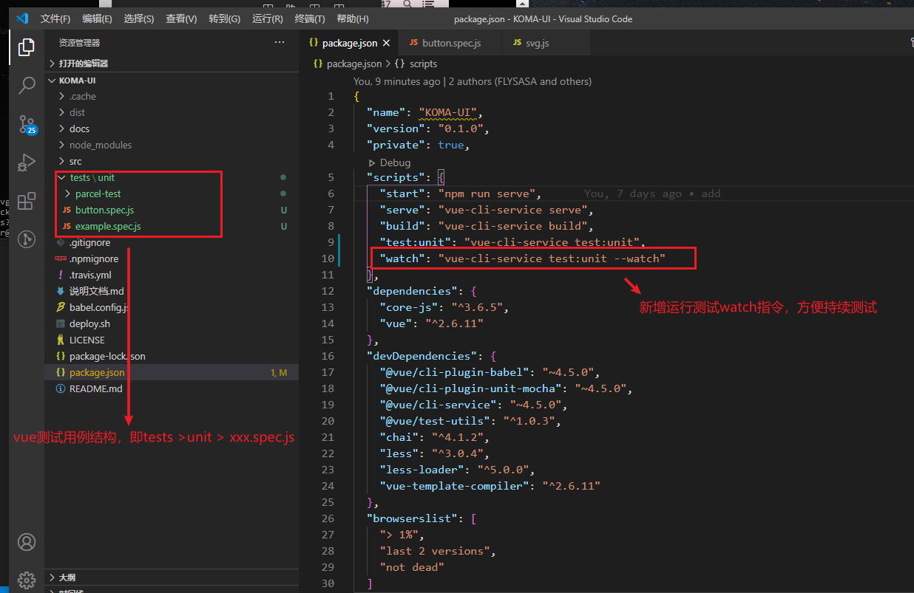
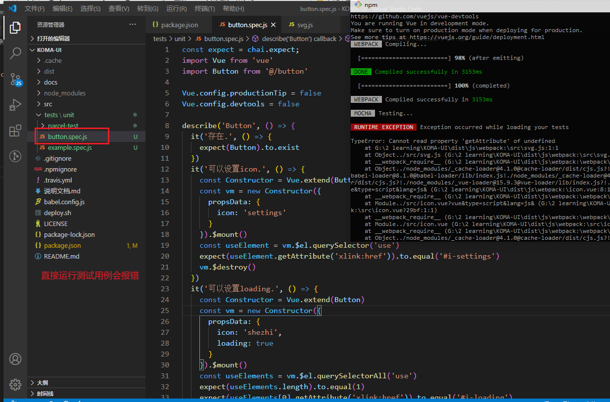
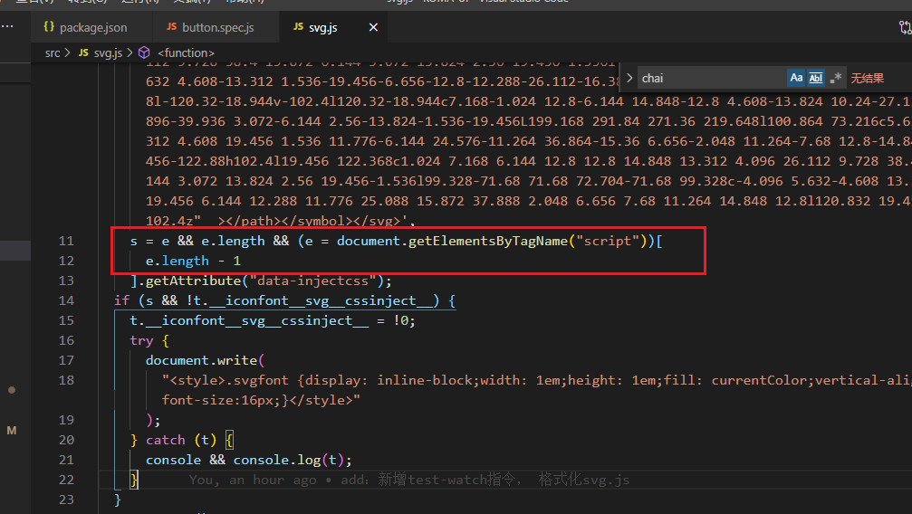
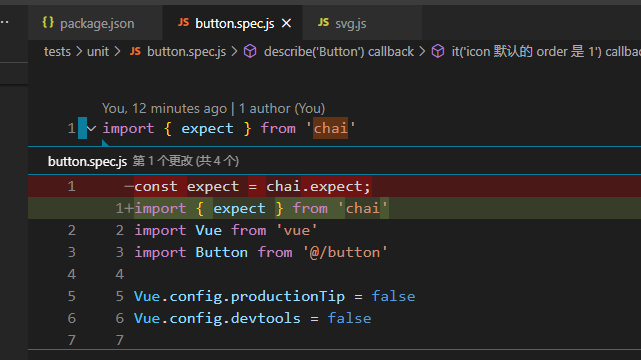
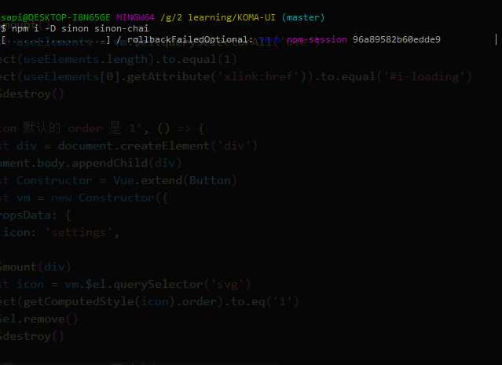
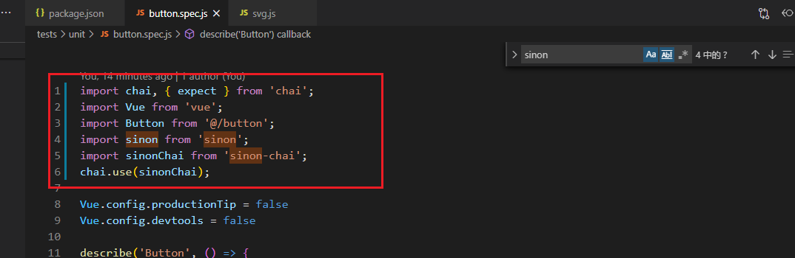
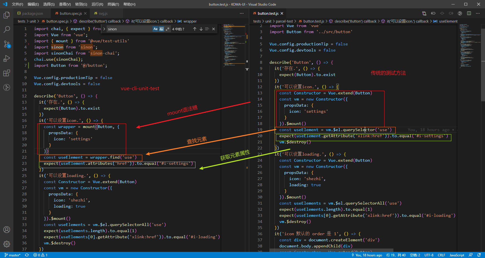

## Vue单元测试

将打包工具从 `parcel` 升级到 `vue-cli` 后，原本的测试用例也无法适用。

#### 如何升级现有的测试用例？

##### 1. 测试的目录结构 添加指令


##### 2. 改造现有测试用例

因为之前的测试用例都是运行在chrome里的，vue-cli的单元测试是运行在node里的。所以像 `getComputedStyle` 因为没有dom是无法拿到值的，这就会产生一系列问题。 




1. 运行`button`时，svg报错，修改svg解决报错加入下面这行：


2. chai引入错误，修改如下：


3. `sinon is not defined` 错误

- 安装sinon 和 sinon-chai

- 引入sinon chai


- 测试通过


4. 用`vue-cli-unit`方式重构测试用例

```js
// 常用的几个api

// mount 挂载
const wrapper = mount(Button, {
  propsData: {
    icon: 'settings'
  }
})

// html 
wrapper.html()

// find 查找元素
const useElement = wrapper.find('use')

// attributes 获取元素属性
useElement.attributes('href')

// classes 获取元素class集合
useElement.classes()

// vm 实例
const vm = wrapper.vm
const el = vm.$el
```

