# vue动画

### 1. 动画方式1-css过渡
[动画示例](https://jsbin.com/cusixapaxa/edit?html,css,js,output)
```js
<div id="demo">
  <button v-on:click="show = !show">
    Toggle
  </button>
  <transition name="fade">
    <p v-if="show">hello</p>
  </transition>
</div>

new Vue({
  el: '#demo',
  data: {
    show: true
  }
})

// css
.fade-enter-active, .fade-leave-active {
  transition: opacity .5s;
}
.fade-enter, .fade-leave-to /* .fade-leave-active below version 2.1.8 */ {
  opacity: 0;
}
```
动画的class添加过程：
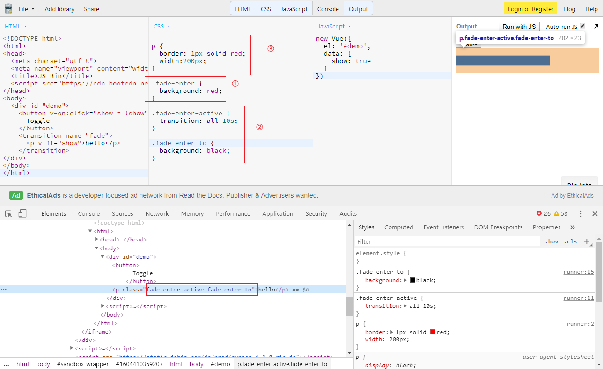

> `v-enter-active` 一般用来定义过渡时间


### 2. 动画方式2-css动画
[动画示例](https://jsbin.com/wecunisade/edit?html,css,js,output)

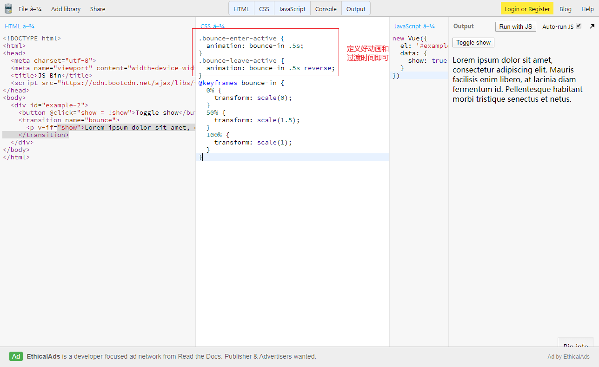


可以引入动画库`Animate.css`搭配使用：
[1. animate bootcdn](./https://www.bootcdn.cn/animate.css/)
[2. animate 官网示例](./https://animate.style/)


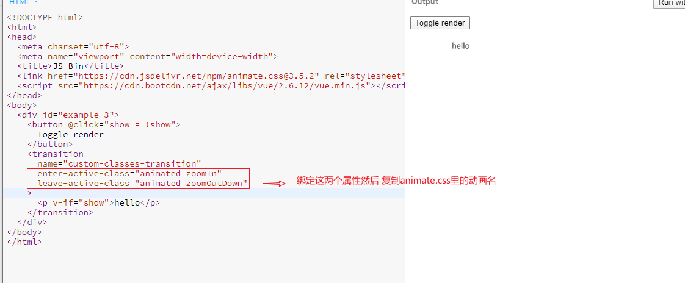

### 3. 动画方式3-使用动画钩子

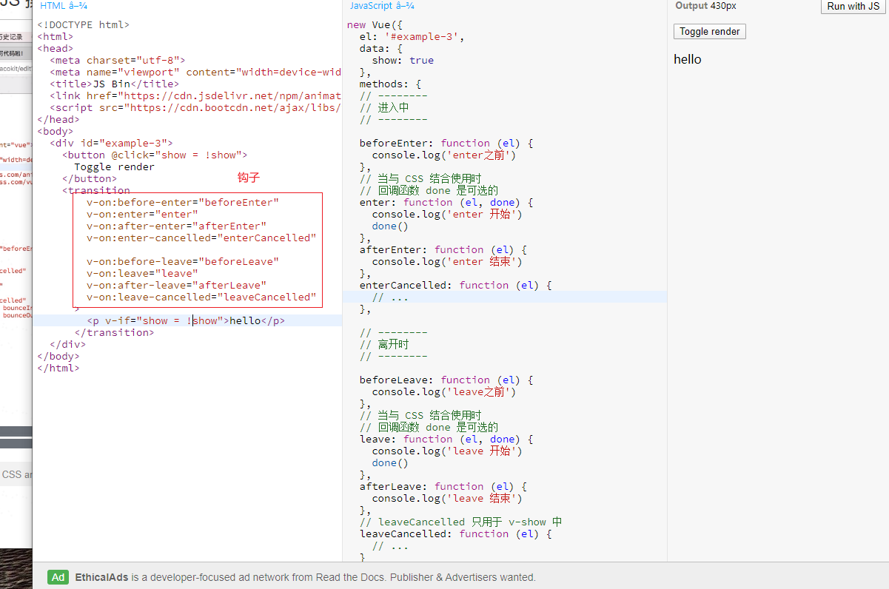

[可以搭配使用js动画库](https://www.bootcdn.cn/velocity/)
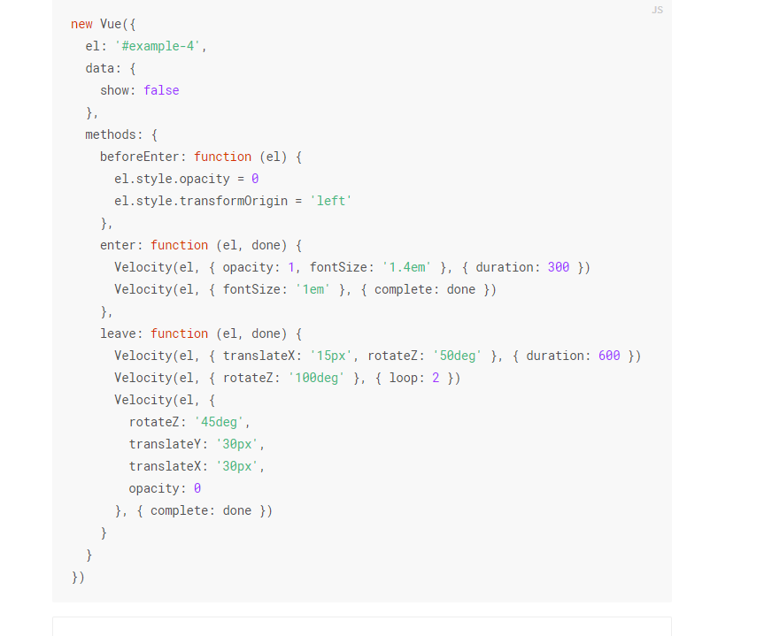


### 4. 动画方式4-多元素过渡动画
[测试案例](http://js.jirengu.com/juzemutoro/1/edit?html,css,js,output)

同标签key的重要性：
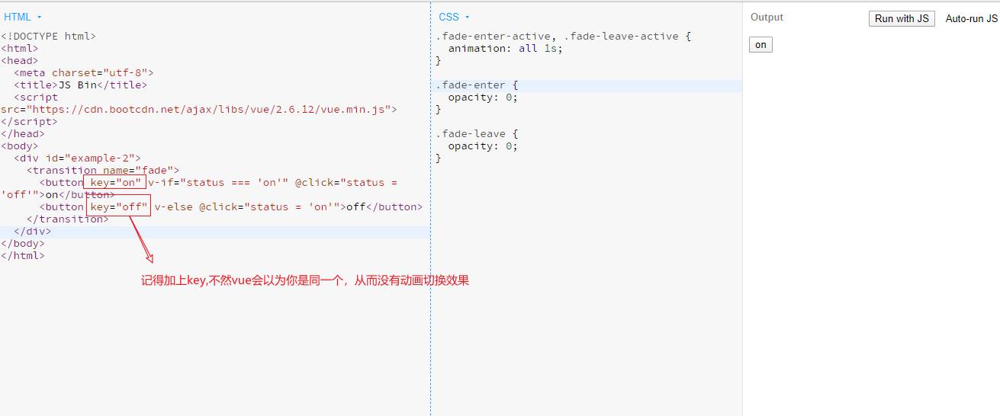
 两种过渡模式：
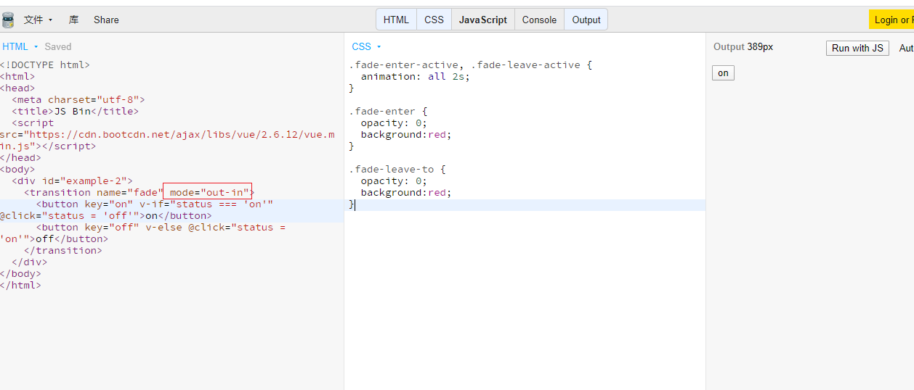


### 5. 动画方式5-多组件过渡动画

[测试案例](https://jsbin.com/juqicewike/edit?html,css,js,output)


### 6. 动画方式5-列表渲染
[测试案例](http://js.jirengu.com/fasoxomiqu/1/edit?html,css,output)

要点：
1. `transition-group` 与一般不一样这里是 group
2. 里面要是for循环


```js
// html
<div id="list-demo" class="demo">
  <button v-on:click="add">Add</button>
  <button v-on:click="remove">Remove</button>
  <transition-group name="list" tag="p">
    <span v-for="item in items" v-bind:key="item" class="list-item">
      {{ item }}
    </span>
  </transition-group>
</div>

// js
new Vue({
  el: '#list-demo',
  data: {
    items: [1,2,3,4,5,6,7,8,9],
    nextNum: 10
  },
  methods: {
    randomIndex: function () {
      return Math.floor(Math.random() * this.items.length)
    },
    add: function () {
      this.items.splice(this.randomIndex(), 0, this.nextNum++)
    },
    remove: function () {
      this.items.splice(this.randomIndex(), 1)
    },
  }
})

// css
.list-item {
  display: inline-block;
  margin-right: 10px;
}
.list-enter-active, .list-leave-active {
  transition: all 1s;
}
.list-enter, .list-leave-to
/* .list-leave-active for below version 2.1.8 */ {
  opacity: 0;
  transform: translateY(30px);
}
```
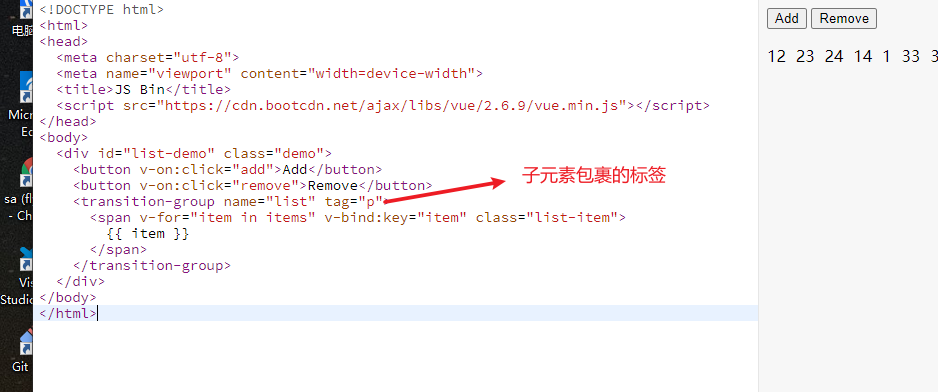


---
> 总结：
一般`enter-active` 和 `leave-active` 用来定义过渡时间。
一般`xxx-enter` 和 `xxx-leave-to` 用来定义起止状态。


1. transition方式
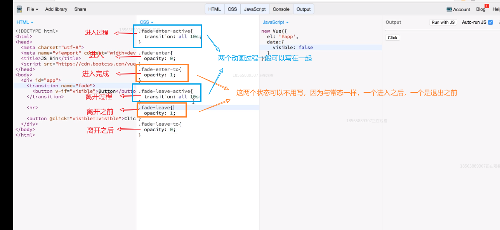
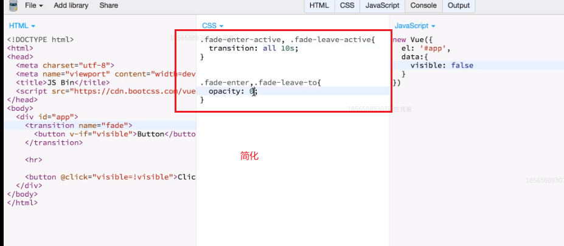

2. animation方式
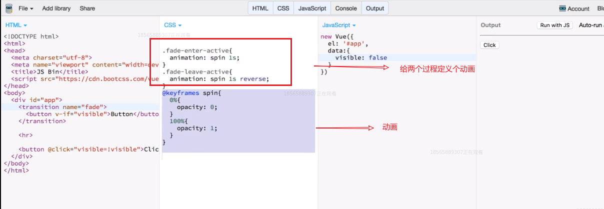


---

**给transition加上v-if是无效的**