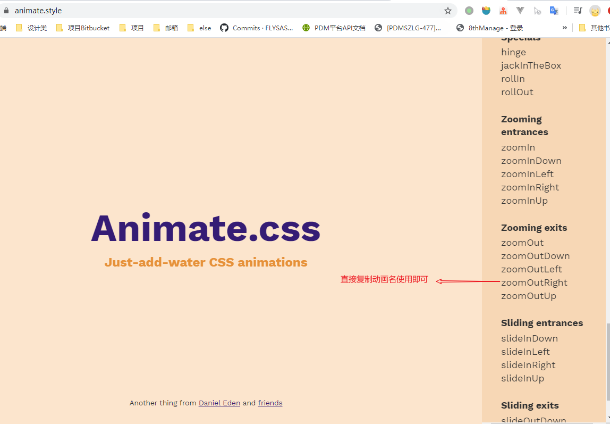

# vue动画

### 1. 动画方式1-css过渡
[动画示例](https://jsbin.com/cusixapaxa/edit?html,css,js,output)
```js
<div id="demo">
  <button v-on:click="show = !show">
    Toggle
  </button>
  <transition name="fade">
    <p v-if="show">hello</p>
  </transition>
</div>

new Vue({
  el: '#demo',
  data: {
    show: true
  }
})

// css
.fade-enter-active, .fade-leave-active {
  transition: opacity .5s;
}
.fade-enter, .fade-leave-to /* .fade-leave-active below version 2.1.8 */ {
  opacity: 0;
}
```
动画的class添加过程：


> `v-enter-active` 一般用来定义过渡时间


### 2. 动画方式2-css动画
[动画示例](https://jsbin.com/wecunisade/edit?html,css,js,output)


可以引入动画库`Animate.css`搭配使用：
[1. animate bootcdn](./https://www.bootcdn.cn/animate.css/)
[2. animate 官网示例](./https://animate.style/)





### 3. 动画方式3-使用动画钩子


[可以搭配使用js动画库](https://www.bootcdn.cn/velocity/)


### 4. 动画方式4-多元素动画
[测试案例](http://js.jirengu.com/juzemutoro/1/edit?html,css,js,output)

同标签key的重要性：

 两种过渡模式：
