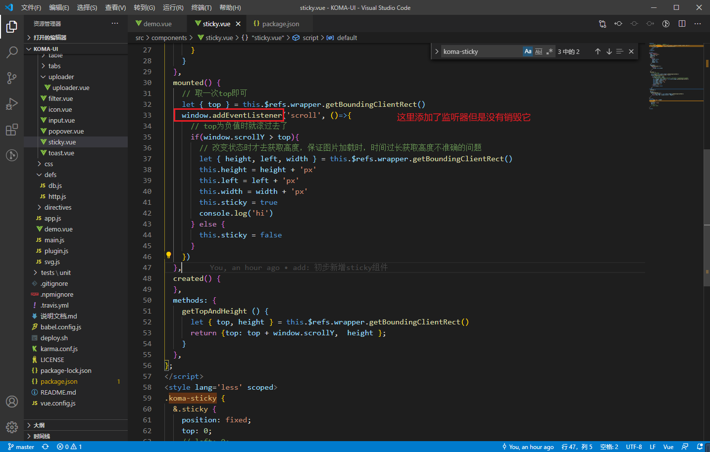
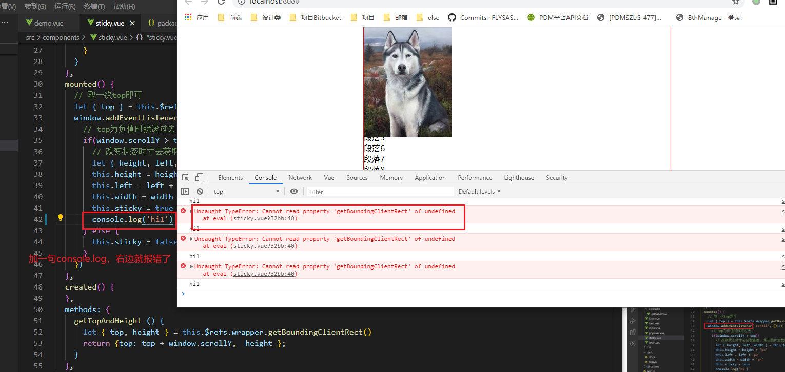
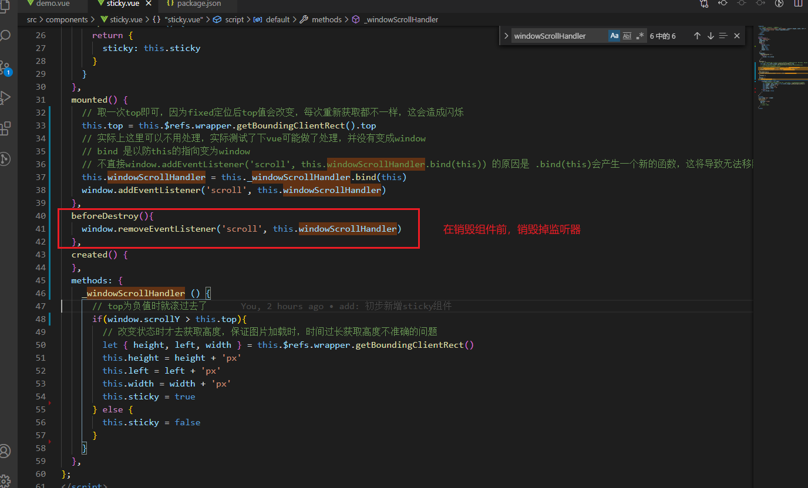
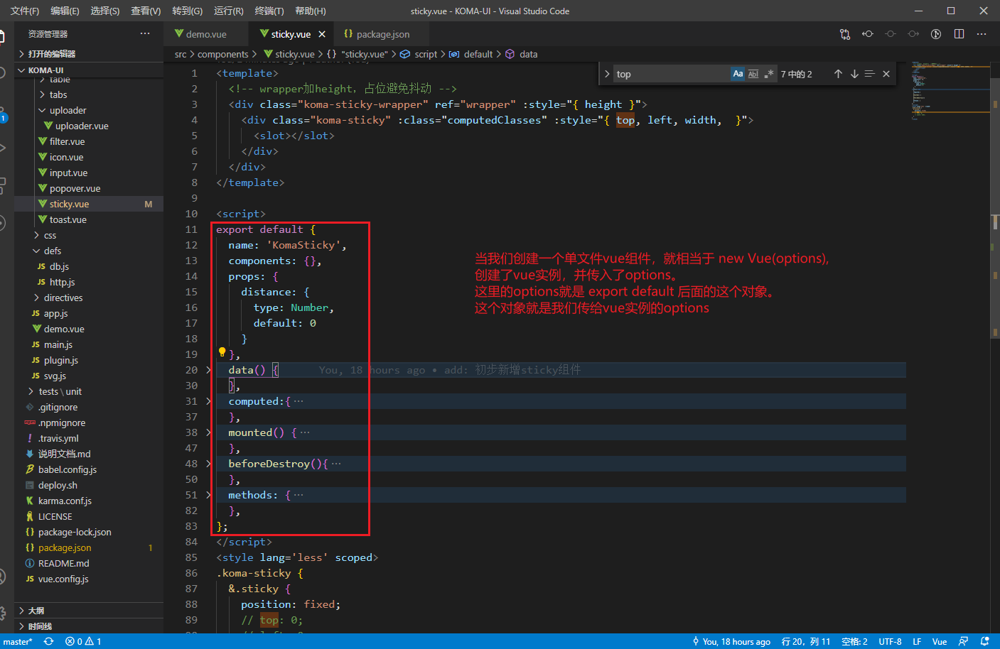
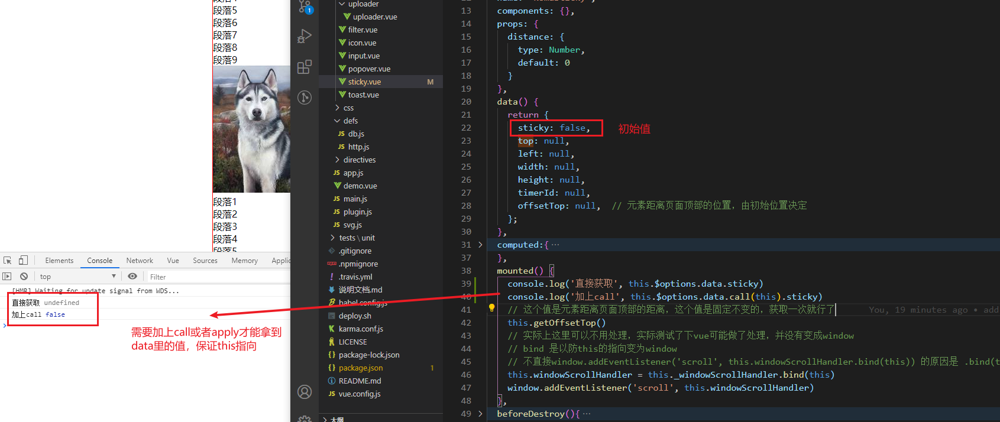
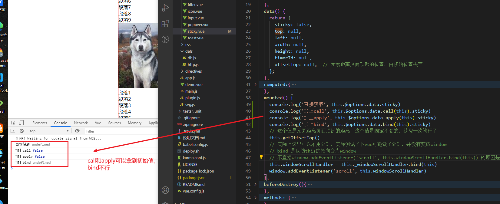
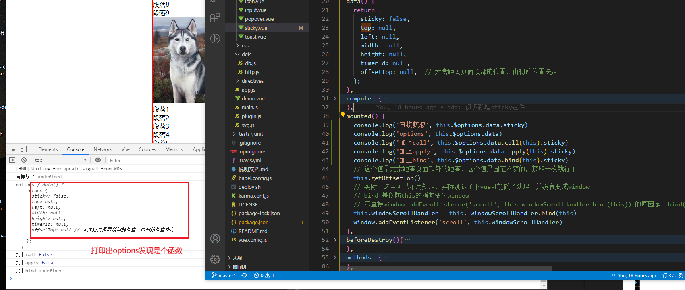

### 1. 如何判断dom元素内部的子元素标签？
```
<div class="parent" ref="parent">
  <span class="child">儿子</span>
</div>


let childrenEl = this.$refs['parent'].children
for (let node of childrenEl) {           // 注意这里用的是let of因为children是数组元素
  console.log(node.nodeName.toLowerCase())   // span
}

```

如果要判断组件内部的子元素标签：
```
for(let node of this.$el.children) {}
```

**实例应用可以看group-button组件**

> 综上我们可以知道: 
> 1. 获取组件实例的元素可以使用 `this.$el`
> 2. 获取dom元素 可以使用 `this.$ref.xxx`

### 2. 如何判断父组件内部的有哪些子组件？
步骤： 
1. 在每个子组件中定义好 `name`
2. 在父组件中通过 `this.$children` 直接获取子组件
```
this.$children.forEach((vm)=>{
  if(vm.$options.name === 'xxxx'){
    doth...
  }
})
```

> 其实`this、  this.$parent、 this.$children`都是`vm`（实例），
> - 可以通过`vm`获取组件实例`data`和方法
> - 可以通过`vm.$el`获取dom元素


### 3. vue component组件的prop类型验证

```
props: {
  name: {
    type: String|Number,  
    // 或者
    // type: [String, Number]
  }
}
```

### 4. vue 插槽

#### 4.1 插槽内容
插槽的作用，顾名思义就是在父组件中将某些内容插入到子组件的特定位置上（一不小心就开车了呢）。
```
// 子组件
<div class="child">
  <header>
    <slot name="header></slot>
  </header>
  <main>
    <slot></slot>
  </main>
  <footer>
    <slot name="footer"></slot>
  </footer>
</div>

// 父组件
<child>
  // 将这里插入到子组件的 <slot name="header></slot>插槽里
  <template #header>
    <h1>header</h1>
  </template>

  // 没有写插槽的默认 是 v-slot:default 会默认放到子组件的 <slot></slot> 里
  <p>default-content</p>

  <template v-slot:footer>
    <p>footer</p>
  </template>
</child>
```
**以上`v-slot:` 可以简写为`#`**


#### 4.2 作用域插槽

作用域插槽即在子组件的slot标签上，绑上特定属性，然后在父组件上使用 slotProps来获取到这个属性
```
// 子组件
<div class="child">
  <header>
    // 绑定在 <slot> 元素上的 attribute 被称为插槽 prop, 比如这里将user作为属性传给插槽
    <slot name="header :user="user></slot>
  </header>
</div>

// 父组件
<child>
  // 有时候我们想要拿到子组件中传过来的内容，可以使用 slotProps
  <template #header="slotProps">
    <h1>header {{slotProps.user}}</h1>
  </template>

  // 可以用解构语法
  <template #header="{ user }">
    <h1>header {{ user }}</h1>
  </template>
</child>
```

#### 4.3 slot特性
```
<div class="child">

  // 绑定的class是无效的
  <slot class="xxx"></slot>

  // 使用 $refs['xxx'] 也是无法获取到的
  <slot ref="xxx"></slot>

  // 事件xxx也不会执行
  <slot @click="xxx"></slot>

  // 介于如此可以在slot上绑上一个div元素, 这里的xxx都会生效
  <div ref="xxx" @click="xxx" class="xxx">
    <slot></slot>
  </div>

  // v-if是有效的 
  <slot v-if="false"></slot>
</div>
```

#### 4.4 `$slots` 和 `$scopedSlots`
顾名思义：
> `$slots`: 不带作用域的插槽，即slot上没有传递参数
> `$scopedSlots`: 带作用域的插槽，即slot上传递了参数


### 5. 组件prop传递规则
我们给一个组件定义prop时：


在父组件中:


**如果父组件中使用 `popoverClassName`传递prop, 在子组件中将会是`undefined`**

这是因为在html中 attribute 的名是大小写不敏感的，所以浏览器会把所有大写字符解释为小写字符。


等式右边可以。


### 6. 自定义指令
**指令就是为了操纵dom的。**

[自定义指令案例](https://jsbin.com/geboqabuye/edit?html,js,console,output)


如果给指令传入函数，直接 `binding.value()` 就能执行该函数，`binding.value`即绑定的值。


### 7. 判断某个对象里是否有某个key
```js
// let key = 'a'
// let obj = {a: '1'}
// key in obj  =>   true
<span v-if="key in Object"></span>  
```

### 8. props默认为对象的简写
```js
props: {
  data: {
    type: Object,
    default: () => ({})   //默认是对象的话，这里记得加上括号
  }
}
```

### 9. 让自定义组件支持click事件
```html
// 自定义组件
<!-- 再向父组件触发一个click事件即可 -->
<div @click="$emit('click', $event)"></div> 
```

### 10. 为什么要在beforeDestroy里销毁监听器？
这样一个实际场景:
在sticky组件中监听了滚动事件，但是没有销毁掉：



这是为什么？
> webpack的热加载机制，监听到组件变化，会将之前的组件在页面上移除并重新在页面上渲染新的组件，但是旧组件的监听的事件并没有销毁，所以也会触发事件，但是此时页面元素已经不存在了，所以报错。

**当添加了有副作用的代码时，如果修改了除了自己以为的任何东西，比如这里的`window`，所以在销毁自己前需要将副作用代码也销毁掉**


销毁监听器，需要给绑定的事件命名，这就会引申出this指向的问题，在vue中 this 实际指向并不会改变，但是以防万一还是需要给事件 `.bind(this)`, 不要直接将  `.bind(this)`的函数绑定在监听器上，可以用个变量存起来，因为`.bind(this)`会产生一个新的函数，这就导致无法销毁掉这个函数。


### 11. 初步探究vue options
#### 1.什么是 vue 的 options？


经常用到的操作是，将data里的值重置为默认定义的值
```js
data(){
  return {
    a: 0
  }
},

methods: {
  reset(){
    this.a = this.$options.data.call(this).a
  }
}
```


####  2.这里衍生一个问题 `call、apply、bind` 都可以改变this指向，为什么`call apply`可以，`bind`不行？


打印出`options.data`:


**这就好解释为什么实用call和apply可以，而bind不行。 因为data是个函数，我们要获取到的值是函数的返回值，需要执行后才会返回。所以需要使用call和apply立即执行一次。**


#### 3. `call、apply、bind` 的区别
https://segmentfault.com/a/1190000018017796

- bind: bind()会创建一个新函数，在调用时设置this关键字为提供的值。
因为是返回一个新函数，所以需要稍后调用，才会执行。
- call, apply: 调用 call 和 apply 的对象，必须是一个函数 Function。会立即调用。
- call和apply区别： call()方法接受的是参数列表, 而apply()方法接受的是一个参数数组。

```js
function add (a, b) {
    return a + b;
}

function sub (a, b) {
    return a - b;
}

add.bind(sub, 5, 3); // 这时，并不会返回 8
add.bind(sub, 5, 3)(); // 调用后，返回 8
add.call(sub, 5, 3);  // 8
add.call(sub, [5, 3]);  // 8
```