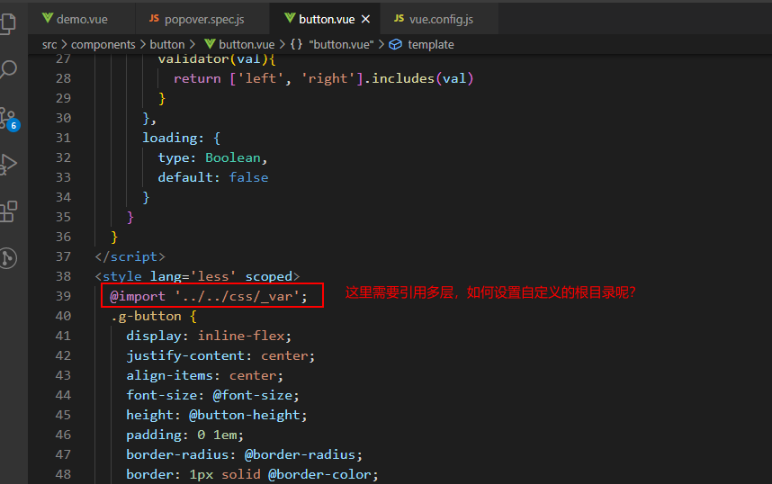
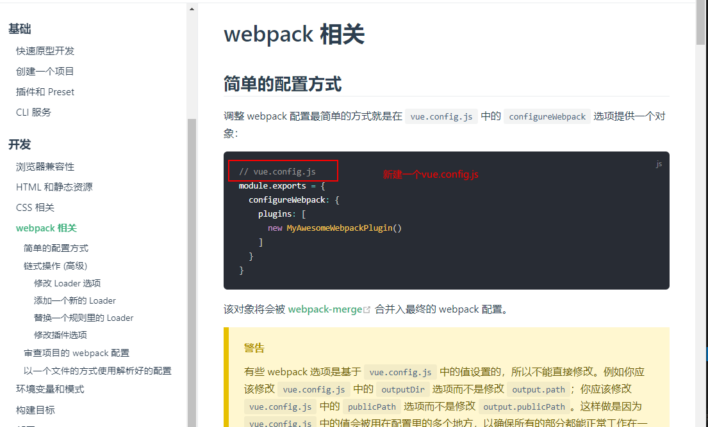
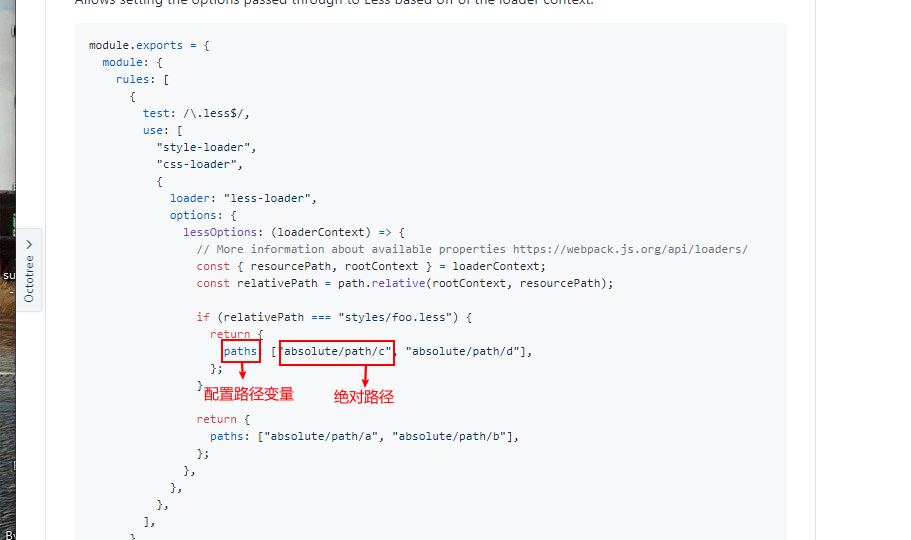
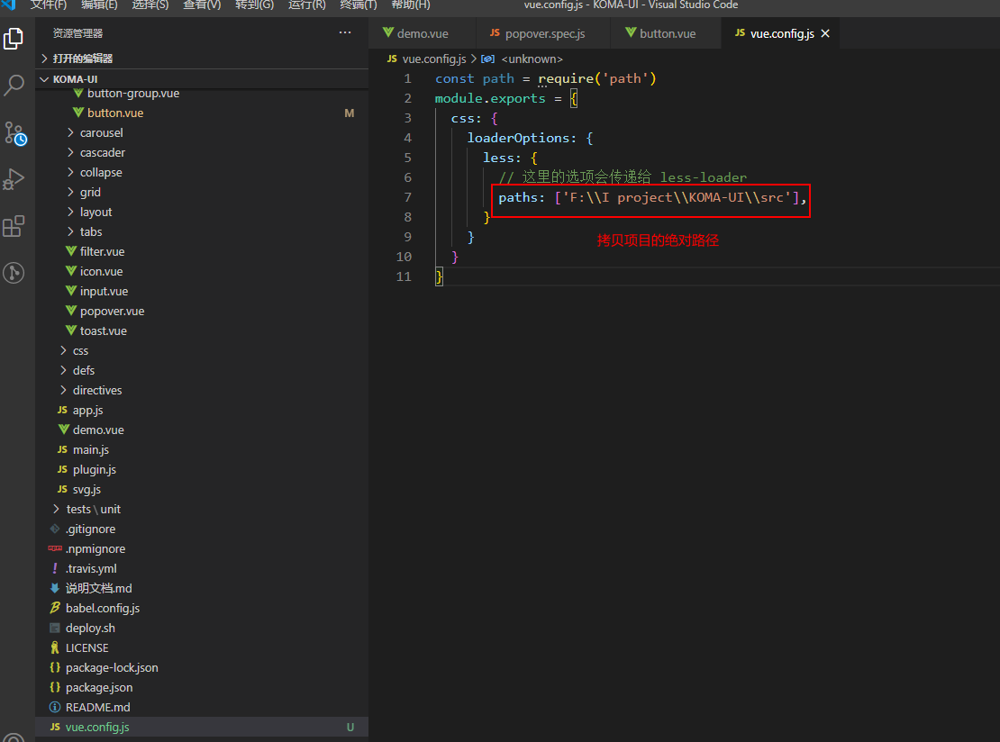
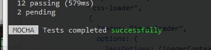
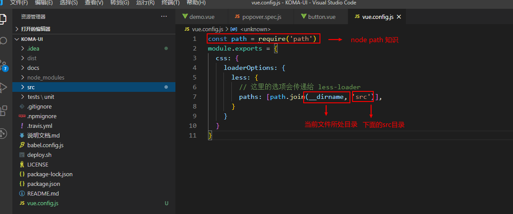
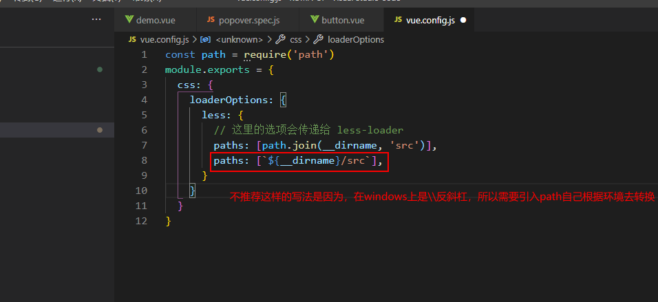

### 1. 在vue中如何配置less等的根目录

如何给下面的情景直接设置 `less` 对应的根目录？

#### 1. 项目根目录下新建一个`vue.config.js`

#### 2. 配置`less-loader`选项
[关于less-loader选项](https://github.com/webpack-contrib/less-loader)

##### 项目实际应用：
**方式1：** 

运行成功：

> 但是需要注意的是，项目的绝对路径因人而异，所以这种方式并不推荐。

**方式2：** 
> 推荐用这种方式

