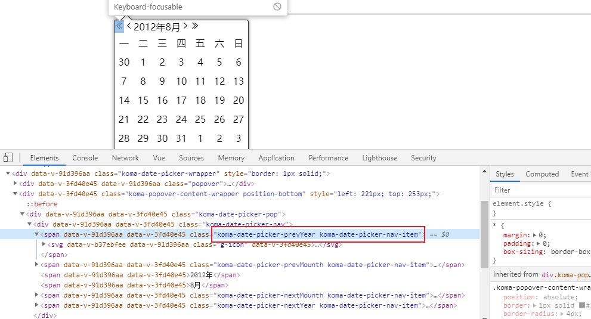
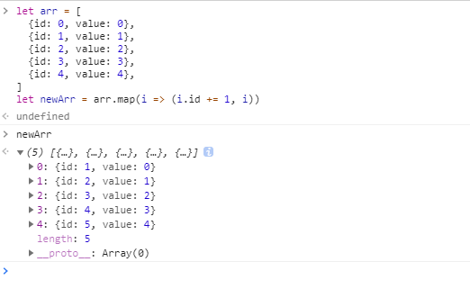

### 1. 如何将省市区`.csv`格式 处理成 `.json` 格式 ？

[省市区数据来源]('https://github.com/eduosi/district/blob/master/district-full.csv')

使用csv-json网站转换： https://csvjson.com/csv2json

#### 1. 定义好列名，使用tab分隔：


### 2. 如何判断上传的文件的名称是否重名，重名则将名称加（1）
```js
let name = input.files[0]
while(this.fileList.filter(i=> i.name === name).length > 0){
  let dotIndex = name.lastIndexOf('.')
  let nameWithoutExtention = name.substring(0, dotIndex)
  let extention = name.substring(dotIndex)
  name = nameWithoutExtention + '(1)' + extention
}

```

### 3. 函数参数整合
```js
// html
<span :class="c('nextYear', 'navItem')"></span>


// js
methods: {
  // 传入多个参数时，这里classNames会是一个数组，class可以是一个数组
  c(...classNames) {
    return classNames.map(className => `koma-date-picker-${className}`)
  }
}
```




### 4. map的快捷写法
```js
let arr = [
  {id: 0, value: 0},
  {id: 1, value: 1},
  {id: 2, value: 2},
  {id: 3, value: 3},
  {id: 4, value: 4},
]
let newArr = arr.map(i => (i.id += 1, i))
```


### 5. 解构赋值重命名
```js
let parent  = this.$refs['parent']
let child = this.$refs['child']
let {height: childHeight} = child.getBoundingClientRect()
let {height: parentHeight} = parent.getBoundingClientRect()
let maxHeight = childHeight - parentHeight
```

### 6. 类数组快速转为数组
```js
let htmlCollects = document.querySelectorAll('p')
Array.from(htmlCollects).forEach(i => i)      // 1. 使用 Array.from() 转换
[...htmlCollects].forEach(i => i)             // 2. 使用 ...扩展运算符
```


