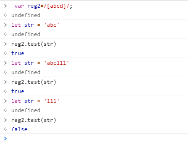

## 正则表达式

正则表达式使用单个字符串来描述、匹配一系列符合某个句法规则的字符串。

有两种写法：
```js
// 如匹配 <%xxx%> 这样的字符串
// reg.test(str)

// 1. 构造函数
var reg = new RegExp('/<%[^%>]+%>/', 'g')  // 注意 + 号是必须的

// 2. 字面量（推荐）
var reg = /<%[^%>]+%>/g;
```

## 1. 属性

#### 1. 修饰符
最后的g代表全局，还有几个修饰符：
1. `g: global`, 全文搜索，不添加的话搜索到第一个结果停止搜索
2. `i: ignore case`, 忽略大小写，默认大小写敏感
3. `m: multiple lines`, 多行搜索

```js
// 多行匹配
var str = 'hello123\nhello222\nhello456'

str.match(/hello\d+/g)  // ["hello123", "hello222", "hello456"]
str.match(/^hello\d+/g) // ["hello123"]
str.match(/^hello\d+/gm) // ["hello123", "hello222", "hello456"]
```


#### 2. 元字符 [] 
`[abcd]` : 代表匹配abcd中的任意一个字符


`[^abcd]`: `^`在中括号里是取反的意思，代表字符串里不含abcd的

**其他元字符：**
字符|含义
--|--
\r|回车符
\n|换行符
\f|换页符
\t|水平制表符
\v|垂直制表符
\0|空字符


#### 3. 范围内
```js
// 匹配一个字符，可以是0-9的任意一个
var reg = /[0123456789]/

// 上面的简写
var reg = /[0-9]/

// 匹配一个字符，可以是a-z中的任意一个
var reg = /[a-z]/

// 匹配一个字符，可以是大小写字母，数字中的任意一个
var reg = /[a-zA-Z0-9]/
```

#### 4. 预设类，官方语法糖
字符|等价|含义
--|--|--
. | [^\r\n] | 除了回车符和换行符之外的所有字符
\d | [0-9] | 数字字符
\D | [^0-9] | 非数字字符
\s | [\t\n\x0B\f\r] | 空白符
\S | [^\t\n\x0B\f\r] | 非空白字符
\w | [a-zA-Z_0-9] | 单词字符，字母、数字下划线
\W | [^a-zA-Z_0-9] | 非单词字符

```js
// 匹配 ab + 数字 + 任意字符的字符串
var reg = /ab\d./
```

#### 5. 边界匹配字符
字符|含义
--|--
^ | 以xxx开头
$ | 以xxx结尾
\b | 单词边界
\B | 非单词边界

```js
var str = 'hello1 word hello2 123456 hello3'
str.match(/hello\d/g)  // ["hello1", "hello2", "hello3"]
str.match(/^hello\d/g) // ["hello1]
str.match(/hello\d$/g) // ['hello3']
str.match(/\bhello\d\b/g) // ["hello1", "hello2", "hello3"]
```
```js
// 检测 className 是否包含 header
var className = 'header3 clearfix active header-fixed'

var reg = /(^|\s)header($|\s)/g // (^|\s) 括号里代表 开头或者空白，这里是header开头或前有空白
```

#### 6. 量词
字符|含义
--|--
？|最多出现1次 
+|出现一次或以上
*|任意次
{n}|出现n次
{n, m}|出现n到m次
{n,}|至少出现n次
{,m}|至多出现m次

```js
// 匹配一个合法的url (url以http或者https或者//开头)
var reg = /^(https?:)?\/\/.+/

// 匹配一个手机号？ (手机号以1开头，长度为11位数字)
var reg = /^1\d{10}$/
```

#### 7. 贪婪模式与非贪婪模式
贪婪模式，量词在默认下尽可能多的匹配：
```js
'123456789'.match(/\d{3,5}/g);  // ["12345", "6789"]
'a123b456cde'.match(/[a-z]\d?/g); // ["a1", "b4", "c", "d", "e"]  因为？默认也是贪婪模式会匹配1，所以是a1
```

非贪婪模式，正则表达式尽可能少的匹配，在量词后加上?即可：
```js
'123456789'.match(/\d{3,5}?/g);  // ["123", "456", "789"]
'a123b456cde'.match(/[a-z]\d??/g); // ["a1", "b4", "c", "d", "e"]  因为？？非贪婪模式会匹配1，所以是["a", "c", "d", "e"]
```

#### 8. 分组
匹配某个词组多次，如  hello 匹配10次。
```js
var reg = /(hello){10}/   // 不加 ()的话会，匹配o十次
```

#### 9. 或
```js
var reg = /hello|world/
// 等同于
var reg = /(hello)|(world)/
```

#### 10. 前瞻
表达式|含义
--|--
exp1(?=exp2)|匹配后面是exp2的exp1
exp1(?!exp2)|匹配后面不是exp2的exp1

```js
(/good(?=Byron)/).exec('goodByron123')  // ['good']  匹配后面是Byron的good
(/good(?!Byron)/).exec('goodCasper123'); //['good'] 匹配后面不是Byron的good
```

---
## 2.方法

正则在前面：
#### 1. RegExp.prototype.test(str)
返回boolean值

```js
var reg = /\d+\.\d{1, 2}$/g;

reg.test('123.45'); // true
reg.test('34.5678'); // false
```

#### 2. RegExp.prototype.exec(str)
方法用于正则表达式模式在字符串中运行查找，如果exec()找到了匹配的文本，则返回一个结果数组。

```js
var str = 'hallo world, hpllo yan, htllo bao'
var reg = /h[a-z]llo/g
// var result = reg.exec(str)  // ["hallo"]
// var result = reg.exec(str)  // ["hpllo"]
// var result = reg.exec(str)  // ["htllo"]

do {
  result = reg.exec(str)
} while (result)
```

正则在后面：
#### 3. String.prototype.search(reg)
search() 方法用于检索字符串中指定的子字符串，或检索与正则表达式相匹配的子字符串。
**search() 方法不执行全局匹配，它将忽略标志g，它同时忽略正则表达式对象的lastIndex属性，并且总是从字符串的开始进行检索，这意味着它总是返回字符串的第一个匹配的位置。**

```js
'a1b2c4'.search(/\d/g);  // 1
'a1b2c4'.search(/\d/);  // 1
```

#### 4. String.prototype.match(reg)
match()方法将检索字符串，以找到一个或多个与regexp匹配的文本。但regexp是否具有标志 g对结果影响很大。
```js
var str = 'hello1 word hello2 123456 hello3'
str.match(/hello\d/g)  // ["hello1", "hello2", "hello3"]
```


#### 5. String.prototype.replace(reg, replaceStr)
```js
'abcabcabc'.replace(/bc/g,'X'); //aXaXaX
'abcaBcabC'.replace(/bc/gi,'X'); //aXaXaX

// 如何将下面错误的hello全部替换成正确的
var str = 'hallo world, hpllo yan, htllo bao'
var reg = /h[a-z]llo/g

var str2 = str.replace(reg, 'hello')  // 原来的str不会发生改变

var str3 = str.replace(reg, function(value){  // 后面也可以是个函数
  return value[0].toUpperCase()
})
```

#### 6. String.prototype.split(reg)
```js
'a,b,c,d'.split(','); //["a", "b", "c", "d"]
'a1b2c3d'.split(/\d/); //["a", "b", "c", "d"]
```

---
#### 题目：
#### 1. 写一个函数 trim(str), 去除字符串两边的空白字符
```js
function trim(str) {
  return str.replace(/^\s+|\s+$/g, '')
}

``` 

#### 2. 写一个函数isEmail(str), 判断用户输入的是不是邮箱
```js
function isEmail(str) {
  return /\w+@.+/.test(str)
}

```

#### 3. 写一个函数isPhoneNum(str), 判断用户输入是不是手机号
```js
function isPhoneNum(str) {
  return /^1\d{10}$/.test(str)
}
```

#### 4. 写一个函数isValidUserName(str) ,判断用户输入是不是合法的用户名（长度6-20个字符，只能包括字母、数字、下划线）
```js
function isValidUserName(str) {
  return /^\w{6, 20}$/.test(str)
}
```

#### 5. 写一个函数isValidPassword(str) ,判断用户输入是不是合法的密码（长度6-20个字符，只能包括大小写字母、数字、下划线，且至少包括两种）
```js
function isValidPassword(str) {
  if(!/^\w{6, 20}$/.test(str)) return false;
  if(/^[a-z]{6, 20}$/.test(str)) return false;  // 全部小写
  if(/^[A-Z]{6, 20}$/.test(str)) return false;  // 全部大写
  if(/^_{6, 20}$/.test(str)) return false;      // 全部下划线
  return true;
}
```

#### 6. 写一个正则表达式，得到如下字符串里所有的颜色
```js
var reg = /#([a-fA-F0-9]{6}|[a-fA-F0-9]{3})(?=;)/g  // (?=;) 前瞻，匹配后面是分号的
var str = 'color: #121212; background-color: #000; width: 12px; bad-color: f#fddee'
console.log( str.match(reg) ) // ['#121212', '#000']
```

#### 7. 把字符串里的数字替换为它的平方，如3的平方是9， 6的平方是36
```js
function powStrNumber (str) {
  var reg = /\d+/g
  return str.replace(reg, function(num) {
    return Math.pow(parseInt(num), 2)
  })
}
let str = `如3的平方是9， 6的平方是36`

powStrNumer(str)  // "如9的平方是81， 36的平方是1296"
```


#### 8. \d，\w,\s,[a-zA-Z0-9],\b,.,*,+,?,x{3},^,$分别是什么?
表达式|含义
--|--
\d|数字
\w|大小写字母，数字，下划线
\s|空白字符
[a-zA-Z0-9]|大小写字母，数字
\b|单词边界
.|除了回车符和换行符外的所有字符
*|匹配任意次
+|匹配至少一次
？|匹配0-1次
x{3}|出现3次x
^|以xxx开头
$|以xxx结尾
