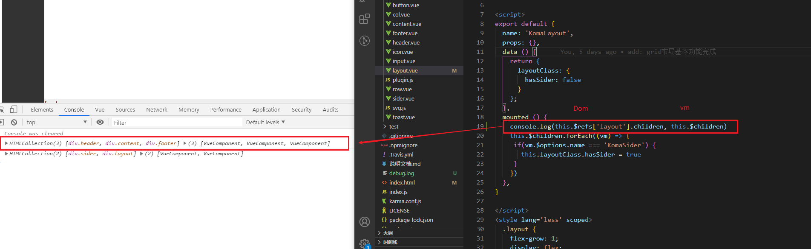
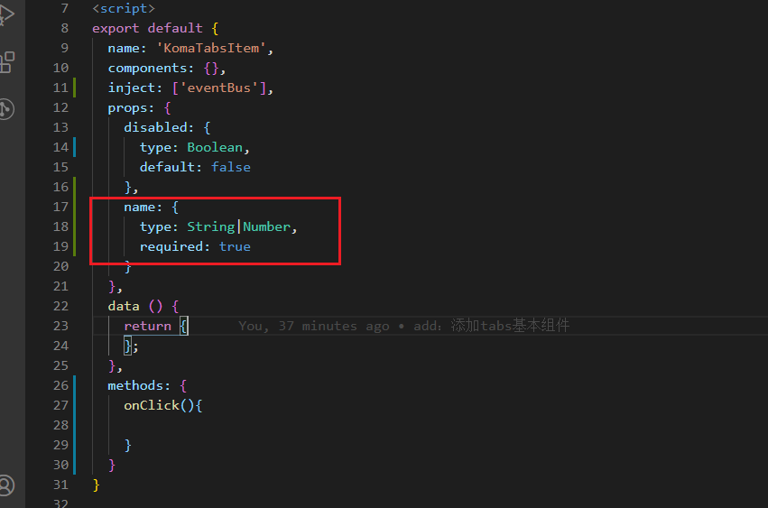

### 1. 如何判断dom元素内部的子元素标签？
```
<div class="parent" ref="parent">
  <span class="child">儿子</span>
</div>


let childrenEl = this.$refs['parent'].children
for (let node of childrenEl) {           // 注意这里用的是let of因为children是数组元素
  console.log(node.nodeName.toLowerCase())   // span
}

```

如果要判断组件内部的子元素标签：
```
for(let node of this.$el.children) {}
```

**实例应用可以看group-button组件**

> 综上我们可以知道: 
> 1. 获取组件实例的元素可以使用 `this.$el`
> 2. 获取dom元素 可以使用 `this.$ref.xxx`

### 2. 如何判断父组件内部的有哪些子组件？
步骤： 
1. 在每个子组件中定义好 `name`
2. 在父组件中通过 `this.$children` 直接获取子组件
```
this.$children.forEach((vm)=>{
  if(vm.$options.name === 'xxxx'){
    doth...
  }
})
```

> 其实`this、  this.$parent、 this.$children`都是`vm`（实例），
> - 可以通过`vm`获取组件实例`data`和方法
> - 可以通过`vm.$el`获取dom元素


### 3. vue component组件的prop类型验证

```
props: {
  name: {
    type: String|Number,  
    // 或者
    // type: [String, Number]
  }
}
```

### 4. 常用测试获取属性操作
```
// 获取自有属性的元素
let el = vm.$el.querySelector('.tabs-item[data-name="sport"]')

// 判断元素是否含有某个class
el.classList.contains('active')

// 判断属性值
vm.$el.getAttribute('data-name').to.eq('women')
```

### 5. less的高级用法 
#### 1.继承： extend
[less placeholder](https://less.bootcss.com/features/#extend)
参考案例：联机选择器轮子


#### 2.混入： mixins
另外还有一种 `mixins`:


后者会将样式写多次，前者只会将class汇总到一起写一个样式


#### 3. 变浅函数


### 4. 在jsbin中测试vue代码
用到网站：
[bootCDN](https://www.bootcdn.cn/)
[JSBIN](https://jsbin.com/geboqabuye/edit?html,js,output)


复制script标签引入即可：

