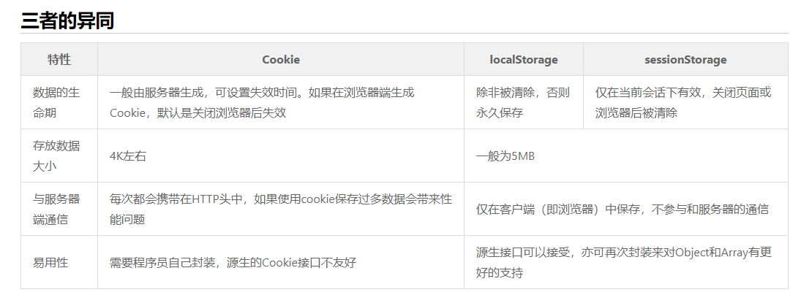

## HTML:

### 1.(必考)你是如何理解HTML语义化的？
- 举例法：
HTML语义化就是使用正确的标签。
段落就写 `p` 标签，标题就写`h1` 标签，文章就写 `article` 标签，视频就写`video`标签，等等。

- 阐述法：
  1. 最开始PHP的后台开发人员写HTML，不会css，使用table布局。
  2. 然后美工人员使用 `div + css`布局。
  3. 专业的前端会使用正确的标签进行页面开发。


### 2. meta viewport 是做什么用的，怎么写？
**死背**：
控制页面在移动端不要缩小显示。

**侃侃而谈**：
一开始，所有页面都是给PC准备的，乔布斯推出 iPhone 3GS，页面是不适应手机屏幕的，所以乔布斯的工程师想了一个办法，默认把手机模拟成 980px，页面缩小。
后来，智能手机普及，这个功能在部分网站不需要了，所以我们就用 meta:vp 让手机不要缩小我的网页。

key|mean|example
--|--|--
width|视口的宽度|	width=device-width 指缩放为 100% 时以 CSS 像素计量的屏幕宽度
initial-scale|初始化缩放比例|	initial-scale=1.0 初始化不进行缩放
maximum-scale|用户最大缩放比例|	maximum-scale=1.0 不允许用户缩放

```html
<meta name="viewport" content="width=device-width, initial-scale=1, maximum-scale=1">
```

### 3. 你用过哪些HTML5标签？
内容相关：`header main footer article`
功能相关： `canvas video audio`

如video一般会用到哪些属性？
> src: 视频的地址
> autoplay: 自动播放
> poster: 封面
```html
<video src="videofile.ogg" autoplay poster="posterimage.jpg"></video> 
```

### 4. H5是什么？
搜一下知乎就知道了，H5表示移动端页面，反正不是HTML5。

---

## css:
### 1. 必考：两种盒模型分别说一下。
```css
box-sizing: content-box;  // 标准盒子模型(默认) padding和border会改变盒子的实际大小，需要重新计算
box-sizing: border-box; // IE盒子模型 不管怎么写padding和border宽度都固定在书写时的width
```

那种好一点？
`boder-box` 不用重新计算。

### 2. 必考: 如何居中？如何垂直居中？
1. 水平居中：
- 内联： 爸爸身上写 `text-align: center;`
- 块级： `margin-left: auto; margin-right:auto;`

2. 垂直居中：
7种方式实现垂直居中：
常用的几种：
```js
// 1. translate(-50%, -50%)
<div class="parent">
  <div class="child">
    一串文字一串文字一串文字一串文字一串文字一串文字一串文字一串文字一串文字一串文字
  </div>
</div>

.parent{
  height: 600px;
  border: 1px solid red;
  position: relative;
}
.child{
  border: 1px solid green;
  position: absolute;
  top: 50%;
  left: 50%;
  transform: translate(-50%,-50%);
}


// flex布局
.parent{
  height: 600px;
  border: 1px solid red;
  
  display: flex;
  justify-content: center;
  align-items: center;
}
.child{
  border: 1px solid green;
  width: 300px;
}
```

### 3. 必考：flex 怎么用，常用属性有哪些？
看 MDN，背代码。

### 4. 必考：BFC 是什么？
块格式化上下文`（Block Formatting Context，BFC）`
给一个div元素 `overflow: hidden;`,它里面的浮动元素就会被div包裹起来。

哪些是BFC, 不用全部背下来，面试官只知道其中几个：
- 浮动元素（元素的 float 不是 none）
- 绝对定位元素（元素的 position 为 absolute 或 fixed）
- 行内块元素
- overflow 值不为 visible 的块元素
- 弹性元素（display为 flex 或 inline-flex元素的直接子元素）

[兄弟间的上下margin合并也可以使用BFC,方法是在其中一个包裹一个div然后用overflow:hidden;](https://jsbin.com/yilabapaje/edit?html,css,output  )
作用： 清除浮动，取消父子的margin合并。

### 5. css选择器 优先级？
1. 越具体优先级越高
2. 同样优先级写在后面的覆盖写在前面的
3. !important 优先级最高，但是要少用

### 6. 必考：清除浮动说一下
```css
.clearfix:after{
  content: '';
  display: block; // 或者table
  clear: both;
}
.clearfix {
  zoom: 1;   /*IE 兼容*/
}
```
---
## 原生JS:
### 1. 必考：ES 6 语法知道哪些，分别怎么用？
let const 箭头函数 Promise 展开操作符 默认参数 import export，见
[整理的列表](https://fangyinghang.com/es-6-tutorials/)

### 2. 必考 Promise、Promise.all、Promise.race 分别怎么用？
- 1.背代码 Promise 用法
```js
 function fn(){
     return new Promise((resolve, reject)=>{
        resolve(数据) // 成功时调用 
        reject(错误) //失败时调用 
     })
 }
 fn().then(success, fail).then(success2, fail2)
```
- 2.背代码 Promise.all 用法
```js
 Promise.all([promise1, promise2]).then(success1, fail1)
```
> promise1和promise2都成功才会调用success1。

- 3.背代码 Promise.race 用法
```js
 Promise.race([promise1, promise2]).then(success1, fail1)
```
>promise1和promise2只要有一个成功就会调用success1；
promise1和promise2只要有一个失败就会调用fail1；
总之，谁第一个成功或失败，就认为是race的成功或失败。

这个问题可以结合实例来问，比如获取三个下拉框数据源后再去获取表单初始化数据。
```js
const allFieldDatas = await Promise.all(arr.map(async (i)=>{
    let singleData = await this.ajaxGetData(i)
    return singleData;
}))

ajaxGetData(i){
    return new Promise((resolve, reject)=>{
        this.$get(i.url, (res)=>{
            resolve(res)
        })
    })
}
```


### 3. 必考 手写函数防抖和函数节流
```js
 // 节流（均匀时间均匀输出）
 function throttle(fn, delay){
     let canUse = true
     return function(){
         if(canUse){
             fn.apply(this, arguments)
             canUse = false
             setTimeout(()=>canUse = true, delay)  // 必须一定时间后才能重复触发
         }
     }
 }
 const throttled = throttle(()=>console.log('hi'), 3000)
 throttled()

 // 相当于ADC平A，就算你把A键按烂了，但是攻速只有那么快还是只会匀速。


// 防抖 （一定时间内重复触发只会执行最后一次）
function debounce(fn, delay){
     let timerId = null
     return function(){
         const context = this
         if(timerId){window.clearTimeout(timerId)}
         timerId = setTimeout(()=>{
             fn.apply(context, arguments)
             timerId = null
         },delay)
     }
 }
 const debounced = debounce(()=>console.log('hi'))
 debounced()

 // 吟唱大招，如果还没到释放时间重复点击，将会重新计时。
```

### 4. 必考 手写AJAX
```js
// 背代码，完整版
 var request = new XMLHttpRequest()
 request.open('GET', '/a/b/c?name=ff', true);
 request.onreadystatechange = function () {
   if(request.readyState === 4 && request.status === 200) {
     console.log(request.responseText);
   }
};
 request.send();

// 背代码，简化版
 var request = new XMLHttpRequest()
 request.open('GET', '/a/b/c?name=ff', true)
 request.onload = ()=> console.log(request.responseText)
 request.send()
```


### 5. 必考: 这段代码里的this是什么？
```js
fn()
this => window/global

obj.fn()
this => obj

fn.call(xx)
this => xx

fn.apply(xx)
this => xx

fn.bind(xx)
this => xx

new Fn()
this => 就是新生成的实例

fn = ()=> {}
this => 外面的 this
```
具体机制：
[《this 的值到底是什么？一次说清楚》](https://zhuanlan.zhihu.com/p/23804247)


### 6. 必考: 闭包/立即执行函数是什么？
```js
// 闭包： 用于隐藏变量
function (){
    var n = 0
    return function(){
        n += 1 // 可以拿到外面所定义的n
    }
}

let  adder = ()
adder() // n === 1
adder() // n === 2
console.log(n) // n is not defined 外面拿不到

// 立即执行函数
;(function (){
    var name
}())

;(function (){
    var name
})()

!function (){  // 常用
    var name
}()

~function (){
    var name
}()


// 立即执行函数的目的： 造出一个函数作用域，防止污染全局变量

// ES 6 新语法
{
let name
}
```

闭包 https://zhuanlan.zhihu.com/p/22486908
立即执行函数 https://zhuanlan.zhihu.com/p/22465092


### 7. 什么是JSONP, 什么是CORS, 什么是跨域？
JSONP https://zhuanlan.zhihu.com/p/22600501
CORS https://developer.mozilla.org/zh-CN/docs/Web/HTTP/Access_control_CORS


### 8. 必考： async/await 怎么用，如何捕获异常？
[阮一峰的书讲了](http://es6.ruanyifeng.com/?search=async&x=0&y=0#docs/async)
[方方的视频课讲了](https://xiedaimala.com/courses/12a78a03-35f9-42ea-9b37-540540460f6e) 最后一节。
[await MDN](https://developer.mozilla.org/zh-CN/docs/Web/JavaScript/Reference/Operators/await)

```js
// 使用try catch 捕获异常
async function f3() {
  try {
    var z = await Promise.reject(30);
  } catch (e) {
    console.log(e); // 30
  }
}
f3();
```

### 9. 常考： 如何实现深拷贝？
背代码，要点：
1. 递归
2. 判断类型
3. 检查环（也叫循环引用）
4. 需要忽略原型

```js
1. JSON 来深拷贝
var a = {...}
var b = JSON.parse( JSON.stringify(a) )
// 缺点：JSON 不支持函数、引用、undefined、RegExp、Date……

2. 递归拷贝
function clone(object){
    var object2
    if(! (object instanceof Object) ){
        return object
    }else if(object instanceof Array){
        object2 = []
    }else if(object instanceof Function){
        object2 = eval(object.toString())
    }else if(object instanceof Object){
        object2 = {}
    }
    for(let key in object){
        object2[key] = clone(object[key])
    }
    return object2
}
3. 环
4. RegExp、Date、Set、Symbol、WeakMap
```


### 10. 常考：如何用正则实现 trim()？
```js
String.prototype.trim = function(){
    return this.replace(/^\s+|\s+$/g, '')
}
//或者 
function trim(string){
    return string.replace(/^\s+|\s+$/g, '')  // \s+ 匹配多个空格，  | 或
}
```


### 11. 不用 class 如何实现继承？用 class 又如何实现？
```js
1. 背代码，不用 class 这样实现

 function Animal(color){
     this.color = color
 }
 Animal.prototype.move = function(){} // 动物可以动
 function Dog(color, name){
     Animal.call(this, color) // 或者 Animal.apply(this, arguments)
     this.name = name
 }
 // 下面三行实现 Dog.prototype.__proto__ = Animal.prototype
 function temp(){}
 temp.prototype = Animal.prototype
 Dog.prototype = new temp()

 Dog.prototype.constuctor = Dog // 这行看不懂就算了，面试官也不问
 Dog.prototype.say = function(){ console.log('汪')}

 var dog = new Dog('黄色','阿黄')


2. 背代码，用 class 就简单了
 class Animal{
     constructor(color){
        this.color = color
     }
     move(){}
 }
 class Dog extends Animal{
     constructor(color, name){
        super(color)
        this.name = name
     }
     say(){}
 }
```

### 12.常考：如何实现数组去重？
```js
1.计数排序的逻辑（只能正整数）
var a = [4,2,5,6,3,4,5]
var hashTab = {}
for(let i=0; i<a.length;i++){
    if(a[i] in hashTab){
        // 什么也不做
    }else{
        hashTab[ a[i] ] = true
    }
}
//hashTab: {4: true, 2: true, 5: true, 6:true, 3: true}
console.log(Object.keys(hashTab)) // ['4','2','5','6','3']


2.Set 去重
Array.from(new Set(a))


3.WeakMap 任意类型去重
```

### 13.放弃：== 相关题目（反着答）
不要背，记不住，太复杂且没有规律


### 14. 送命题：手写一个 Promise
提前写一遍，放在博客里，参考 https://juejin.im/post/5aafe3edf265da238f125c0a

---
## DOM:
### 1. DOM事件模型是什么？
1. 冒泡
2. 捕获


### 2. 必考： 事件委托? 有什么好处？
**事件委托**： 假设父元素有4个儿子，我不监听4个儿子，而是监听父元素，看触发事件的元素是哪个儿子，这就是事件委托。
**好处**： 可以监听还没有出生的儿子(动态生成的元素)，节省监听器。

```JS
// 错误版（有bug）
ul.addEventListener('click', function(e){
    if(e.target.tagName.toLowerCase() === 'li') {
        fn()  // 要执行的函数
    }
})

// bug 在于，如果用户点击的是 li 里面的 span，就没法触发 fn，这显然不对。


// 高级版
/**
** element: 代理父元素
** eventType: 事件类型
** selector: 被代理的子元素
** fn： 触发事件
**/
function delegate(element, eventType, selector, fn) {
    element.addEventListener(eventType, e => {
        let el = e.target  
        while (!el.matches(selector)) {  // 例如我点击了li里面的span而不是li
            if (element === el) {
                el = null
                break
            }
            el = el.parentNode  // 找到span的父元素 li 然后再触发事件
        }
        el && fn.call(el, e, el)
    })
    return element
}

// 思路是点击 span 后，递归遍历 span 的祖先元素看其中有没有 ul 里面的 li。
```


### 3. 曾考： 用mouse事件写一个可拖曳的div
参考代码：https://jsbin.com/munuzureya/edit?html,js,output

---
## HTTP:
### 1. HTTP 状态码知道哪些？ 分别是什么意思？
```
2xx 表示成功
3xx 表示需要进一步操作
4xx 表示浏览器方面出错
5xx 表示服务器方面出错
```
完整参考 http://www.runoob.com/http/http-status-codes.html


### 2. 大公司必考：HTTP 缓存有哪几种？

### 3. 必考：GET 和 POST 的区别
- GET参数通过URL查询参数传递，POST放在Request body（请求消息体）中。
- GET请求在URL中传送的参数是有长度限制的（一般1024个字符），而POST没有。
- GET在浏览器回退时是无害的，而POST会再次提交请求。
- GET产生的URL地址可以被加入收藏栏，而POST不可以。
- GET请求会被浏览器主动cache，而POST不会，除非手动设置。
- GET请求只能进行url编码，而POST支持多种编码方式。
- GET请求参数会被完整保留在浏览器历史记录里，而POST中的参数不会被保留。
- 对参数的数据类型，GET只接受ASCII字符，而POST没有限制。
- GET比POST更不安全，因为参数直接暴露在URL上，所以不能用来传递敏感信息。

### 4. Cookie V.S. LocalStorage V.S. SessionStorage V.S. Session
https://jerryzou.com/posts/cookie-and-web-storage/


---
## Vue押题：
### 1. (必考)watch 和 computed 和 methods 区别是什么？

**computed**：
1. 是计算值
2. 应用：就是简化tempalte里面{{}}计算和处理props或$emit的传值
3. 具有缓存性，页面重新渲染值不变化, 如果 computed 属性依赖的属性没有变化，那么 computed 属性就不会重新计算。
4. 在computed里面进行异步操作是无效的，比如nextTick等，参考 方寸step组件计算style的时候

**watch**：
1. 是观察的动作
2. 应用：监听props，$emit或本组件的值执行异步操作
3. 无缓存性，页面重新渲染时值不变化也会执行

**methods**:
1. computed 和 methods 相比，最大区别是 computed 有缓存：如果 computed 属性依赖的属性没有变化，那么 computed 属性就不会重新计算。methods 则是看到一次计算一次。
2. 支持异步

### 2. (必考)Vue有哪些生命周期钩子函数？ 分别有什么用？
https://cn.vuejs.org/v2/api/#%E9%80%89%E9%A1%B9-%E7%94%9F%E5%91%BD%E5%91%A8%E6%9C%9F%E9%92%A9%E5%AD%90


### 3. (必考)Vue如何实现组件间的通信？
1. 父子组件： 使用prop传递数据，父组件使用v-on监听事件，子组件使用$emit触发事件
2. 爷孙组件：通过两对父子通信，爸爸之间父子通信，爸儿之间父子通信
3. 兄弟组件： `new Vue()`作为`eventBus`, `eventBus.$on` 和 `eventBus.$emit`是主要的api
4. 任意组件： 使用Vuex通信


### 4. (必考)Vue数据响应式怎么做到的？
也可以说是双向绑定。
https://cn.vuejs.org/v2/guide/reactivity.html
> 当你把一个普通的 JavaScript 对象传入 Vue 实例作为 data 选项，Vue 将遍历此对象所有的 property，并使用 Object.defineProperty 把这些 property 全部转为 getter/setter。

> Vue 不能检测数组和对象的变化，可以使用 Vue.set(object, propertyName, value) 方法向嵌套对象添加响应式 property。

### 5. (必考)Vue.set是做什么的？
Vue 不能检测数组和对象的变化，对于已经创建的实例，Vue 不允许动态添加根级别的响应式 property。但是，可以使用 `Vue.set(object, propertyName, value)` 方法向嵌套对象添加响应式 property。

```js
// Object.assign() 或 _.extend()。但是，这样添加到对象上的新 property 不会触发更新。
// 代替 `Object.assign(this.someObject, { a: 1, b: 2 })`
this.someObject = Object.assign({}, this.someObject, { a: 1, b: 2 })
```

### 6. Vuex的作用？
Vuex 是一个专为 Vue.js 应用程序开发的状态管理模式。
说出核心概念的名字和作用：State/Getter/Mutation/Action/Module
https://vuex.vuejs.org/zh/

### 7. VueRouter作用？
https://router.vuejs.org/zh/
Vue Router 是 Vue.js 官方的路由管理器。

背下文档第一句：Vue Router 是 Vue.js 官方的路由管理器。
说出核心概念的名字和作用：History 模式/导航守卫/路由懒加载
说出常用 API：
```
router-link/router-view/this.$router.push/this.$router.replace/this.$route.params
this.$router.push('/user-admin')
this.$route.params
```

---
## Webpack:
### 1.必考：有哪些常见 loader 和 plugin，你用过哪些？
### 2.英语题：loader 和 plugin 的区别是什么？
### 3.必考：如何按需加载代码？
### 4.必考：如何提高构建速度？
### 5.转义出的文件过大怎么办？
上面五题请看这个不错的参考：https://zhuanlan.zhihu.com/p/44438844

---
## 安全
### 1. 必考： 什么是XSS?如何预防？
https://zhuanlan.zhihu.com/p/22500730
### 2. 必考： 什么是CSRF?如何预防？ 
https://zhuanlan.zhihu.com/p/22521378


---
### 开放题目：
### 1.必考：你遇到最难的问题是怎样的？
比如祥源移动端sso方案整改。回退空白页。
要点：一波三折。参考 https://www.zhihu.com/question/35323603


### 2.你在团队的突出贡献是什么？
带队等，把小事说大。

### 3.最近在关注什么新技术
书、博客、推特、知乎，不要说 CSDN、百度。

### 4.有没有看什么源码，看了后有什么记忆深刻的地方，有什么收获
看过源码说源码，推荐看 underscore.js 的源码
没看过源码就说同事的代码，代码烂就说哪里烂，代码好就说哪里好
收获：命名规范、设计模式