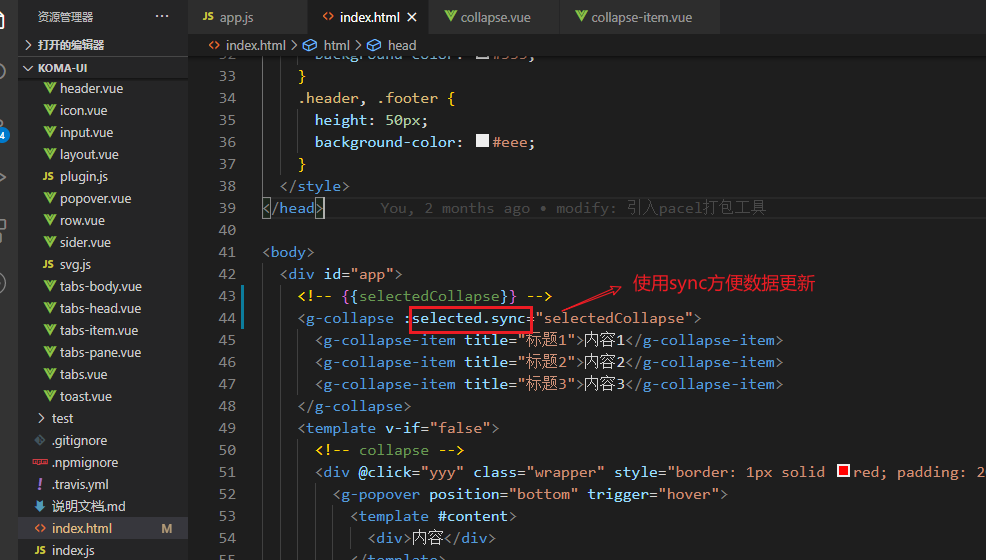
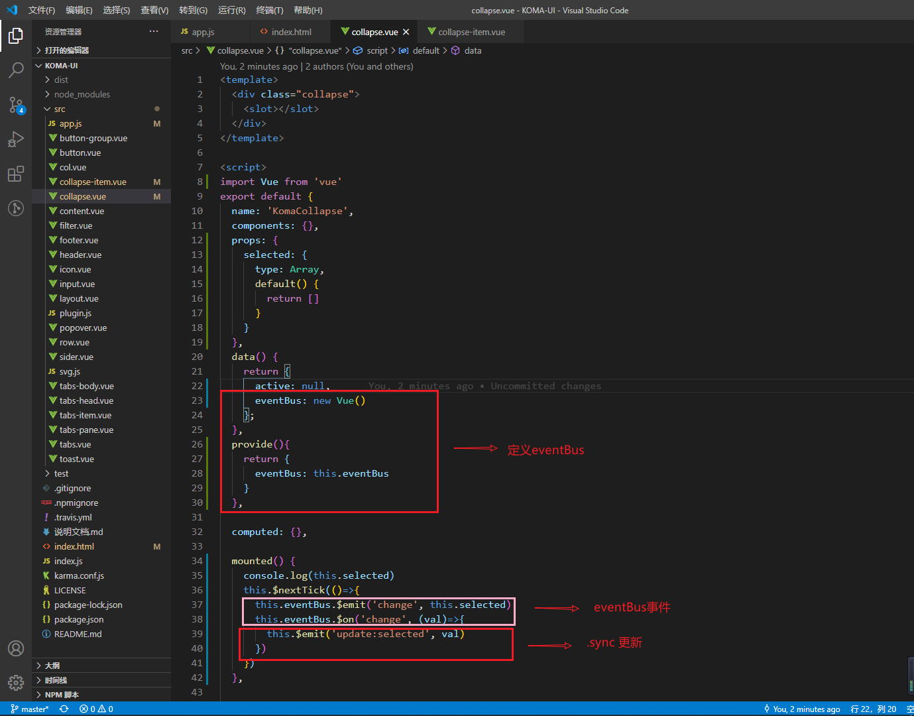
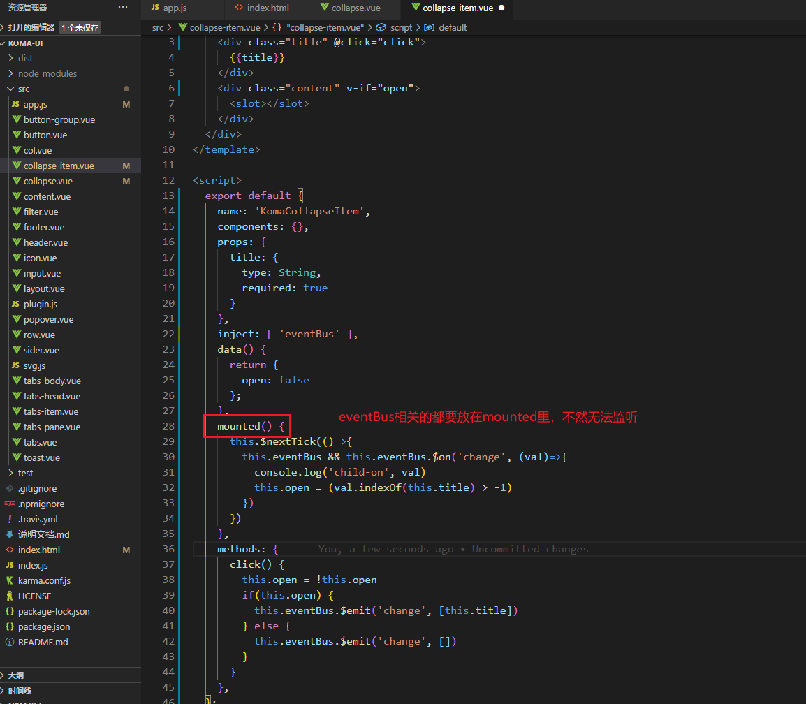
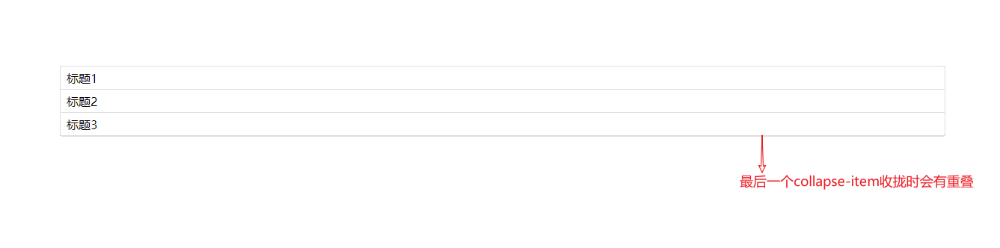
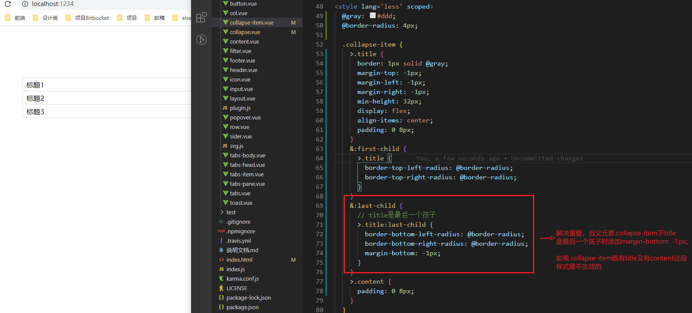
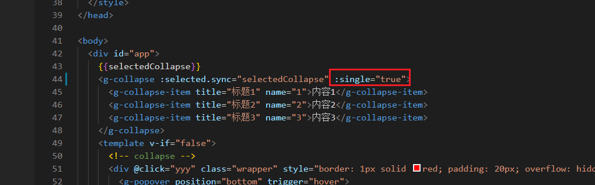
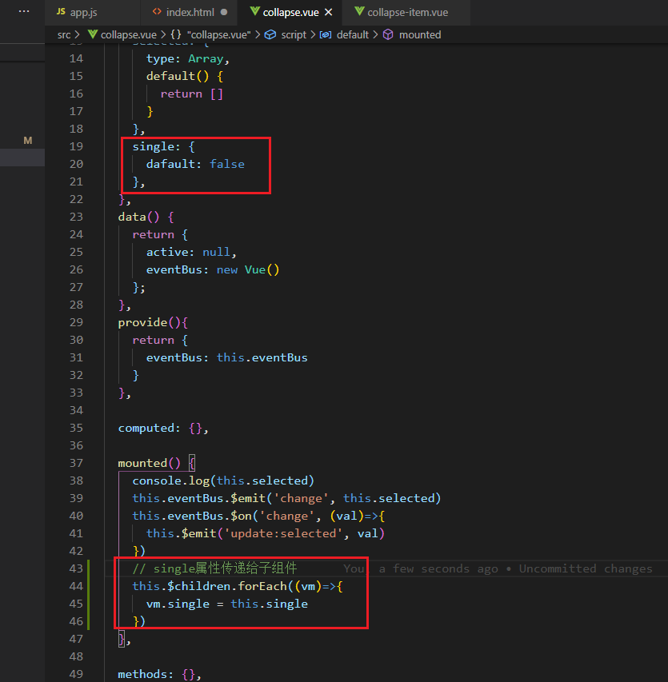
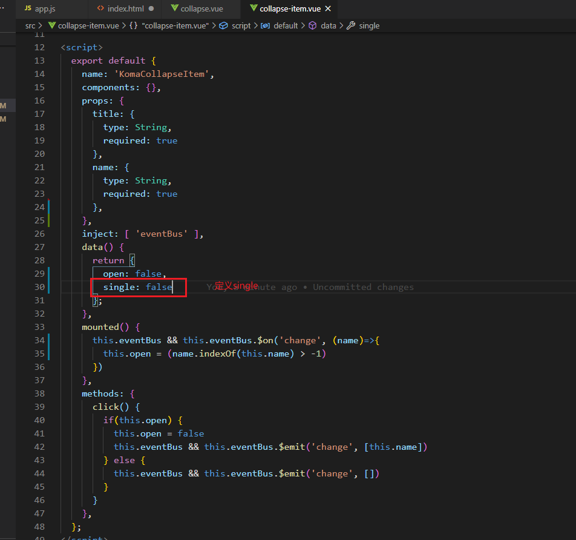
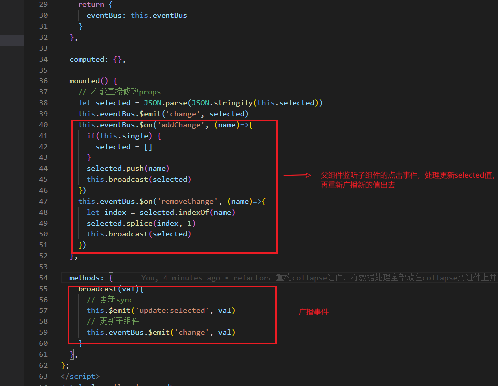
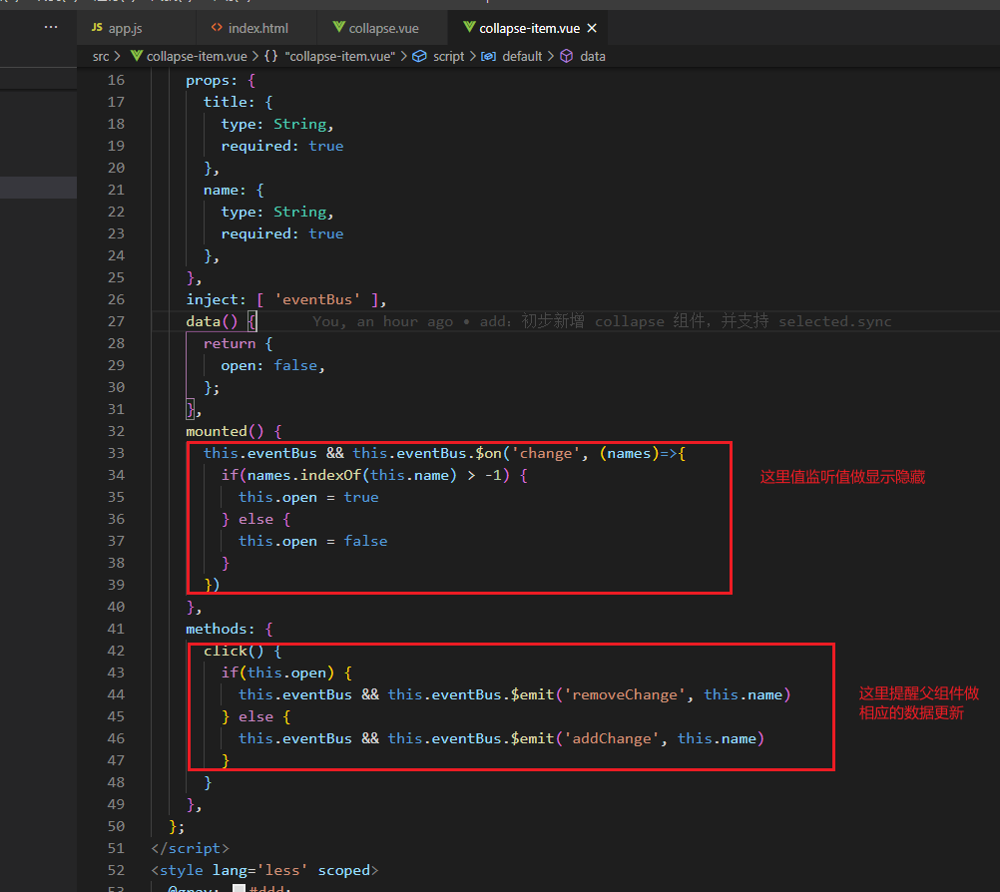

# collapse组件：

手风琴组件特点是点击某个collapse-item时要关闭其他几个。而且要通知并更新父组件绑定的selected。

综上我们要用到：
> 1. eventBus （在vue中使用要在mounted函数里，是因为**父组件触发eventBus发布订阅，只有在mouted时才能保证子组件已经创建好并能接收到**）
> 2. .sync

使用：
> html

> collpase父组件

> collapse-item子组件

## 1. 让collapse支持single属性
如何在collpase上绑定了single属性，同时collapse-item也能拿到该属性？

## 2. 重构collapse组件
将数据处理集中在collapse父组件上。
> 父组件

> 子组件

