# 搭建官网

### 1.如何使用Vuepress?

#### 安装：

```
// 安装
npm i vuepress -D   // 在项目中使用vuepress

// 创建docs
mkdir docs && echo '# Hello VuePress' > docs/README.md

// 在package.json中添加指令
"scripts": {
  "docs:dev": "vuepress dev docs",
  "docs:build": "vuepress build docs"
}

// 启动
npm run docs:dev
```

启动成功后会 `VuePress` 会在 http://localhost:8080 (opens new window)启动一个热重载的开发服务器。


#### 配置：
使用之前，新增配置文件创建一个.vuepress的文件目录：


##### 配置文件说明：


侧边栏的标题会默认取相对应文件夹里markdown文件的第一个标题，也可以直接自己再定义一个。


自定义标题和导航嵌套：
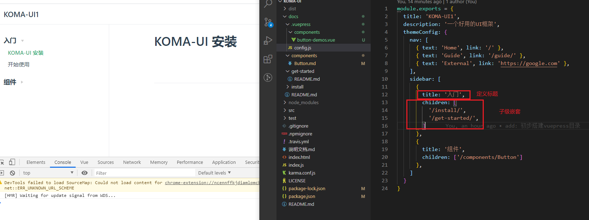


### 2. 在 markdown 中使用 vue组件
**所有在`.vuepress/components`中找到的`*.vue`文件将会自动被注册为全局的异步组件， 即只要在该目录下定义的组件，都将可以被直接引用。**

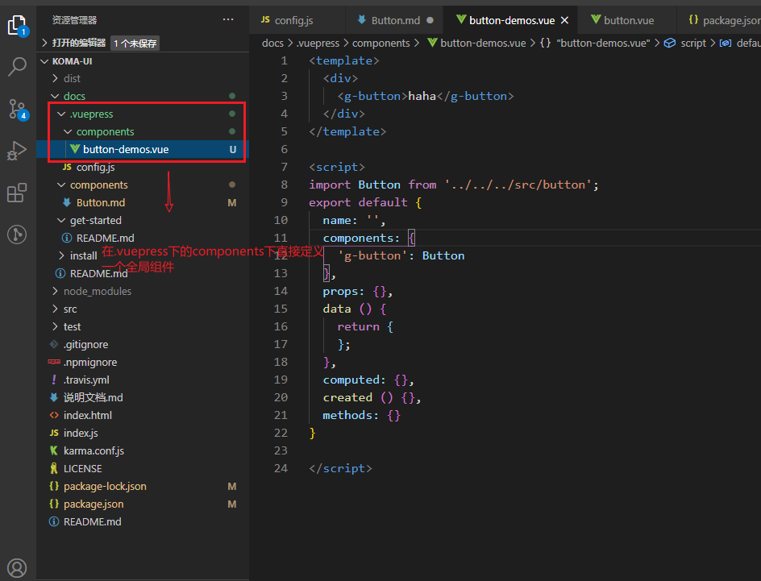

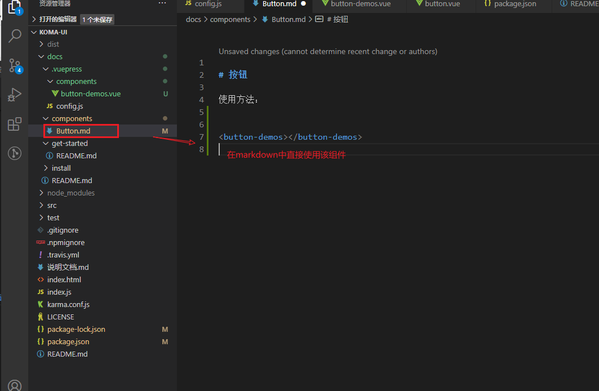

遇到一个bug:
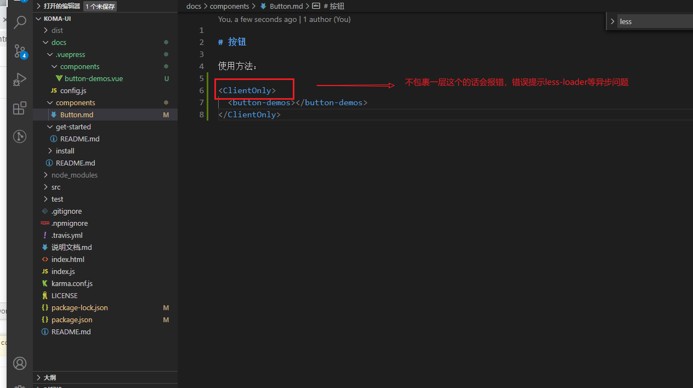
tips: 这个bug很奇葩，等我再次去掉包裹的那层时它又不报错了。


### 3. 在markdown中展示源码
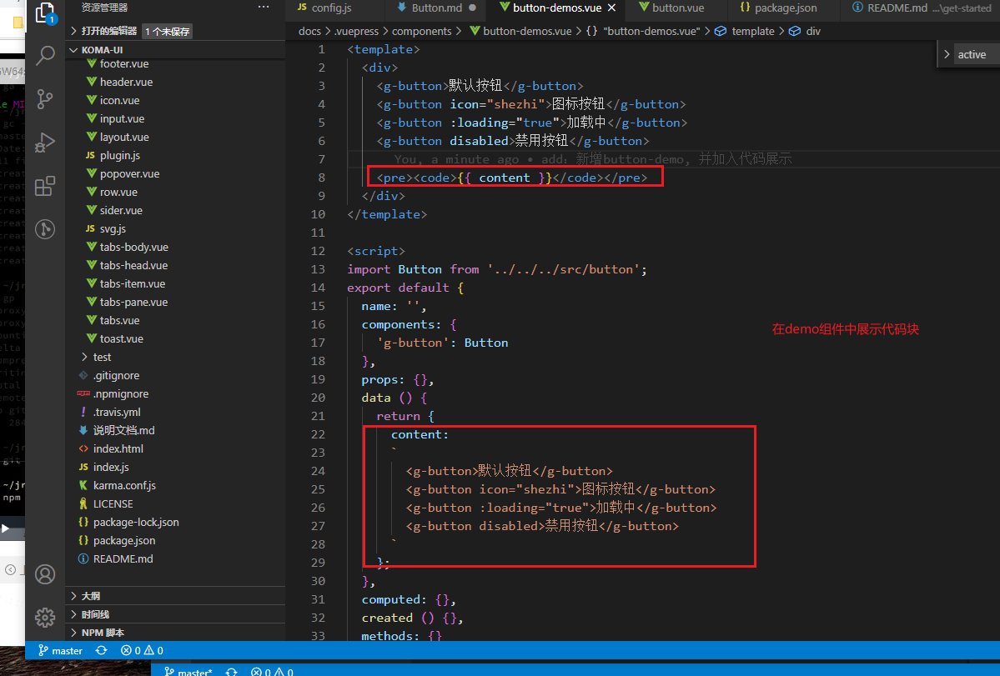


### 4. 打包部署
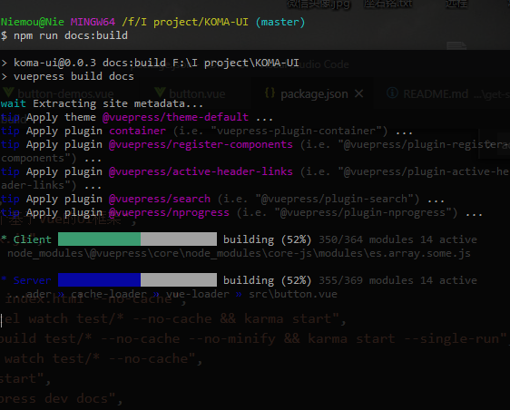

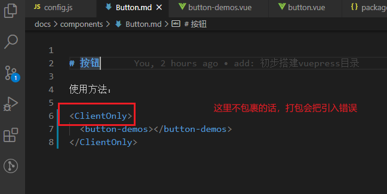

**在markdown中 demo组件不包裹`ClientOnly`会报错**
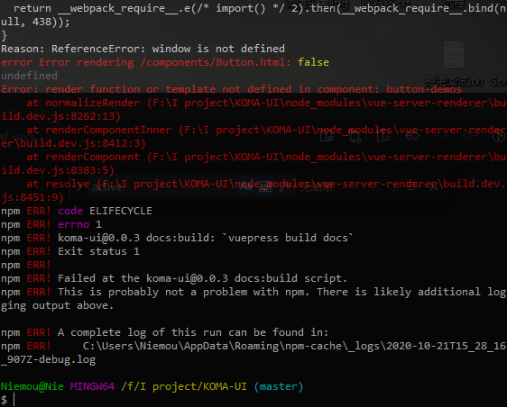


---
#### 部署:
[部署到githubPage链接](https://vuepress.vuejs.org/zh/guide/deploy.html#github-pages)

##### 具体步骤：
##### 1. 在 `config.js` 中加入base
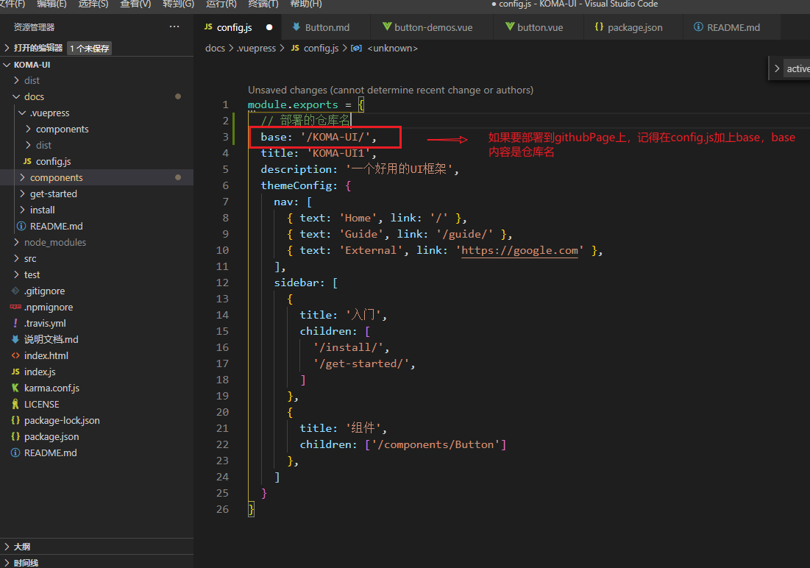

##### 2. 项目的根目录下创建一个如下的 `deploy.sh` 文件
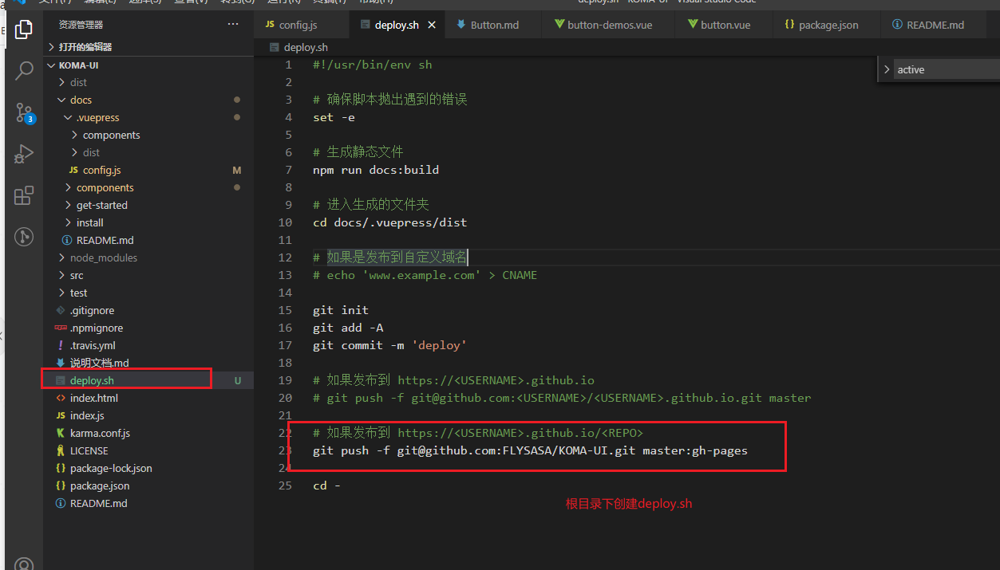

##### 3. 两种方式执行 `deploy.sh`
- 第一种 命令行直接 `./deploy.sh`


- 第二种 添加脚本
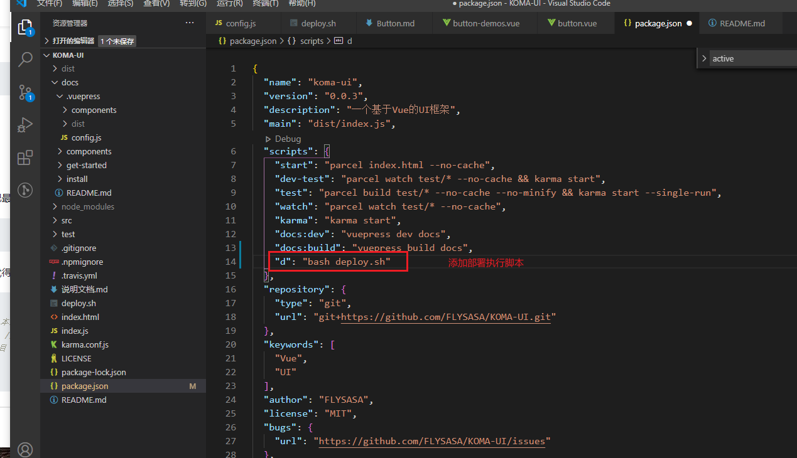
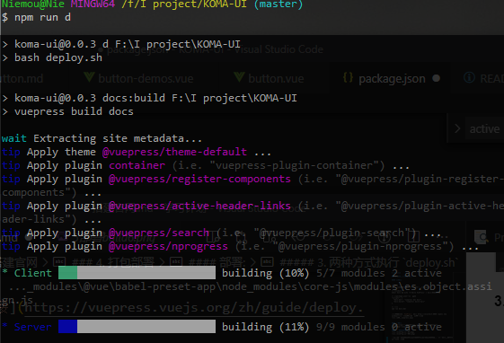


##### 4. 部署预览
更新完文档后，部署使用 `npm run d` 或者 `./deploy.sh`
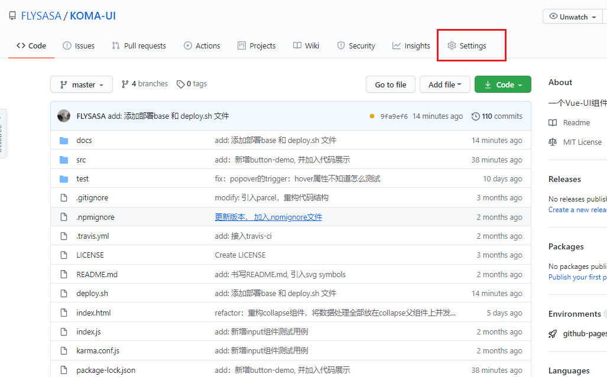
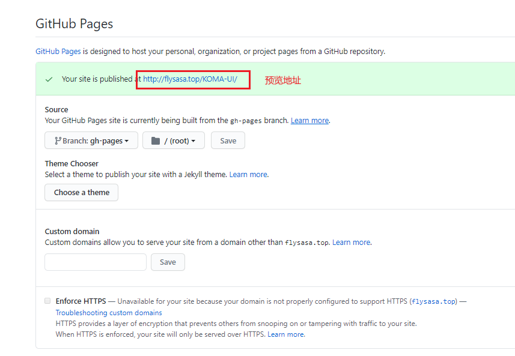
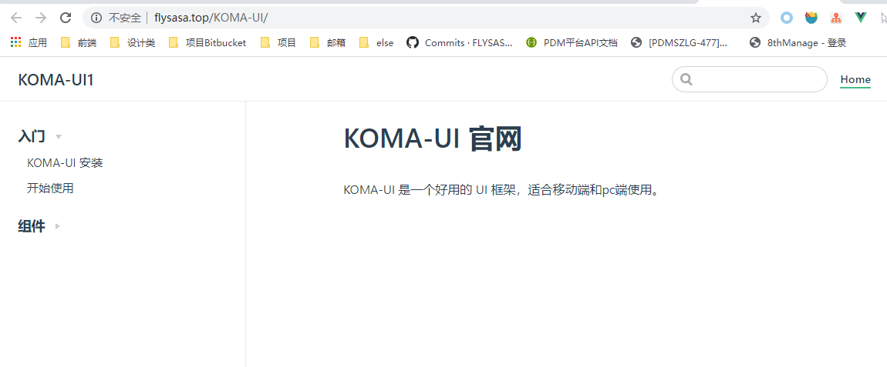