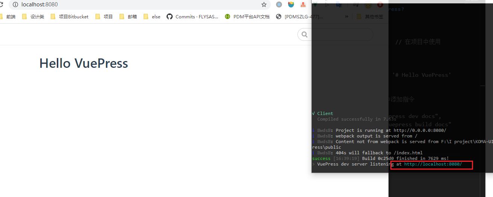
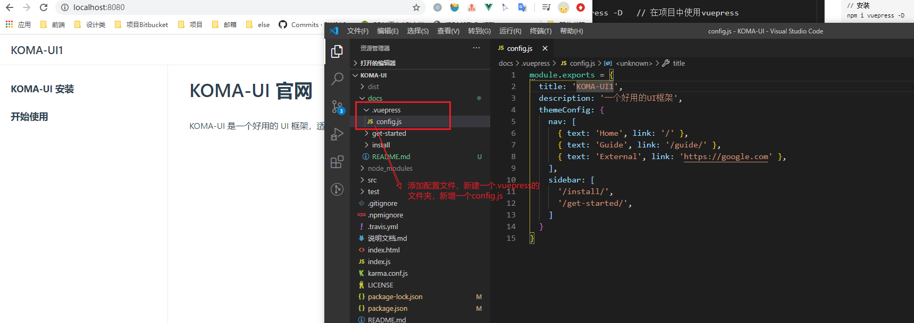
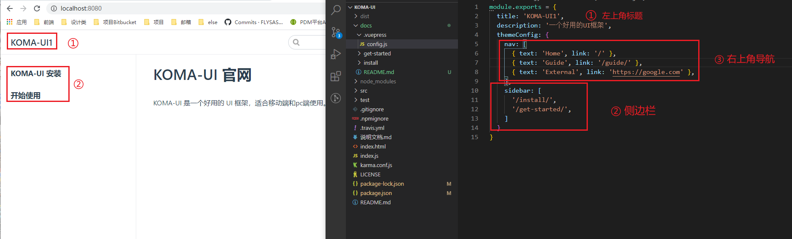
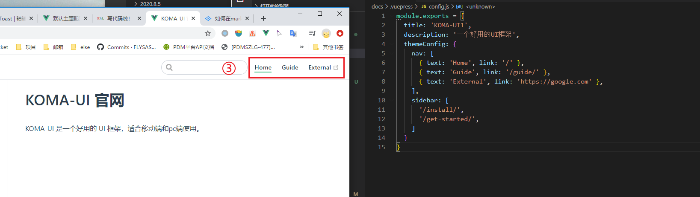

# 搭建官网

### 1.如何使用Vuepress?

#### 安装：

```
// 安装
npm i vuepress -D   // 在项目中使用vuepress

// 创建docs
mkdir docs && echo '# Hello VuePress' > docs/README.md

// 在package.json中添加指令
"scripts": {
  "docs:dev": "vuepress dev docs",
  "docs:build": "vuepress build docs"
}

// 启动
npm run docs:dev
```

启动成功后会 `VuePress` 会在 http://localhost:8080 (opens new window)启动一个热重载的开发服务器。



#### 配置：
使用之前，新增配置文件创建一个.vuepress的文件目录：


##### 配置文件说明：



侧边栏的标题会默认取相对应文件夹里markdown文件的第一个标题
