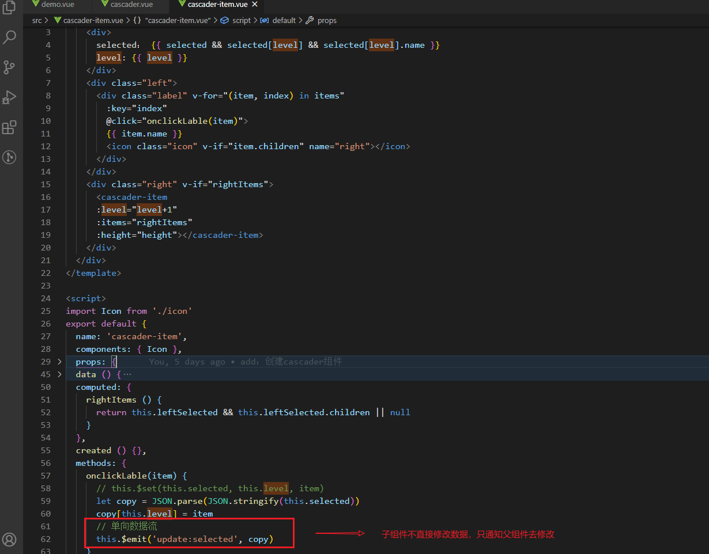
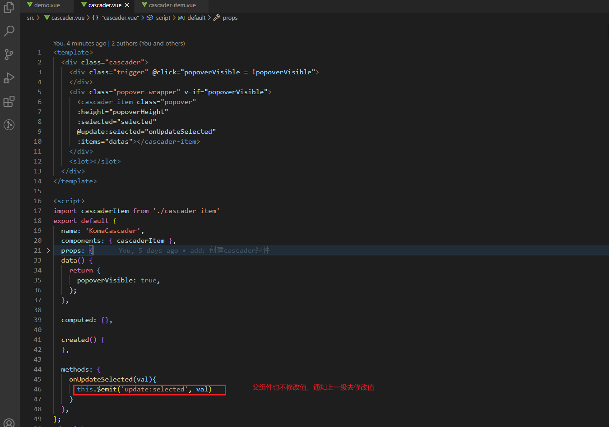
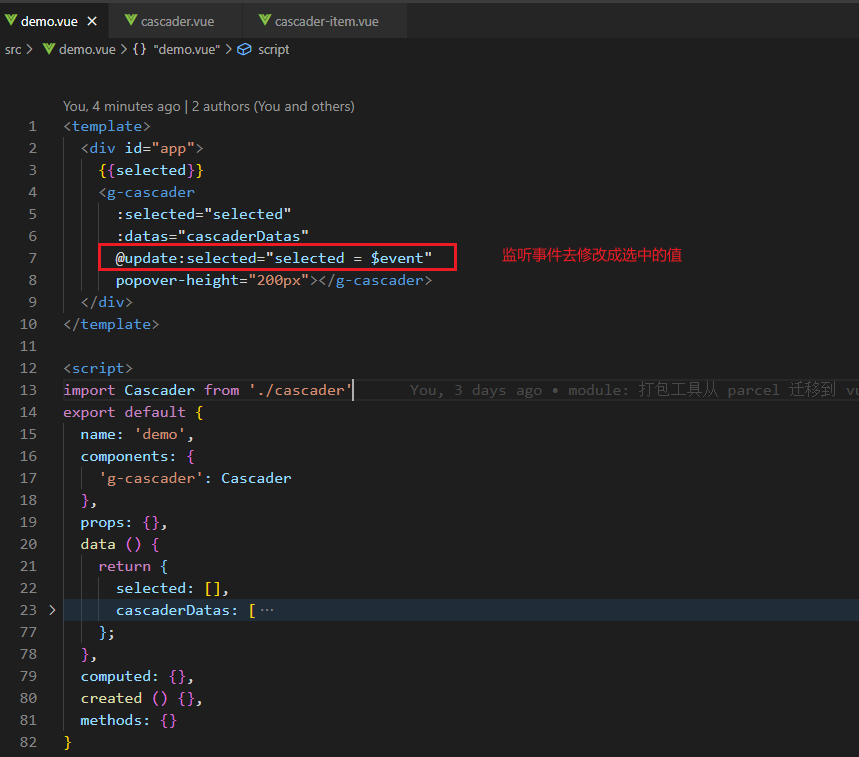
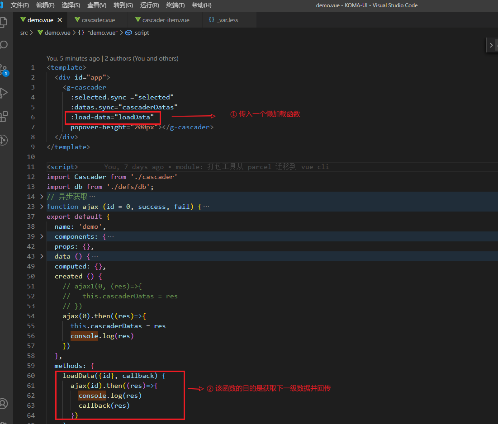
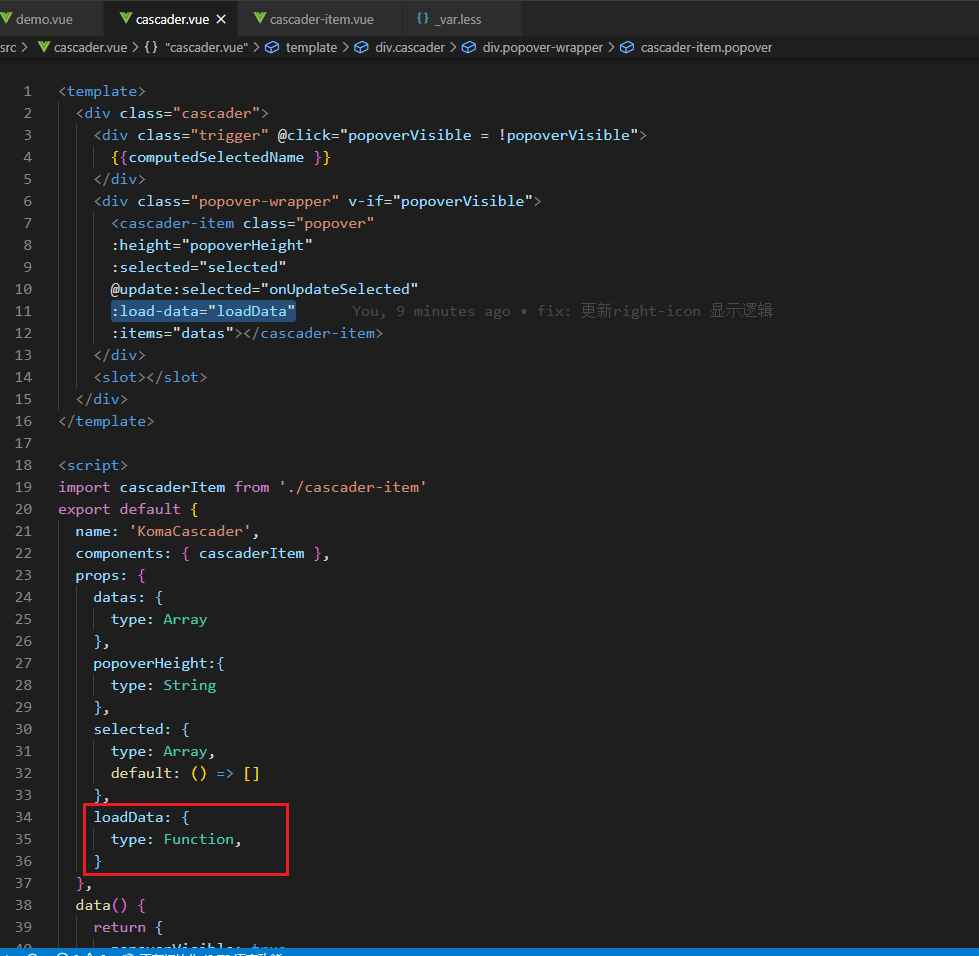
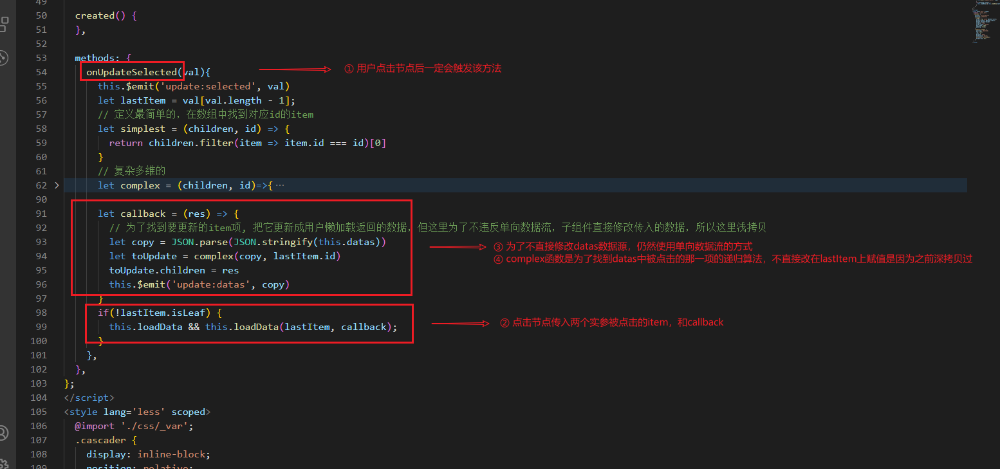
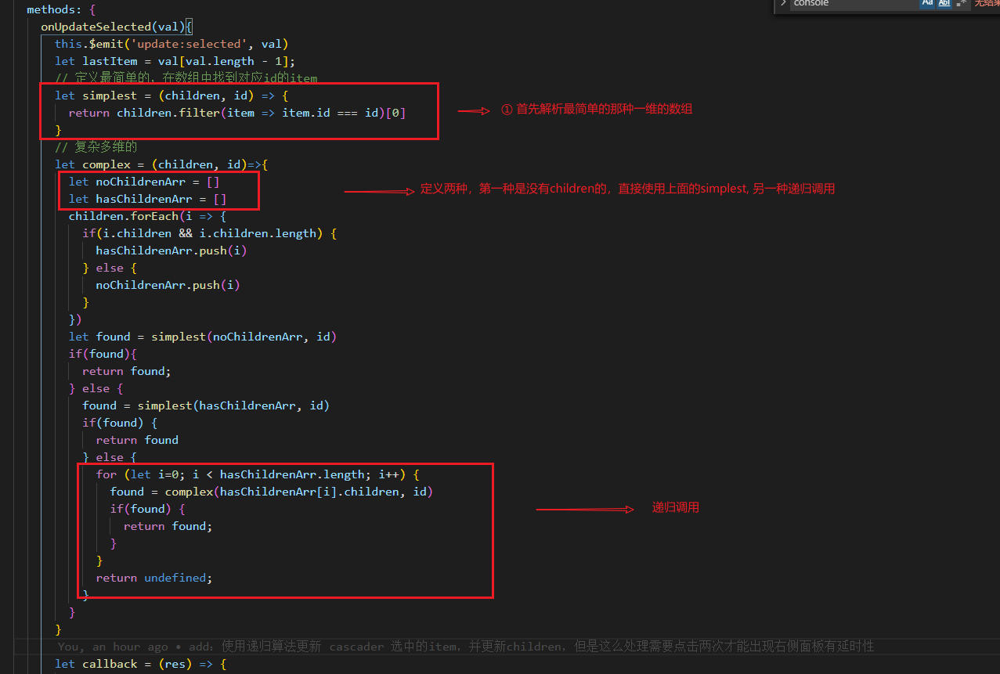

# cascader 组件

属性规则：

### 1.递归组件
cascader数据源不确定有多少层级，所以需要递归组件。

### 2. cascader 递归渲染实现方案

### 3. 重构成单向数据流
**核心子组件永远不要修改传入的数据，只通知父组件去修改**
子组件：

父组件：

爷组件：

### 3. cascader 懒加载数据回传
1. 用户使用懒加载回传数据

这个`loadData` 提供了两个参数，一个是**点击的节点**，另一个是**函数回调**。

2. 组件实现懒加载函数

3. 根据 `id` 递归找到 `datas` 中的 `item`

