#  打包工具从parcel迁移到cli

## 步骤：

### 1. 全局安装 vue-cli
```
npm install -g @vue/cli
```
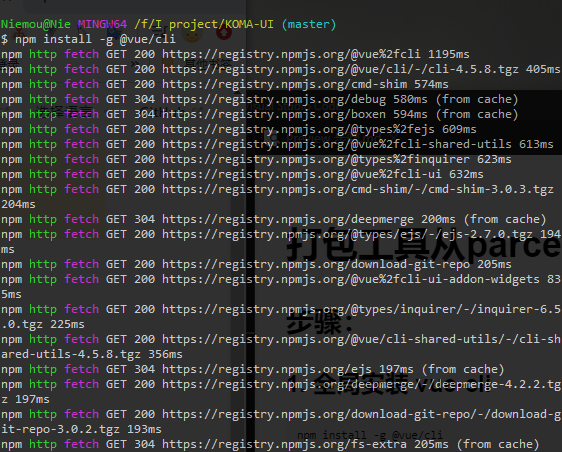

### 2. 在一个临时目录下创建 hello-world

- 1. 新建temp项目
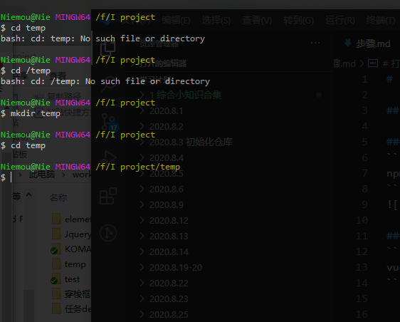

- 使用指令初始化项目：
  ```
  vue create hello-world
  ```

- 2. 初始化项目
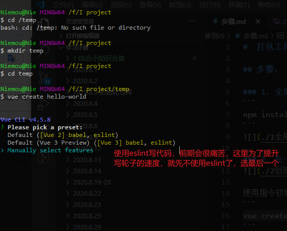
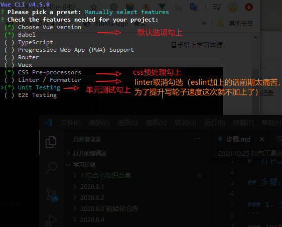
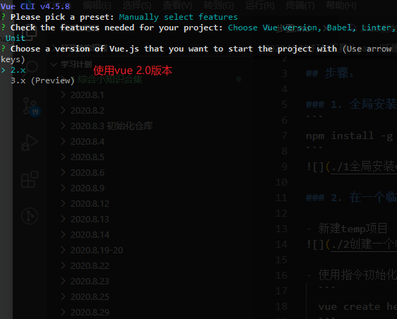
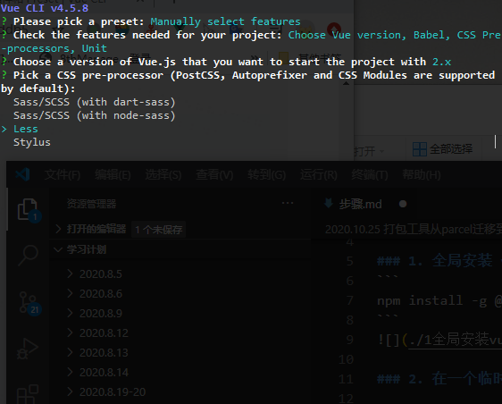
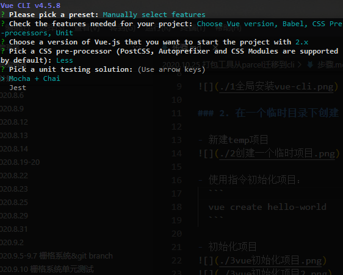
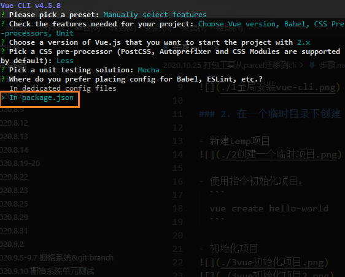
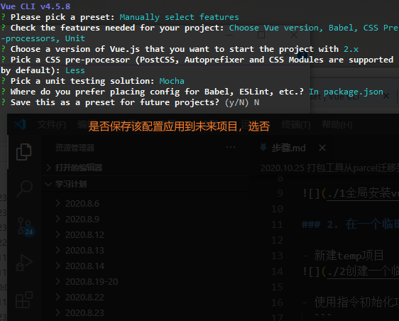
  等待初始化完成：
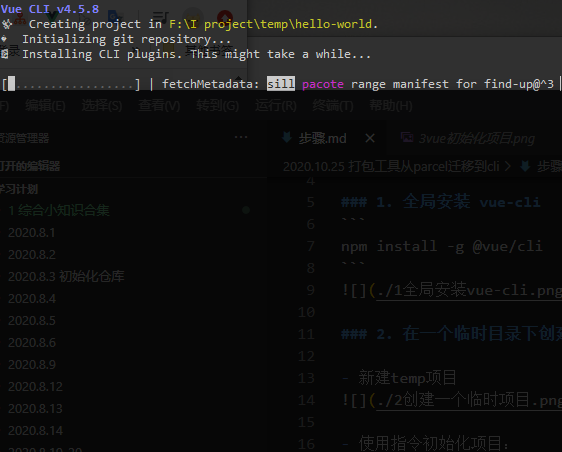
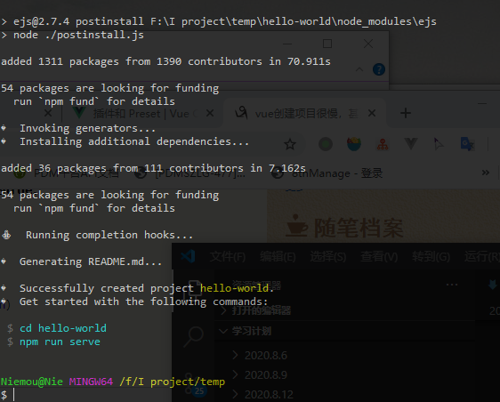
  **如果发现初始化特别慢的话，切成淘宝源即可**

- 3. 配置文件

  将 `hello-world` 的 `package.json` 和 `babel.config.js` 拷贝到你的项目
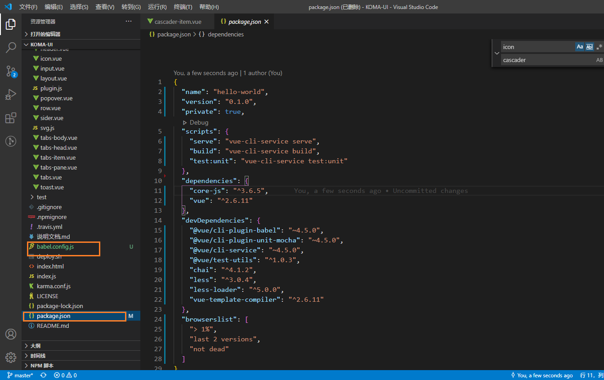

- 4. 重新安装 `node_modules`


- 5. 新建入口文件`src/main.js` 和 demo文件
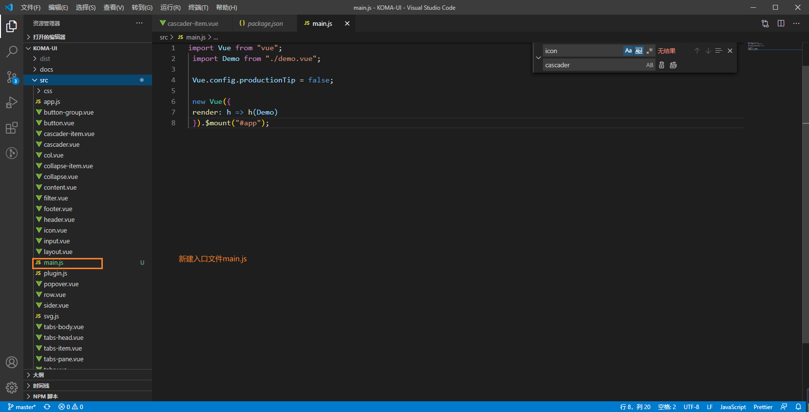
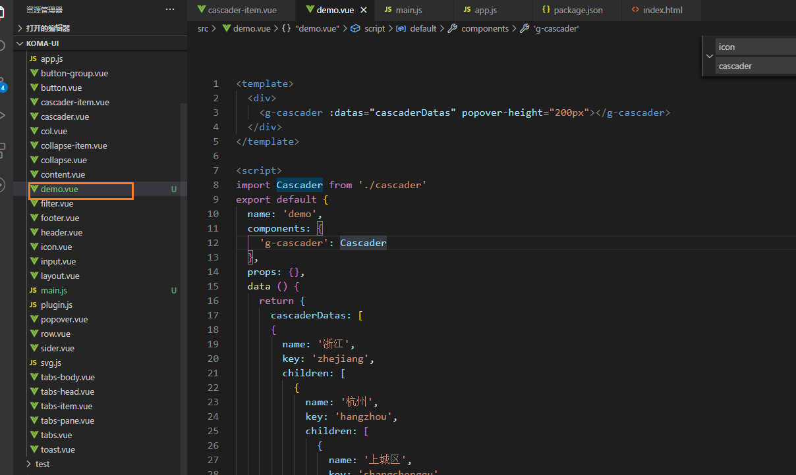

- 6. 运行 `npm run serve` 即可
运行成功
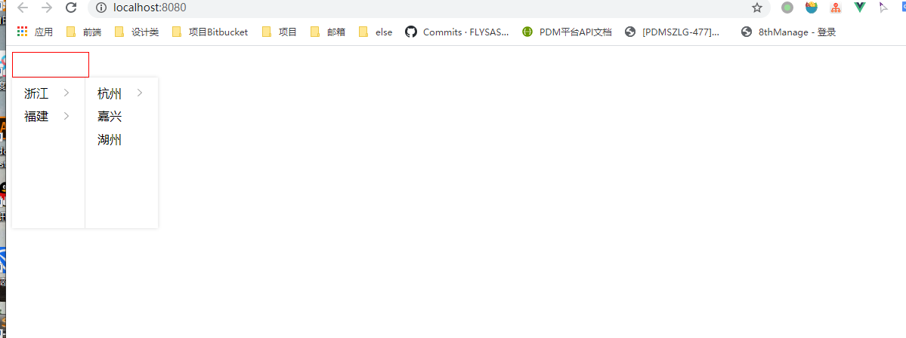