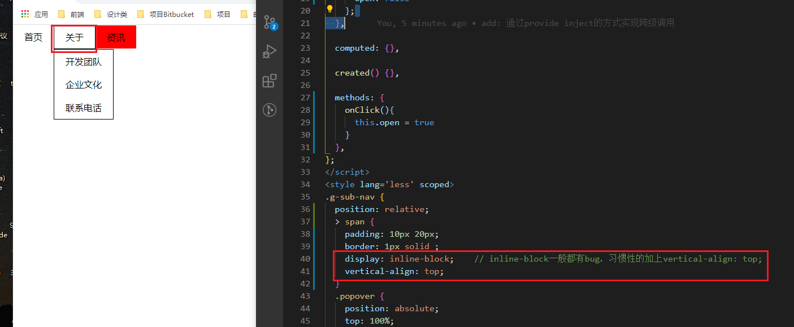
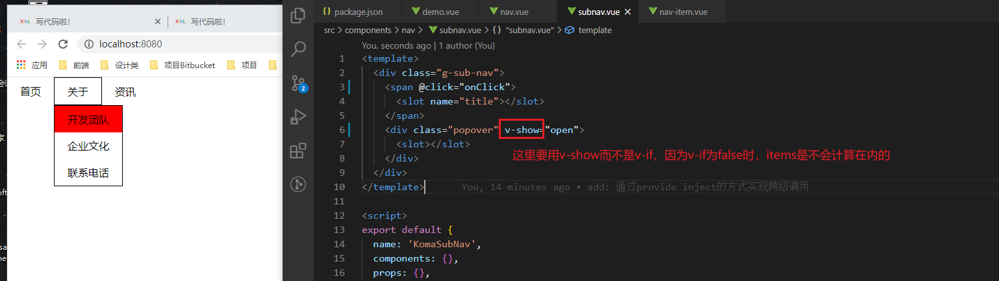
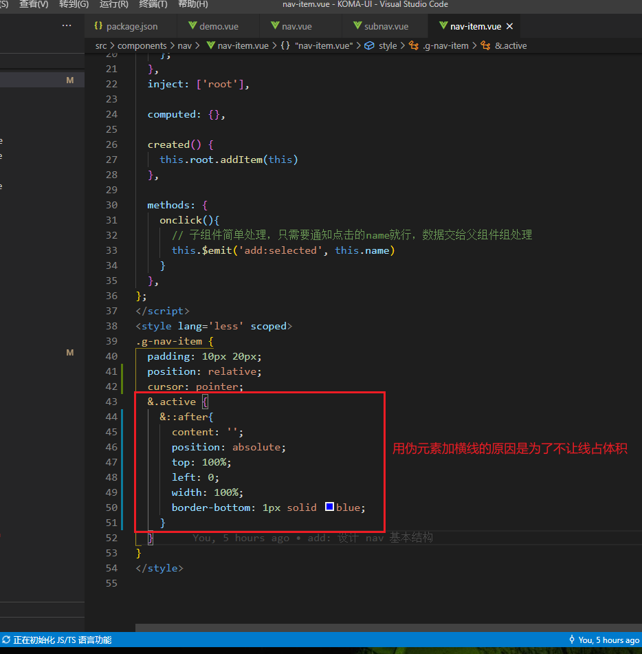

### 1. 使用provide inject方式去得到父组件的子组件
在以往的方式中，我们都是在父组件中使用遍历 $chilren 的方式去拿到子组件。但是这样面对跨级（如爷孙）这种方式就不是很好了。
如：
```js
// 1.以往的方式
// 这种方式的弊端在于，当其中有subNav中间子级时，无法拿到正确的子组件
computed: {
    items(){
      return this.$children.filter(vm => vm.$options.name === 'KomaNavItem')
    }
  },

// 2.provide 和 inject 的方式
// 父组件 provide
data(){
  return  {
    items: [],
  }
},
provide(){
  return  {
    root: this
  }
},
addItem(vm) {
  this.items.push(vm)
},

// 子组件或者孙子组件 inject
inject: ['root'],
created() {
  this.root.addItem(this)   // 子孙组件直接在created后就通知父组件我的存在
}
```

**这样做的好处就是，就算中间隔了好几代，依然能知道对应子组件的实际数量。**

### 2. `inline-block`的bug
使用`display: inline-block;`一般都有bug，所以推荐加上 `vertical-align: top;`


### 3. v-if 和 v-show 的取舍
当组件`v-if`为`false`时，并不会计算在items里面，这会引发更新问题，所以使用`v-show`。


> 两者的区别：
> 1. 渲染方式 
`v-if` 让元素是否渲染在页面中
`v-show` 是一直存在页面中，只是display为none
> 2. 生命周期
`v-if` 为true时，元素created，为false时元素`destroy`
`v-show` 不会更改周期钩子，只修改样式

### 4. 伪元素加横线

