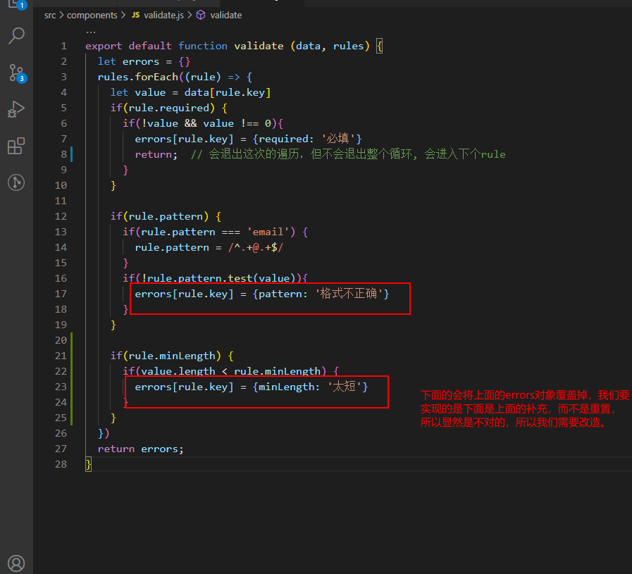
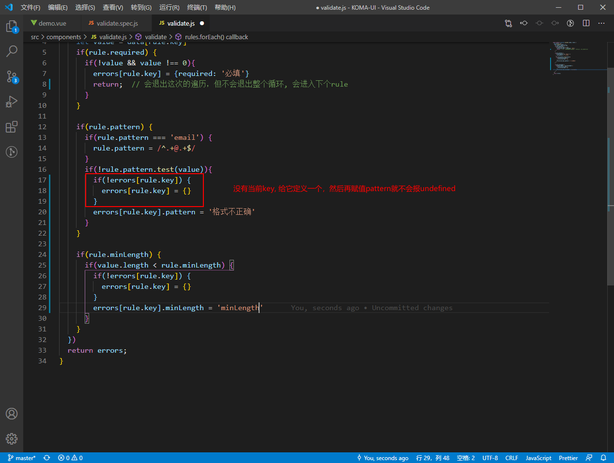
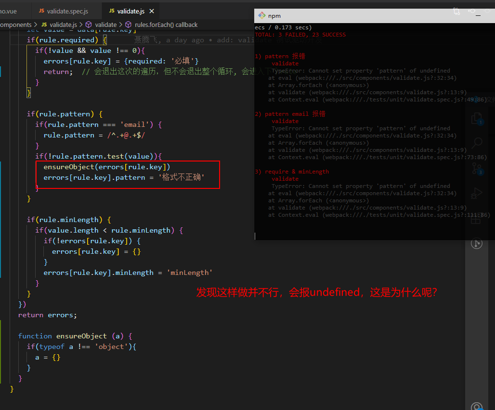
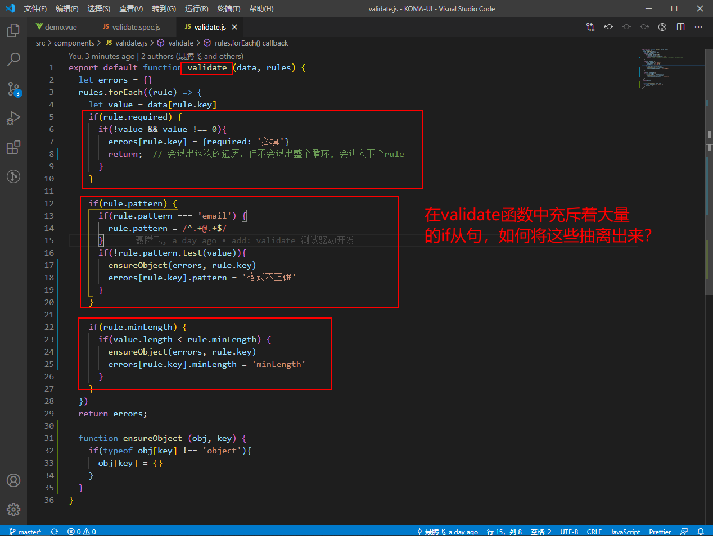
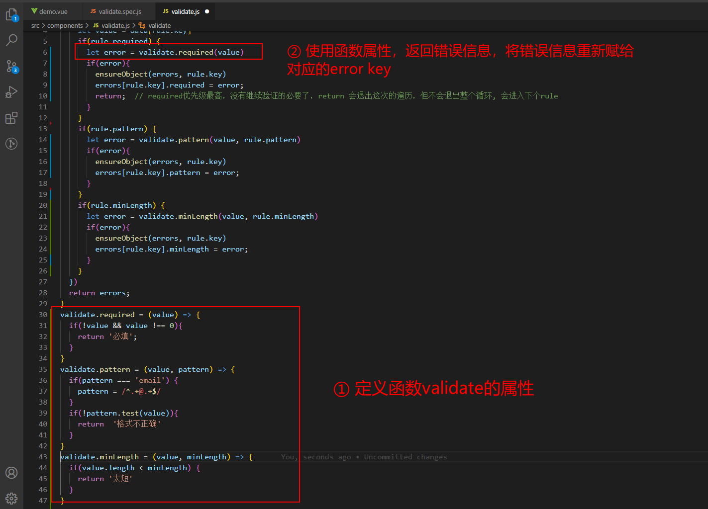
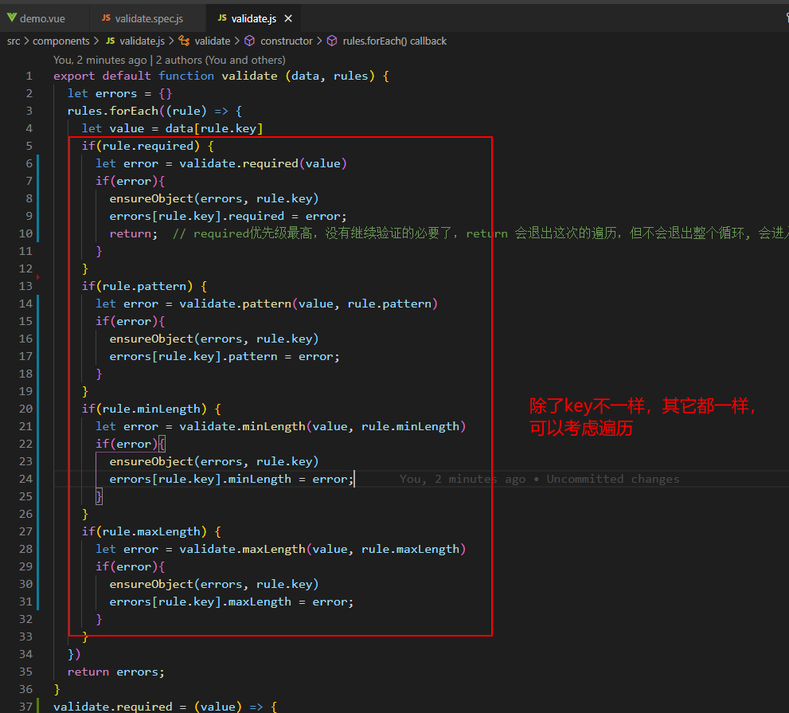
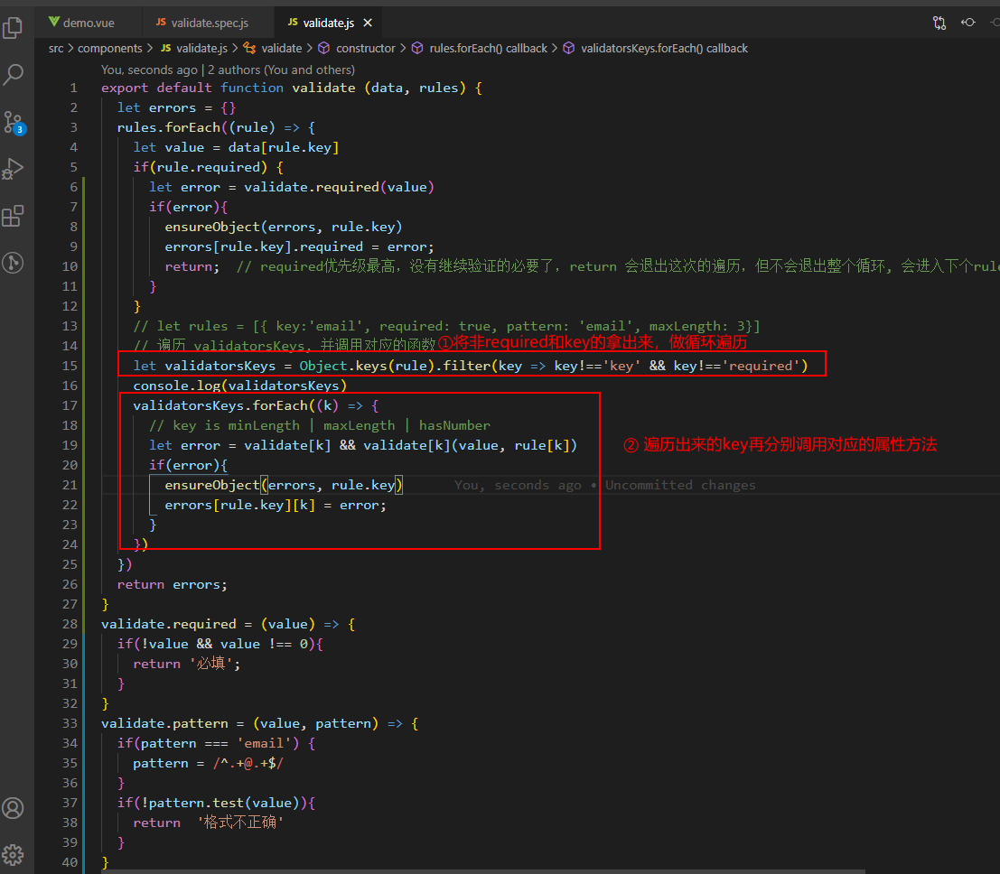
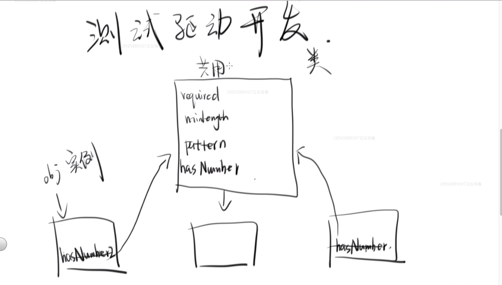
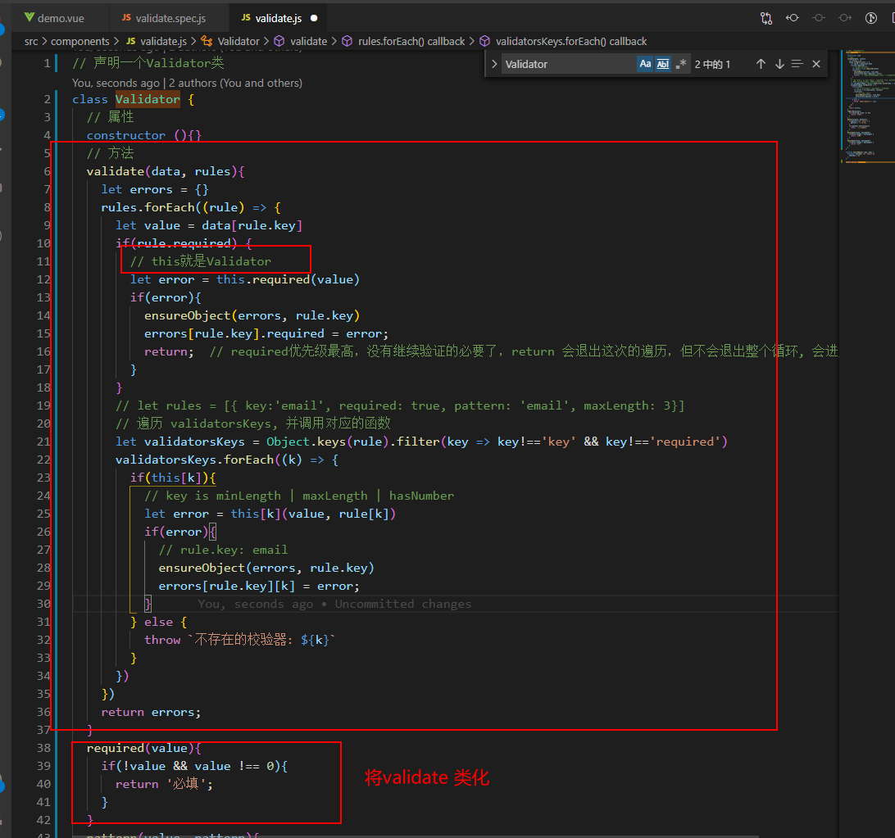
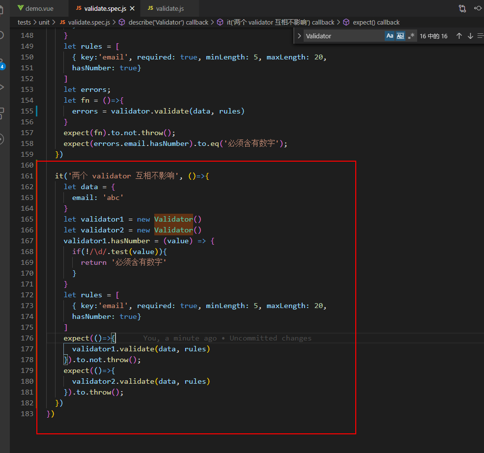

## validator验证规则

[初步实现示例](https://jsbin.com/vahosejeyu/edit?html,js,output)

#### 测试驱动开发
先写测试，再开发组件。

在validate中，我们遇到一个问题，会出现errors对象被重置的问题：



解决重置问题：


这样一来重复代码就很多，优化一下：


解析：
```js
let obj = {}
ensureObject(obj.x)
console.log(obj.x)  // undefined

function ensureObject (a) {
  if(typeof a !== 'object'){
    a = {}
  }
}

// 出现undefined的原因是， 将 a = obj.x, 如果a = {}的时候内存引用发生变化， obj.x不再指向a
```

解决：
```js
let obj = {}
ensureObject(obj, x)
console.log(obj.x)  // undefined

function ensureObject (obj, x) {
  if(typeof obj[x] !== 'object'){
    obj[x] = {}   // 这样引用并没有变化，只是追加了个key值
  }
}
```

### 1. 优化现有验证逻辑：


**函数本身就是对象，可以给validate直接追加属性, 优化如下:**



**再次优化：**


**遍历keys：**



### 2. 抽离为类


这样做的原因： 避免扩展自定义验证规则时，相互影响。



