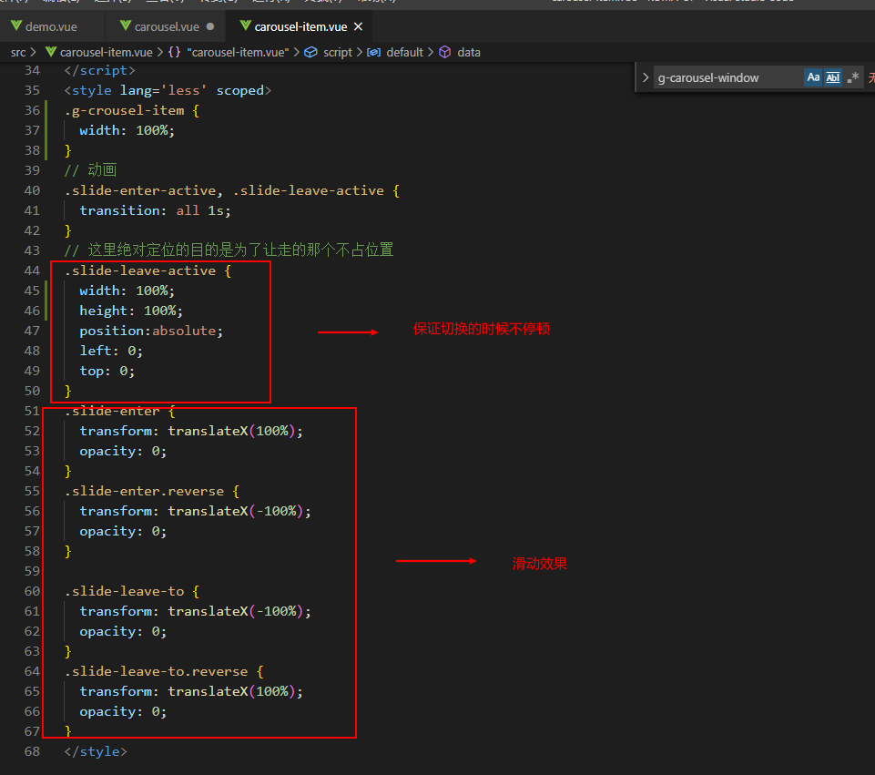

## slides轮播组件

### 1. 结构构思
 
 

 

> 实现思路：
> 1.拿到最外层`selected` 传的参数后，`prop` 传给 `g-carousel`, 在carousel mounted时候去通知其子组件 `carousel-item` 选中的值。

 

> 2. 子组件`g-carousel-item`只需要 判断selected值是否等于自身的name即可，等于则显示。

 