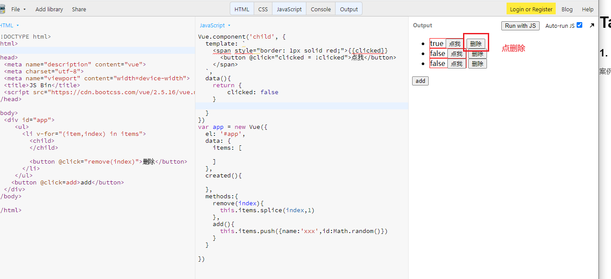
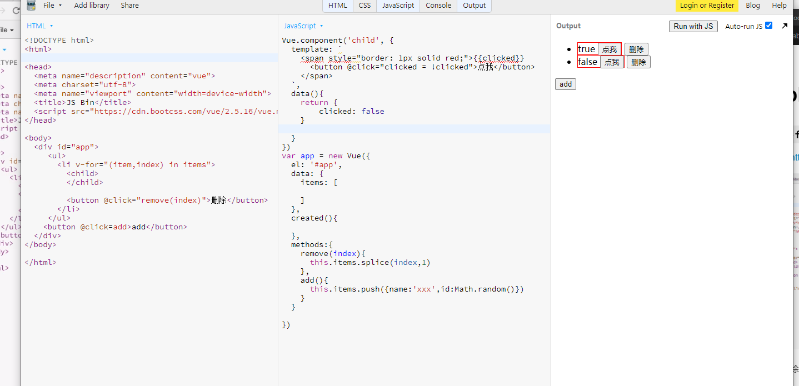
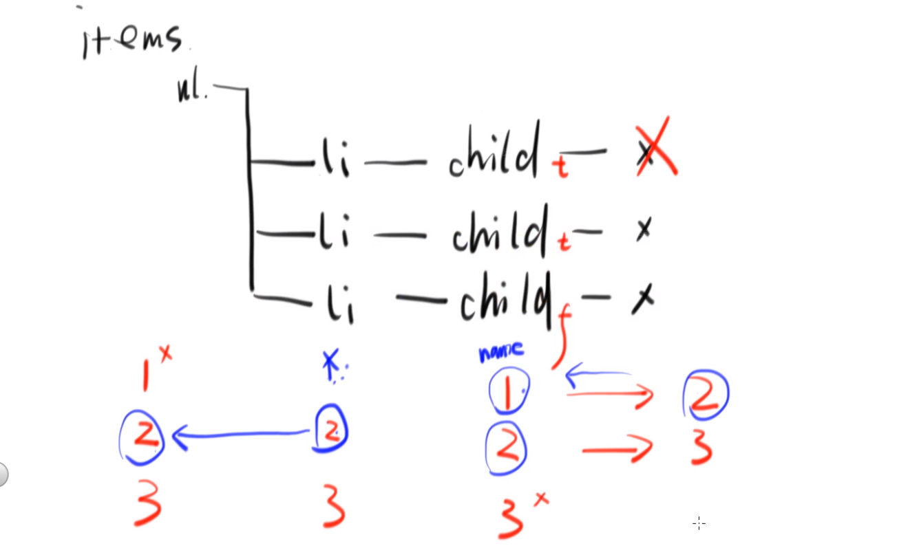

# Table组件

### 1. `v-for`循环中`key`的重要性

案例：https://jsbin.com/pagileduki/edit?html,js,output



点击删除后，会发现没有将true的删掉，而是将最后一个删了


这是因为如果在v-for循环中不添加key的话，vue不知道具体删的是哪个，它会把第二个变成第一个，第三个变成第二个，然后删掉第三个。


> 综上：在v-for循环里一定要给一个key作为唯一标识，而且这个标识尽量不要用index, 否则就会出现上述问题。

### 2. 判断两个数组里的元素是不是全等 
在table里，全选框的需要判断当勾选的数组等于dataSource时，需要自动勾选上。
```js
computed: {
  isAllItemSelectd(){
    // return this.dataSource.length === this.selectedItems.length
    // 上面的判断是不对的
    // this.selectedItems = [{id: 2}, {id: 1}]
    // this.dataSource = [{id: 1}, {id: 2}]
    // 如何判断上面两个数组元素是相等的？
    // 注意sort默认是按字典排序的，即 [1, 2, 11, 22].sort()  =>  [1, 11, 2, 22], 并且会改变原数组！
    // 因为sort会改变原数组，所以前面map一下产生一个新的数组
    const a = this.dataSource.map(i => i.id).sort() 
    const b = this.selectedItems.map(i => i.id).sort()
    let equal = true;
    for (let i = 0; i < a.length; i++) {
      if(a[i] !== b[i]){
        equal = false;
        break;
      }
    }
    return equal;
  }
}
```

