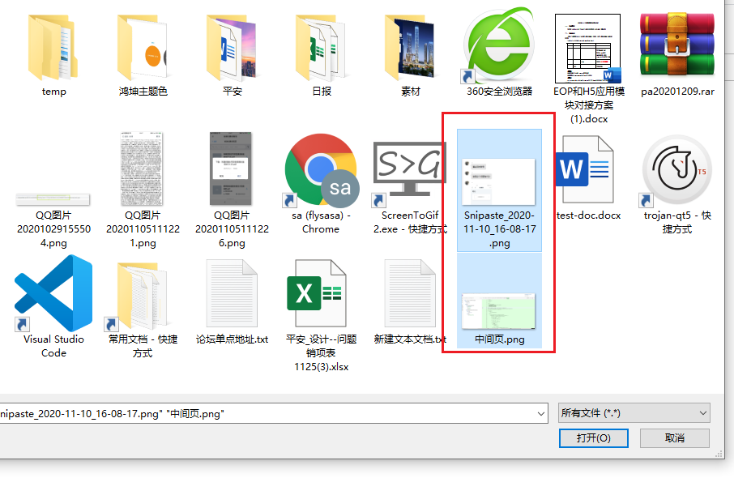
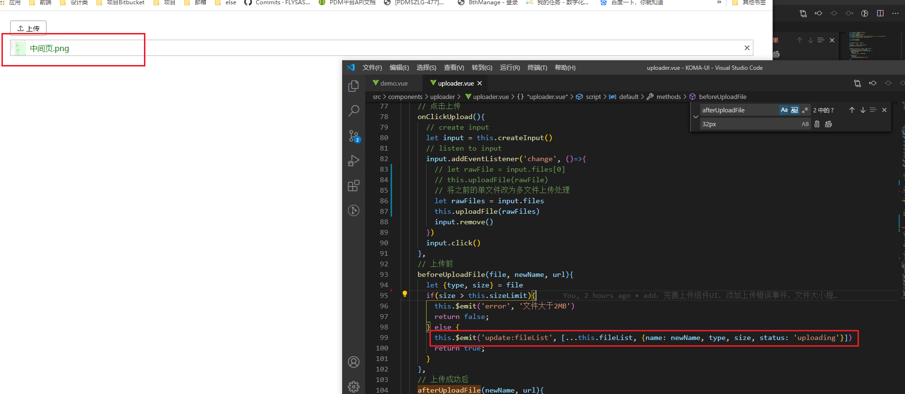
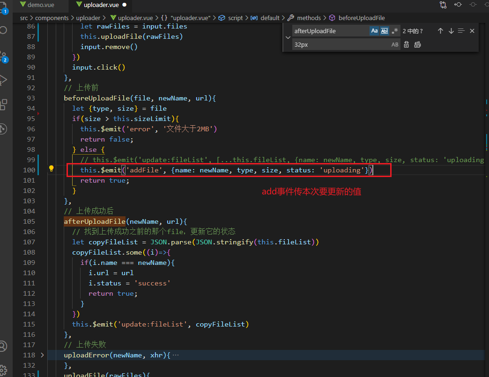
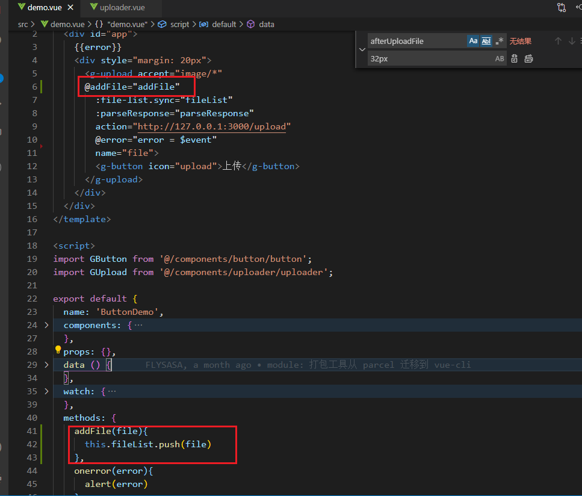
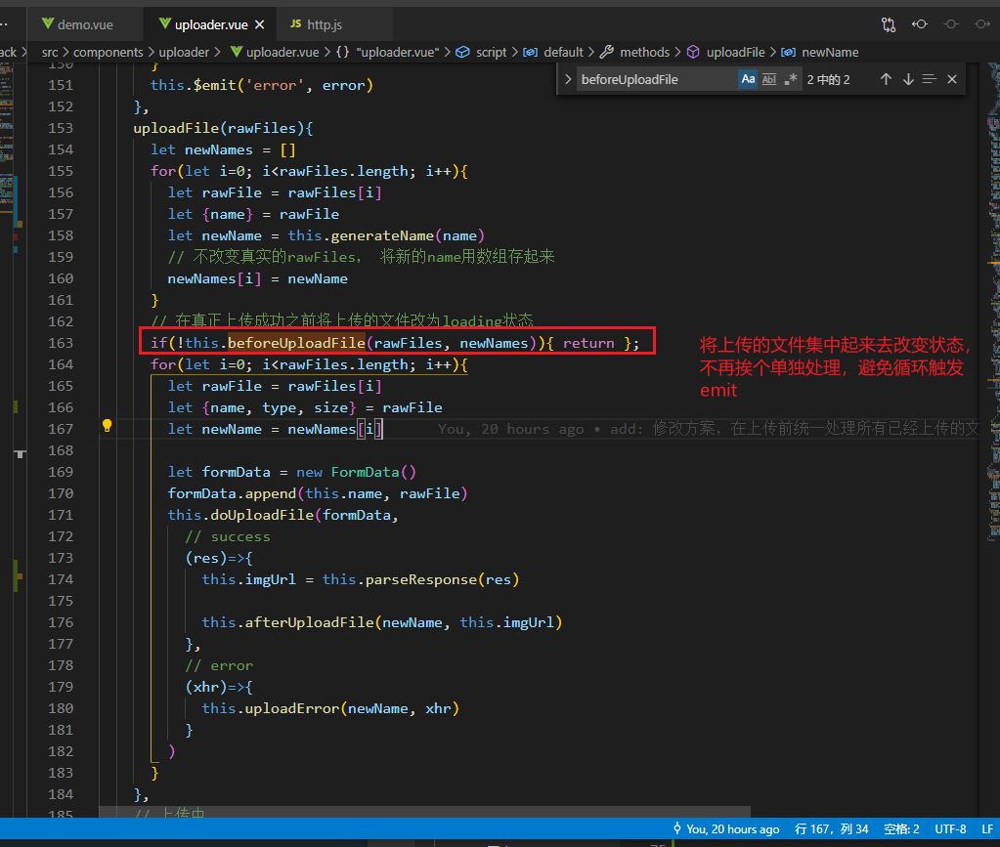
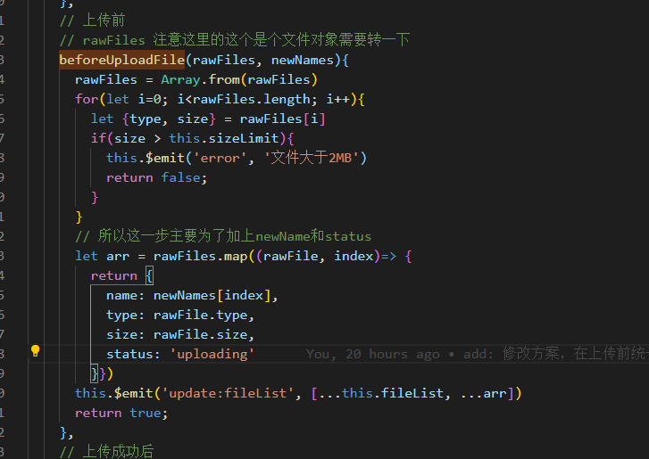
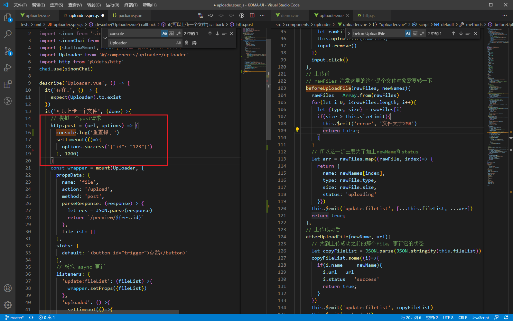
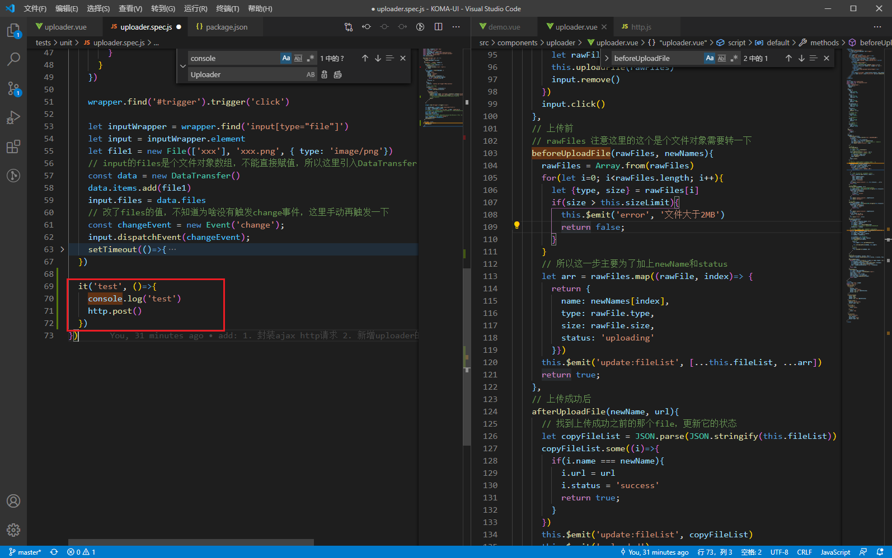
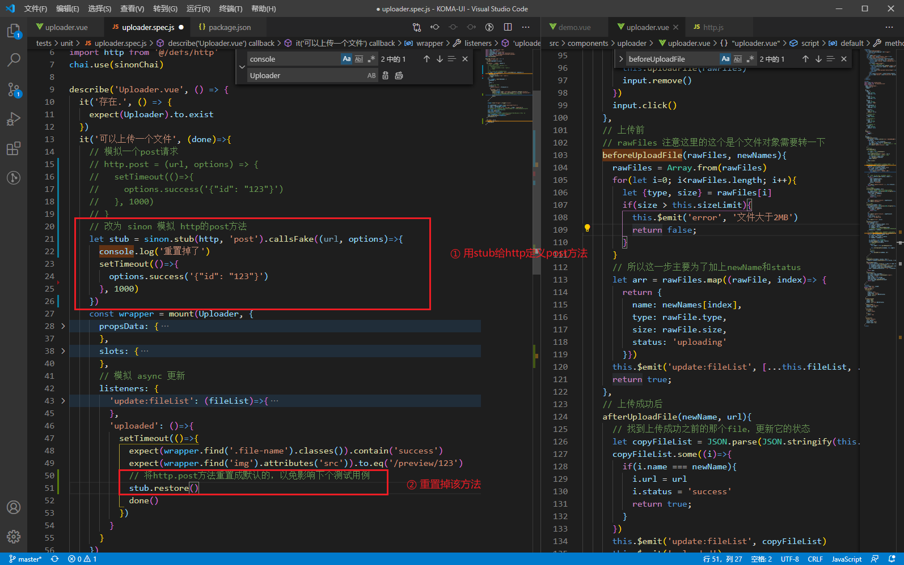
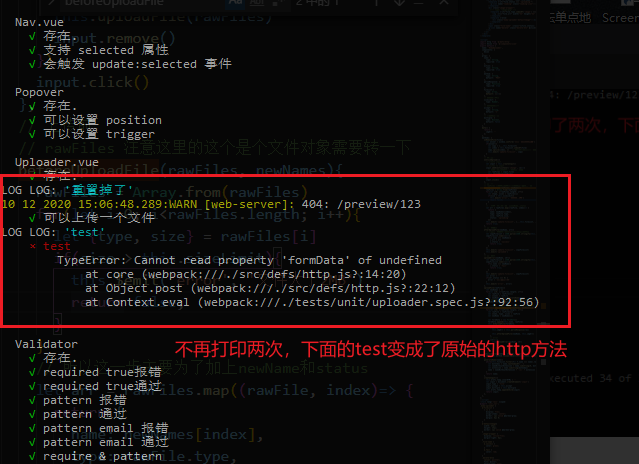

## uploader组件

### 1. 一个异步渲染的bug
在文件上传过程中，定义了一个 上传前的函数:
```js
props: {
  file: ''
}
methods: {
  // 点击上传触发
  uploadFile(){
    this.beforeUploadFile()
    this.uploadFileError()
  },
  // 上传前
  beforeUploadFile(){
    this.$emit('update:file', 'xxx')
  },
  // 上传失败
  uploadFileError(){
    // 这里打印出来还是为空， 即使beforeUploadFile优先执行，而且改变了file的值
    console.log(this.file)   // ''
  }
}

```

解决这个bug也很简单：
```js
uploadFile(){
    this.beforeUploadFile()
    this.$nextTick(()=>{
      this.uploadFileError()      // 改为异步即可
    })
  },
```

### 2. 父组件如何直接拿到子组件emit传过来的值？
```vue
// 父组件
// 这里的error就直接等于了 $evnent
{{error}}
<child @error="error = $event"></child> 

export default {
  data(){
    return {
      error: '',
    }
  }
}

// 子组件
this.$emit('error', '你错了')
```

### 3. 解决子组件同步多次触发 emit， 出现合并的现象
当我们将上传组件改为多文件上传时，遇到一个bug：
即使选中多个文件，最后显示在页面上的只有一个



**同步多次emit，只会以第一次emit的数据为主**

解决办法：
#### 1. 添加一个add监听事件


> 好处： 这样能保证数据的更新在父组件处理，不会出现emit合并
> 坏处： 需要使用者强制监听一个新事件

#### 2. 将所有的文件集中起来，去改变name和状态等




### 4. 测试用例中的方法重置 sinon-stub

在测试用例中需要模拟http请求，会重置掉post方法：


这样做为有个弊端，会把别的测试用例的也重置掉



引入 stub 解决问题：

