### npm发布包

#### 1. 新增`.npmignore`
```
/node_modules/     // 前面加 / 代表根目录下， 后面加 / 代表目录
/.cache/
/docs/
/src/
/tests/
```

#### 2. 执行 npm publish
1. 报错：私人库的问题
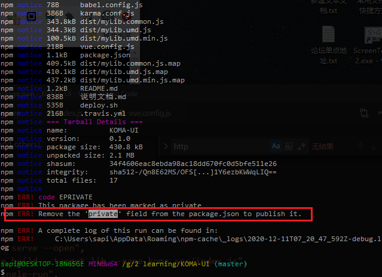
**解决：去掉`package.json`里的 `private: true`**


2. 报错：报淘宝源无权限的问题
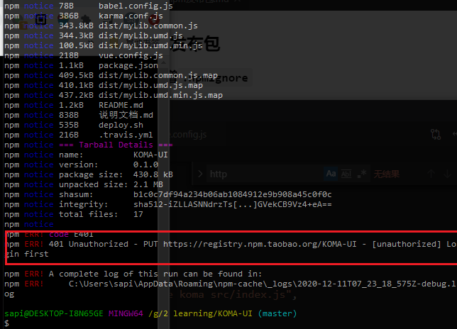
**解决：设置回淘宝源**
`npm config set registry https://registry.npmjs.org`

3. 报错：Not-found
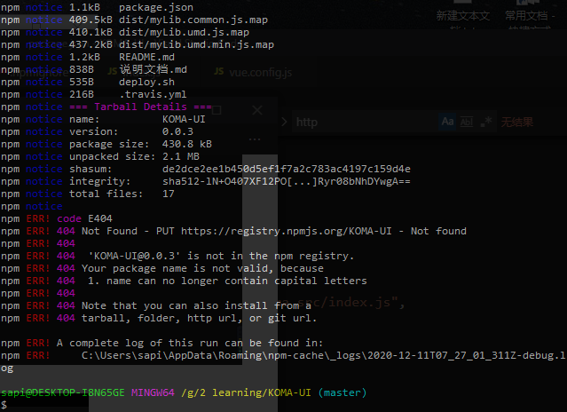
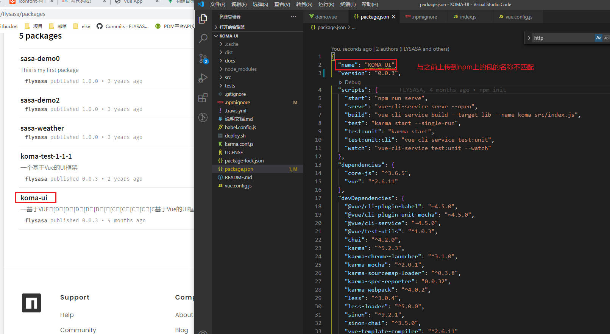
**解决：登录账号**
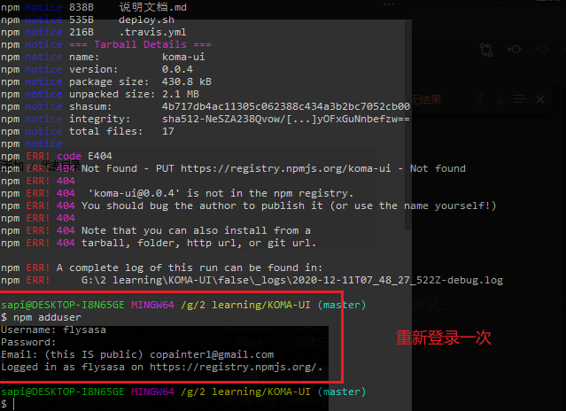

4. 报错：403 Forbidden
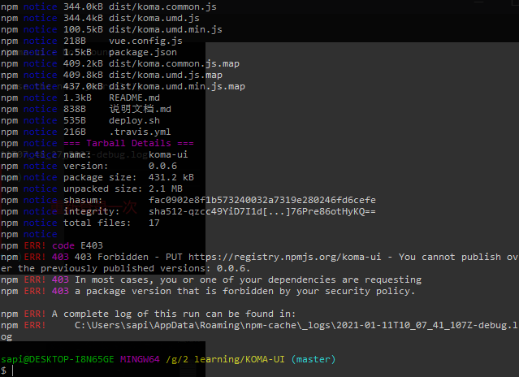
**解决：更新版本**
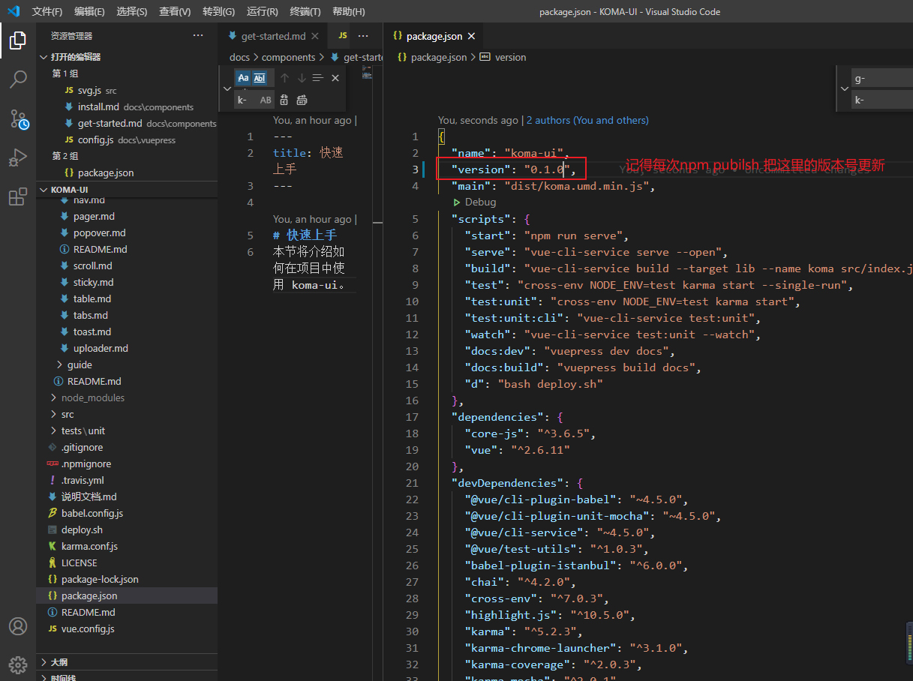

5. 发布成功
`npm ublish`
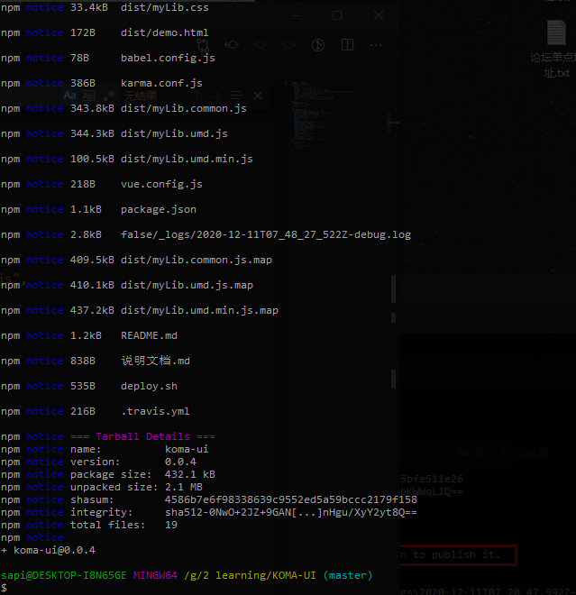


## 测试发布的包：
### 1. 创建临时文件夹
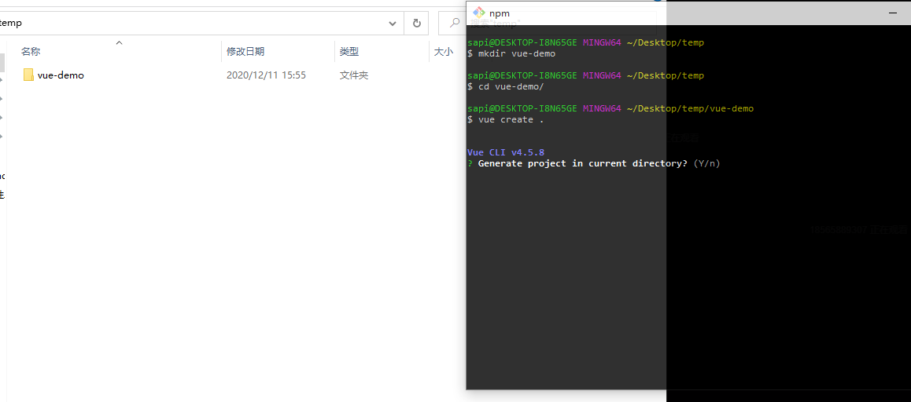

### 2. 使用vue初始化项目
1. 其实可以直接 `vue create vue-demo`
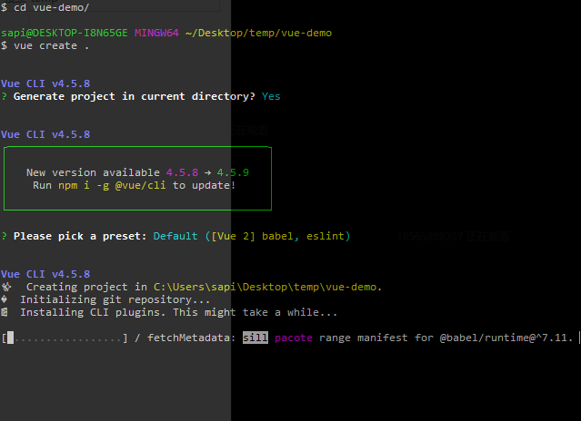
2. `npm i koma-ui` 安装包
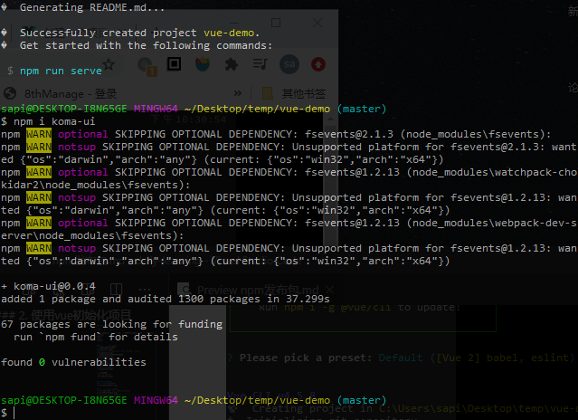
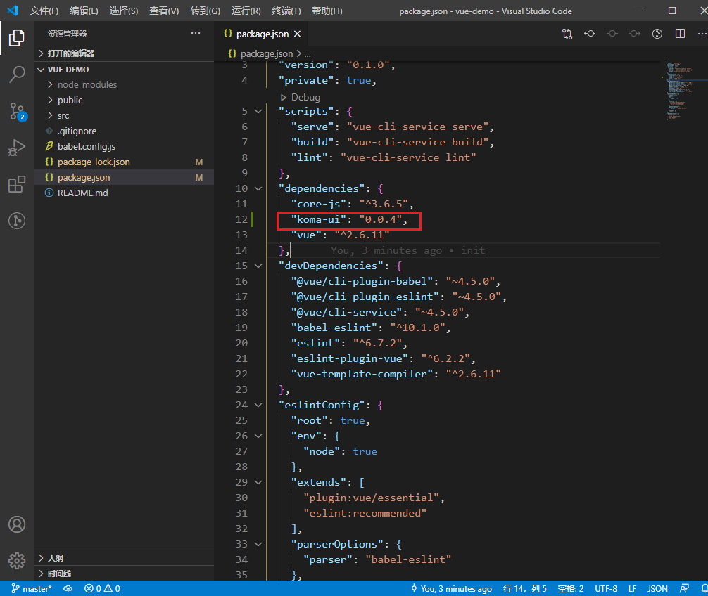

3. demo使用包报错
这是因为没有在koma-ui里定义入口文件
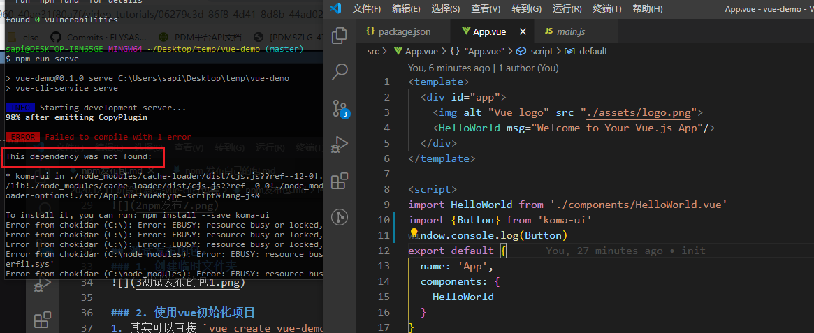


3. 在koma-ui里定义入口文件
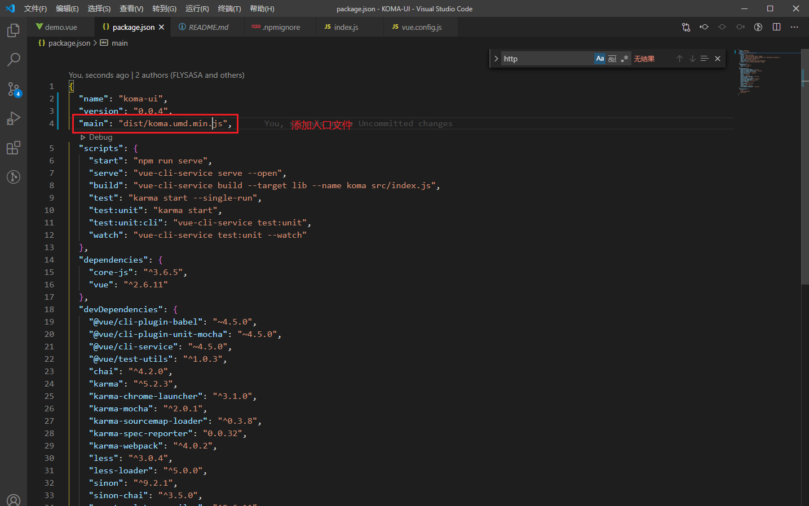
记得重新打包，重新发布

4. 在demo里重新更新koma-ui包
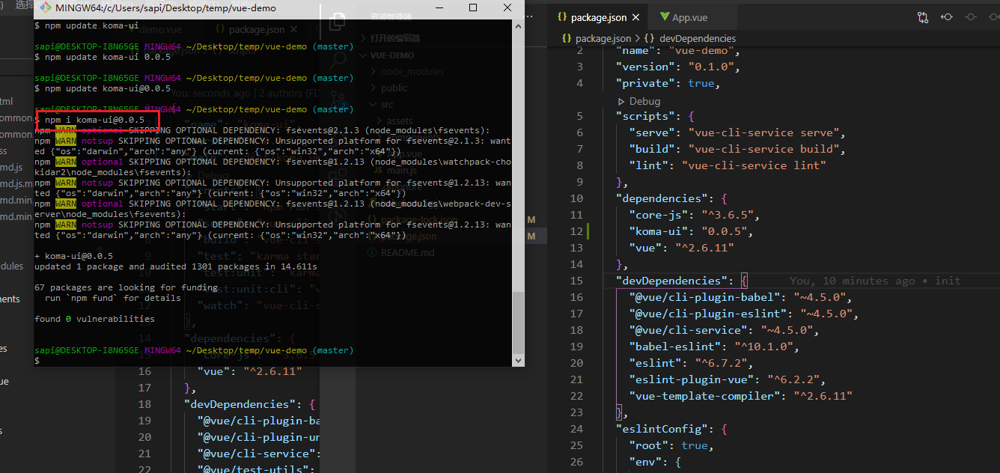

5. 重新引入，引入成功~
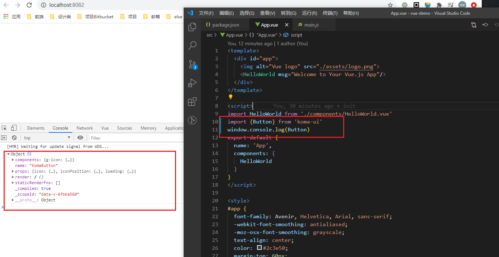

6. 如何使用koma-ui的组件
**koma-ui里的组件导出的时候命名是Button, 所以demo里引入的时候要先引入Button,然后重命名自己的命名。**
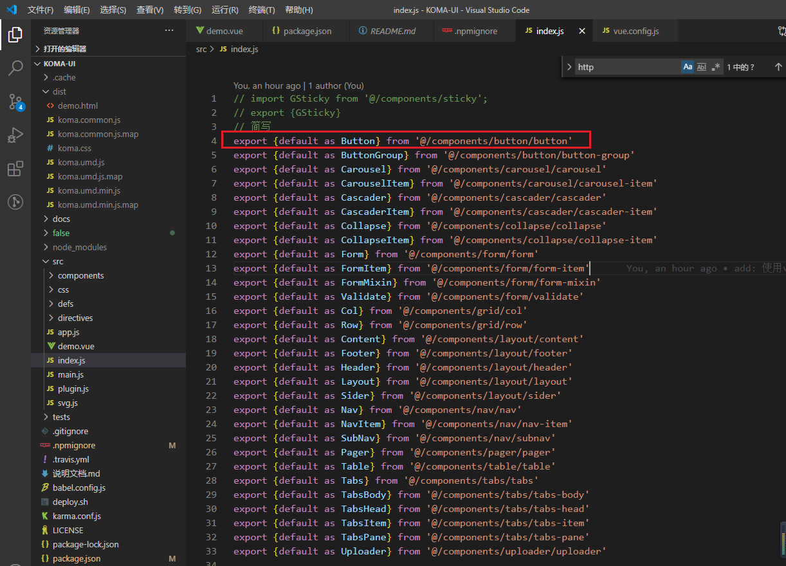
```js
import {  Button as GButton } from 'koma-ui'  // 因为koma-ui里的重命名为GButton
import 'koma-ui/dist/koma.css'
```
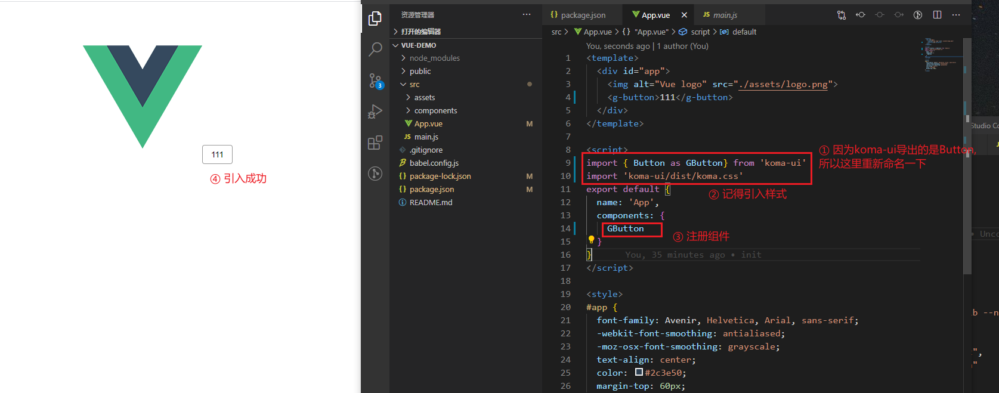


