### 测试

白盒测试：单元测试（根据代码思路去测试）
黑盒测试：人工测试

规模（小 → 大）：
单元测试 →  模块（api）测试 →  功能测试 →  集成测试（E2E）
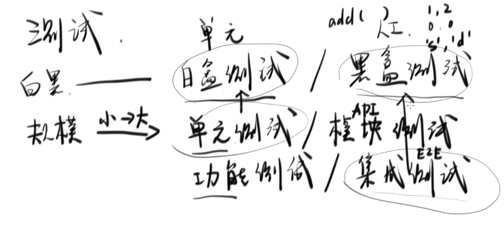


### vue-cli 测试覆盖率
https://vue-test-utils.vuejs.org/zh/installation/#%E7%94%A8-karma-%E6%B5%8B%E8%AF%95%E5%8D%95%E6%96%87%E4%BB%B6%E7%BB%84%E4%BB%B6

之前将vue-cli单元测试改为karma，测试指令为：
```
npm run test       // karma 单次测试
npm run test:unit  // karma 常规测试 持续测试
```

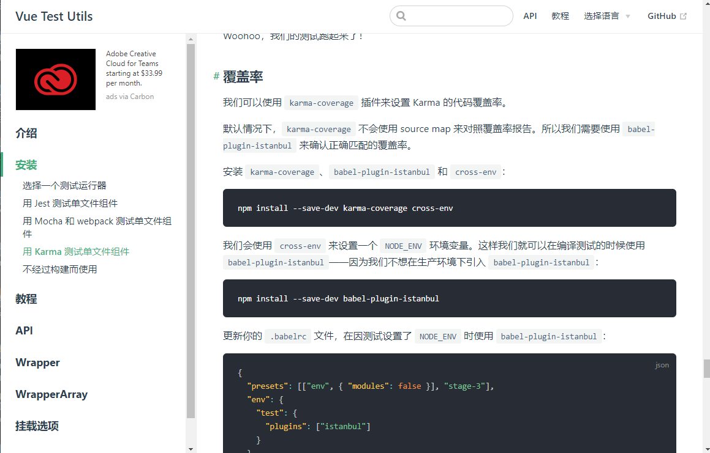

#### 步骤:
1. 装包
```
npm install --save-dev karma-coverage cross-env
npm install --save-dev babel-plugin-istanbul
```

2. 修改 `babel.config.js` 文件
```js
module.exports = {
  presets: [
    '@vue/cli-plugin-babel/preset'
  ],
  env: {
    test: {
      plugins: ["istanbul"]
    }
  }
}
```
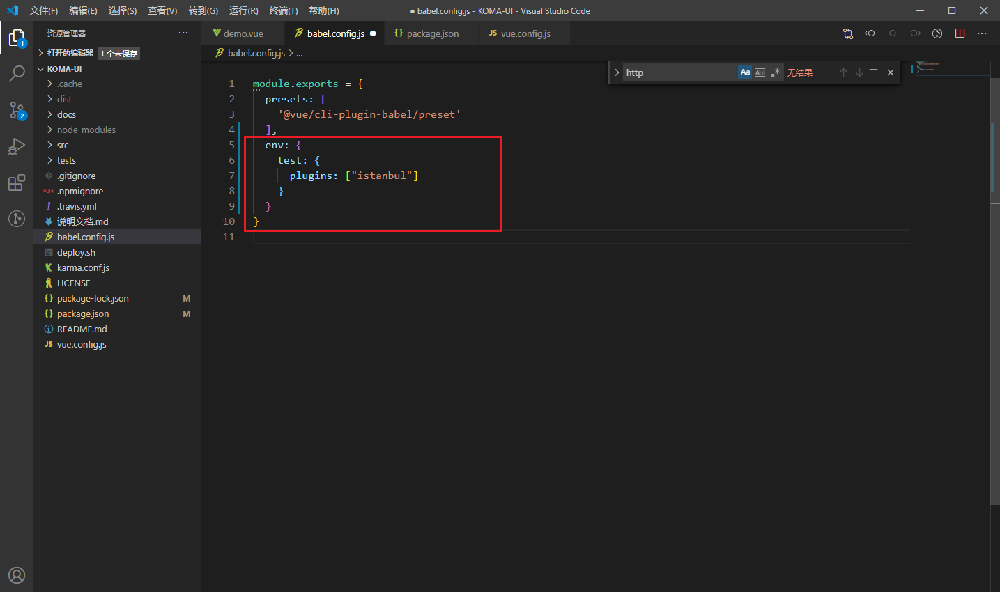

3. 修改 `karma.conf.js` 文件
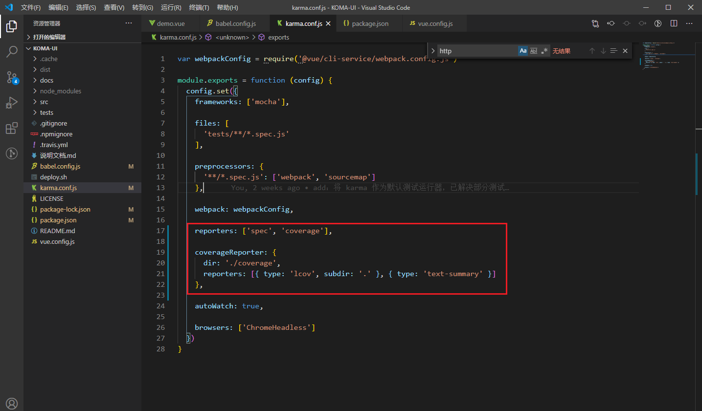

4. 修改 `package.json` 文件
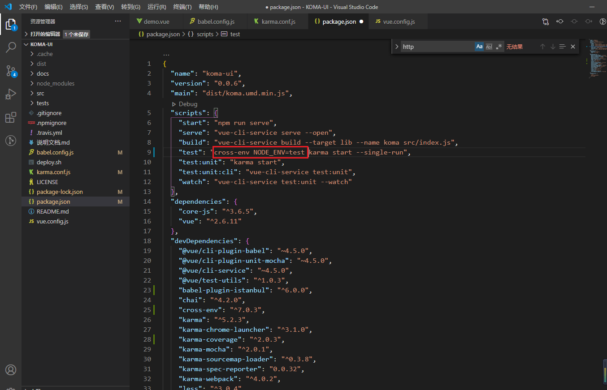

5. 测试用例出现报错
- svg报错： 之前在table时更新过svg，这里再次解决这个问题
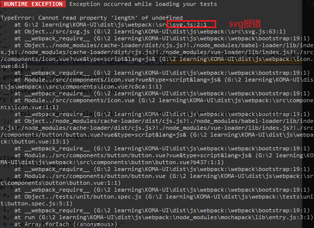
解决：
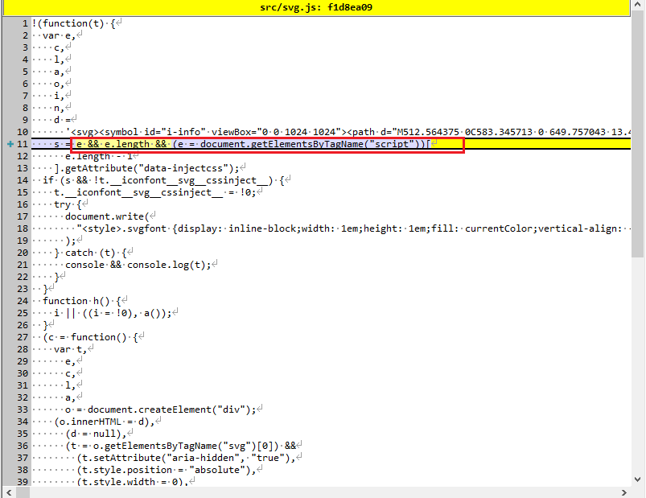


- button测试用例报错
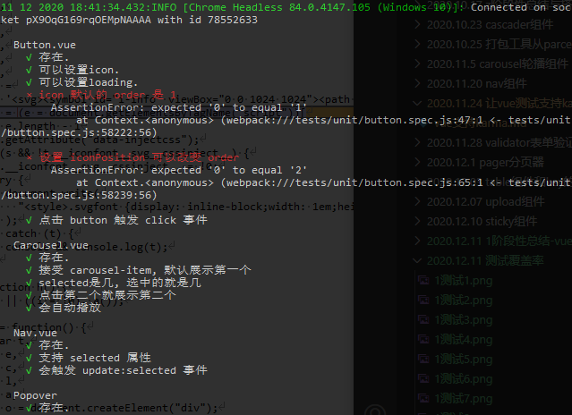
解决：
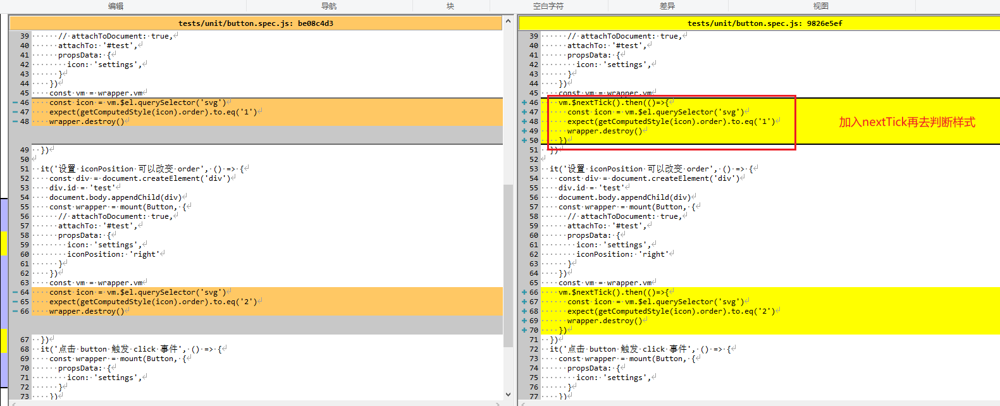

6. 运行成功
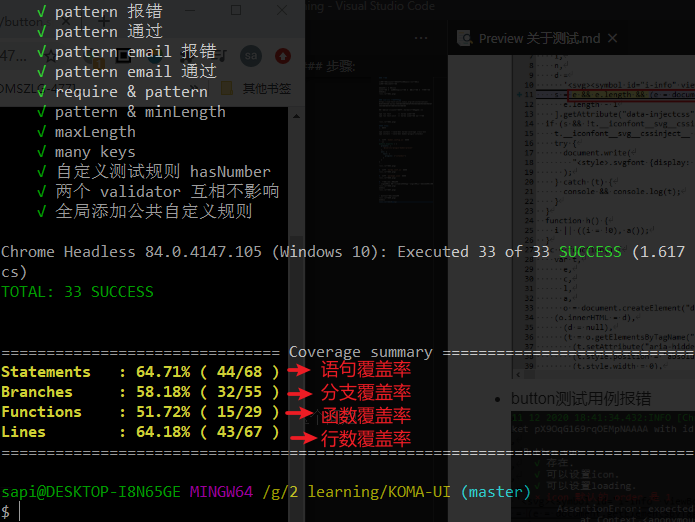
成功后会生成一个coverage目录，打开index.html
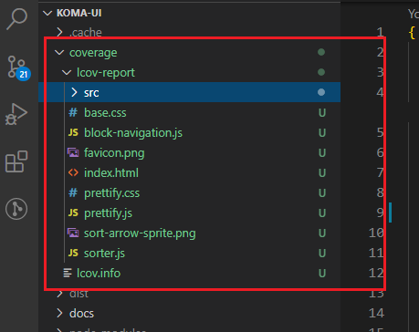
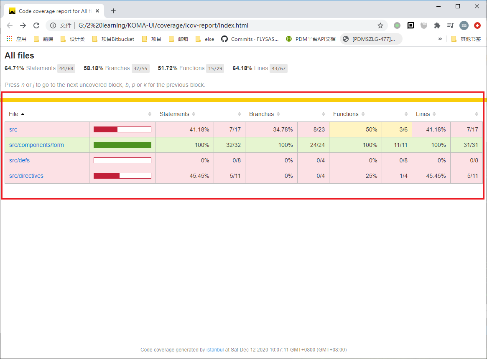

需要注意的是并不是所有测试用例都会计算覆盖率，只有函数代码才会纳入计算。