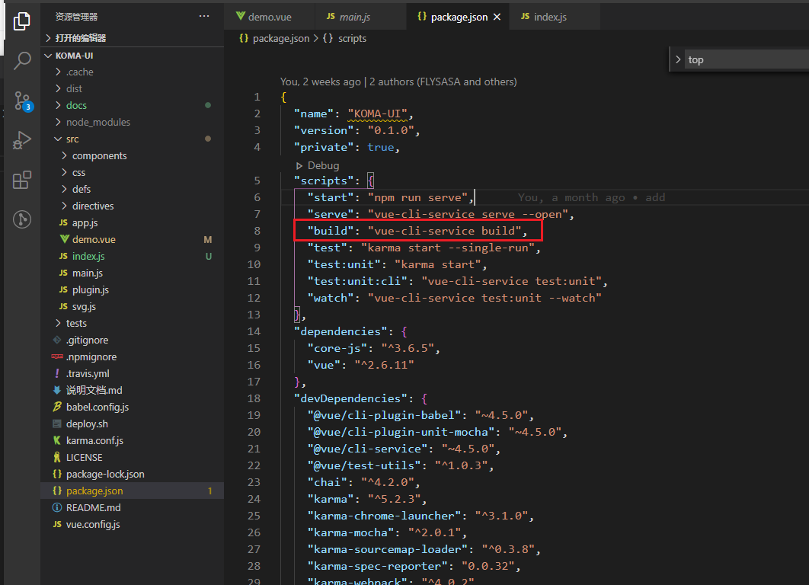
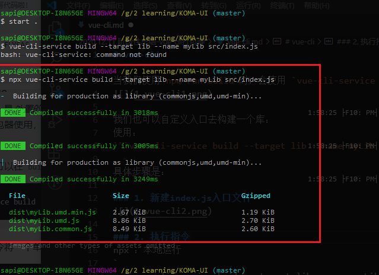
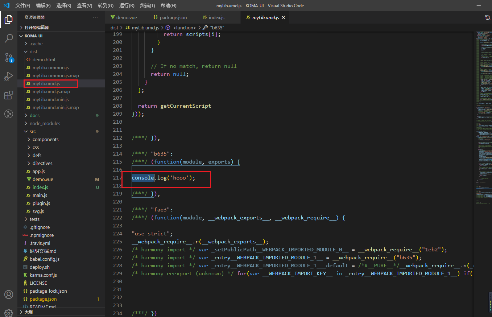
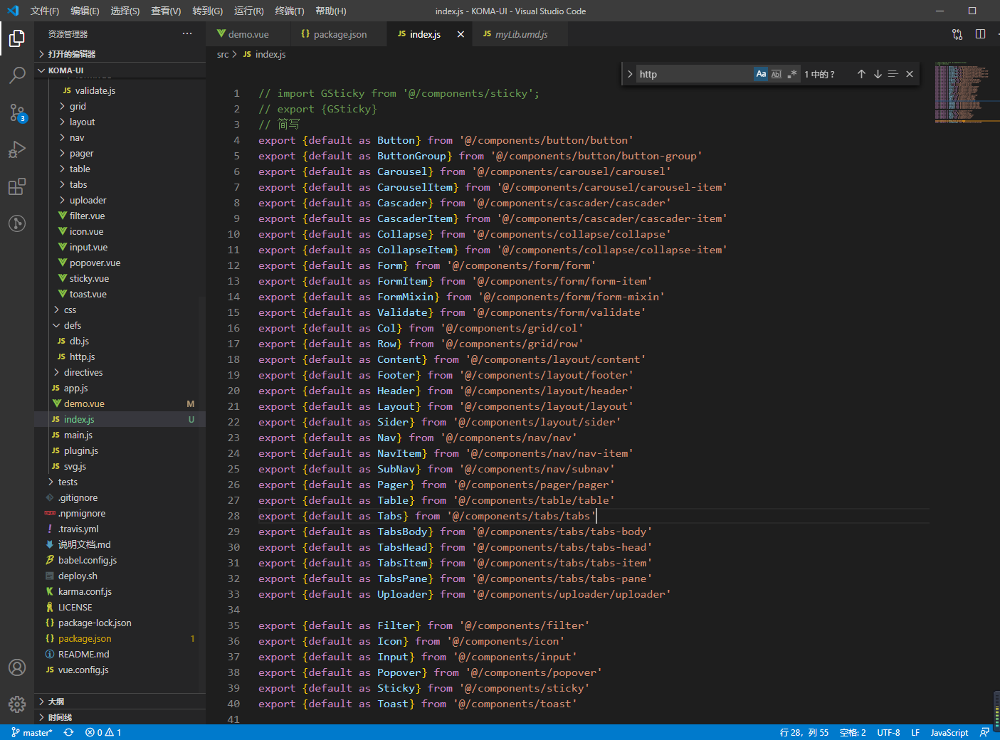
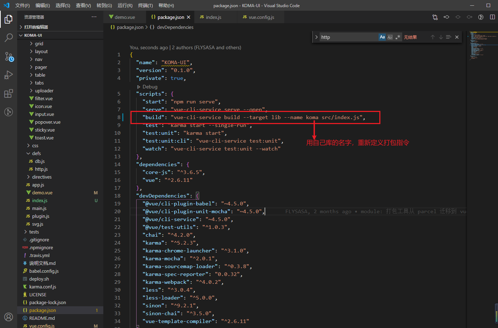

# vue-cli

当我们使用`npm run build`时，会使用 `vue-cli-service build`去构建


我们也可以自定义入口去构建一个库：
使用： 
```vue-cli-service build --target lib --name myLib [entry]```

具体步骤是：

### 1. 新建index.js入口文件


### 2. 使用lib模式打umd包
> UMD: 统一模块定义方法，兼容AMD等其他引用方法
> 因为别人可能引入库用的script标签等方式，所以直接用UMD去处理多种引入方式。

加上npx 就是本地安装`vue-cli-service`
不加npx 需要全局安装`vue-cli-service`
`
npx vue-cli-service build --target lib --name myLib src/index.js
`



打包成功。

### 3. 导出所有组件
``` js
import GSticky from '@/components/sticky';
export {GSticky}

// => 可以简写为
export {default as sticky} from '@/components/sticky'

```


### 4. 重新定义打包命令
