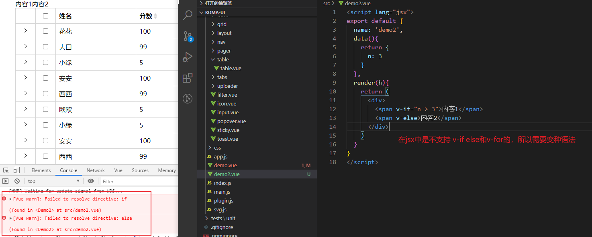
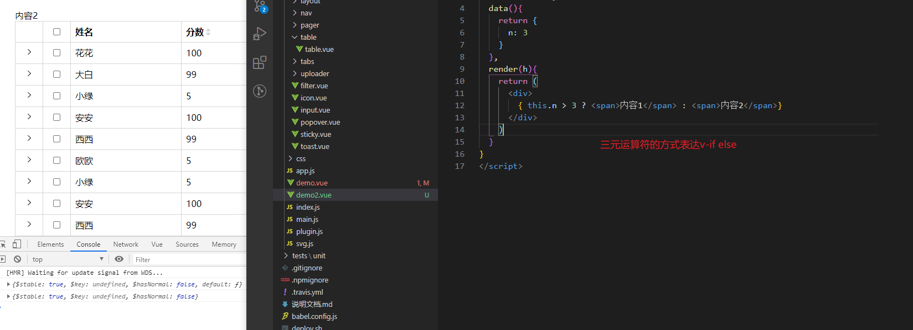

### 渲染函数和jsx语法：

#### 1. 渲染函数
当我们想直接在js里写模板html时，可以如下
```js
// parent.vue
<template>
  <div>
    <child/>
  </div> 
<template>

// child.vue
<script>
  export default {
    name: 'child',
    render(createElement){
      return createElement(
        'div',
        [
          '标题',
          createElement(
            'span',
            '内容'
          )
        ]
      )
    }
  }
</script>
```


#### 2. jsx方式
```js
<script lang="jsx">
  export default {
    name: 'demo2',
    render(h){
      return (
        <div>标题<span>内容1</span></div>
      )
    }
  }
</script>
```


#### 3. jsx语法


##### 1. v-if else
```js
<script lang="jsx">
  export default {
    name: 'demo2',
    data(){
      return {
        n: 3
      }
    },
    render(h){
      return (
        <div>
          { n > 3 ? <span>内容1</span>:<span>内容2</span>}
        </div>
      )
    }
  }
</script>
```



##### 2. v-for
```js
<script lang="jsx">
  export default {
    name: 'demo2',
    data(){
      return {
        items: ['内容1', '内容2', '内容3']
      }
    },
    render(h){
      return (
        <div>
          { this.items.map(i => 
            <li>{i}</li>
          )}
        </div>
      )
    }
  }
</script>
```


##### 3. 添加css样式


