### 升级table组件

想来想去这里关于scopedSlots的高级用法还是不在vue知识集里重新录入了，直接在这里和table组件案例一起汇总介绍。

#### 1. 为什么要升级table? 原本table的痛点？
原本的table组件因为是自己传入columns的方式，然后在组件内部遍历columns去渲染：
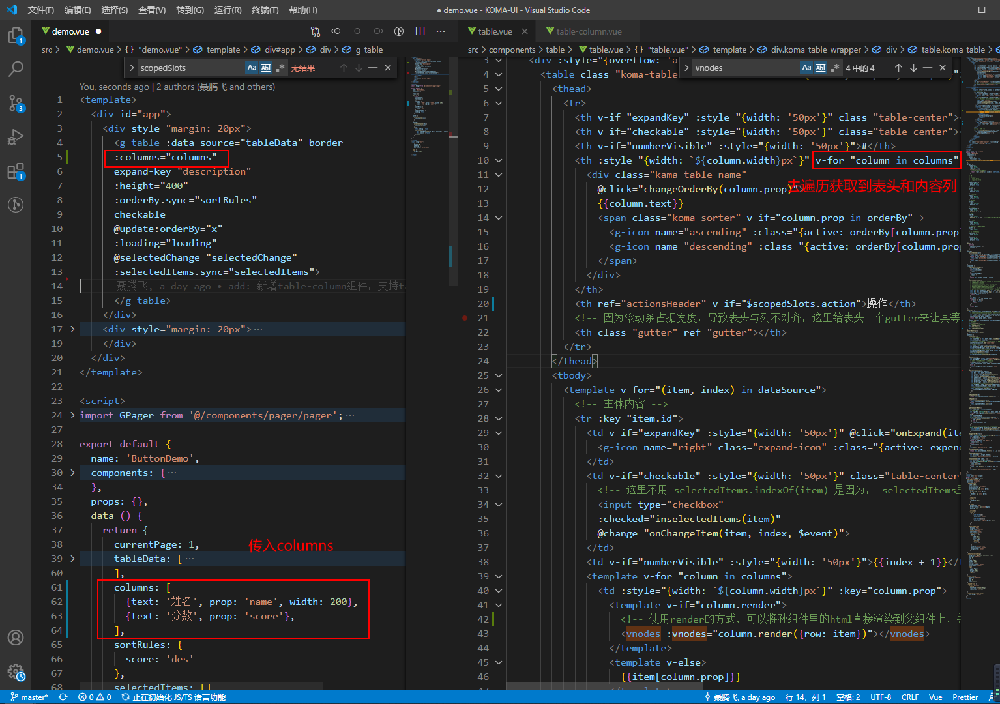

这样虽然在html代码上可以做到非常简洁，只需要传入columns属性就能渲染列，但是可扩展性和定制性非常差，必然用户想自定义列的内容，比如加个a标签，将无从下手。

#### 2. 使用scopedSlots解决痛点
我们之前拓展action操作列时，其实已经用到了slot, 简单回顾下：
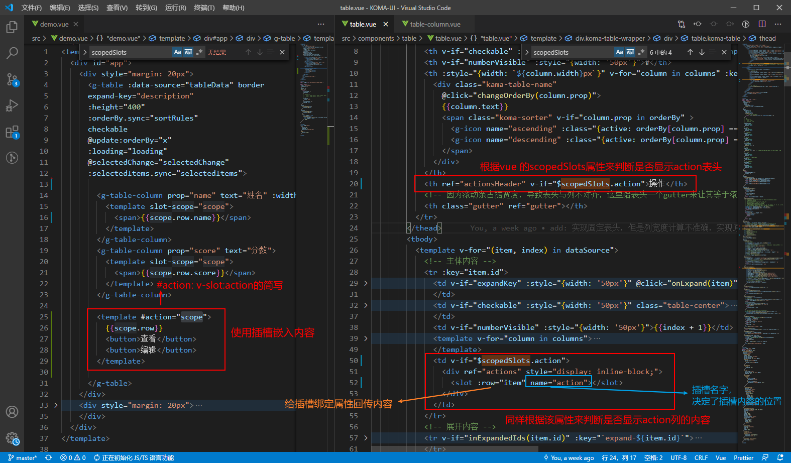

看到这不禁发问，既然使用插槽就可以完成列内容的定制化，为什么不采用这样的方式去渲染其它列的内容 ? 
**答：答案是不可以，列的内容因为要支持用户完全的自定义，所以每一列的内容都是不固定的，我们需要告诉插槽该列的列名和prop，单独用一个普通插槽是无法从父组件里传入所需要的属性的，所以我们需要再使用一个 table-column组件做中转将这些属性传入。**

#### 3. 使用 table-column 组件做slot中转件
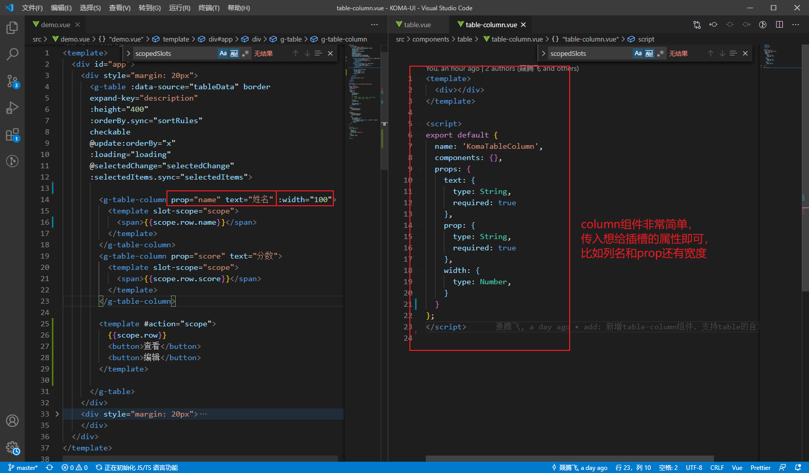

##### ① vm.$scopedSlots
看到这里发现 `scopedSlots` 的出场率特别高频，到底什么是`scopedSlots`?
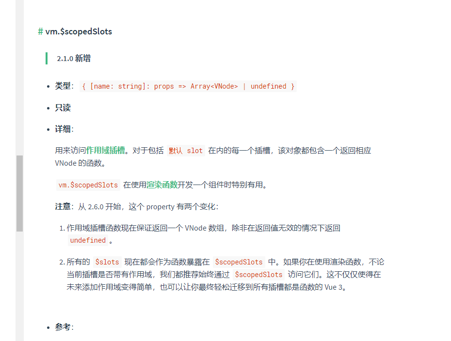
在table组件mounted里打印出来这个属性，会发现：
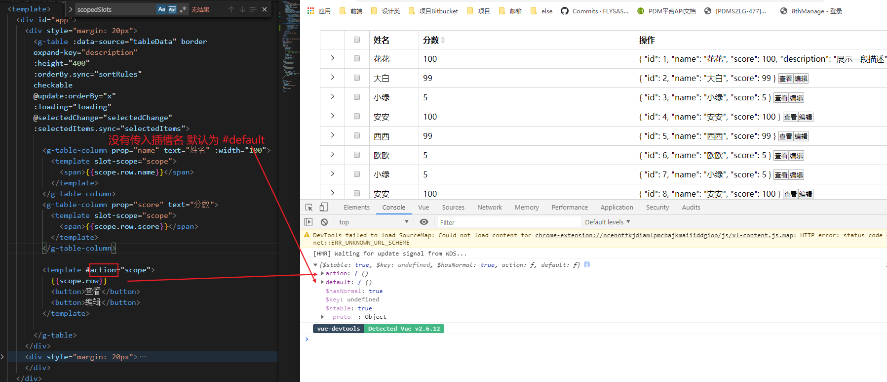

这个属性即绑定在父组件上插槽内容，有多少种name的插槽，这里就会打印出多少个，它是一个对象，对象的值是作用域插槽render函数（会返回一个VNode数组,可以拿这个函数去渲染组件）。这也是为什么会使用 `this.$scopeSlots.action`来判断是否显示操作列的原因。

##### ② vm.$slots
另外一个跟插槽相关的是 `slots`，vue的这个属性我觉得很有意思：
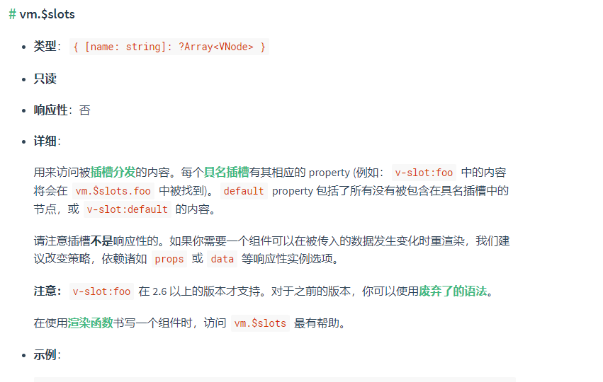

打印出来如图：
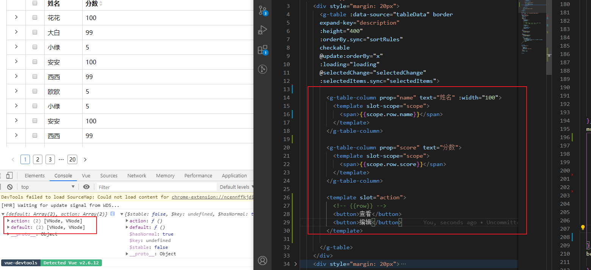
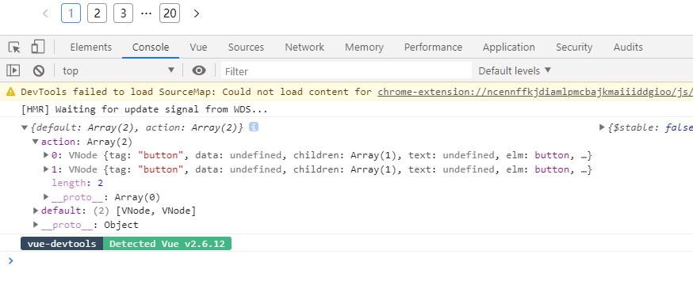
返回的是一个数组，数组里是VNode元素。

为什么说这个属性有意思呢？ 因为不像scopedSlots属性一样实事求是，有多少会打印多少，当给插槽内容加上slot-scope属性后，slots就跟其分家了，不再涵盖该内容。
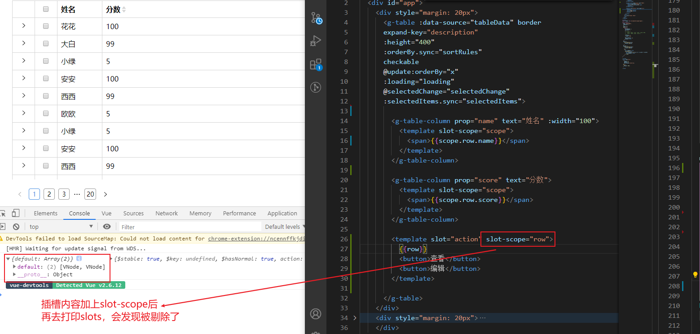
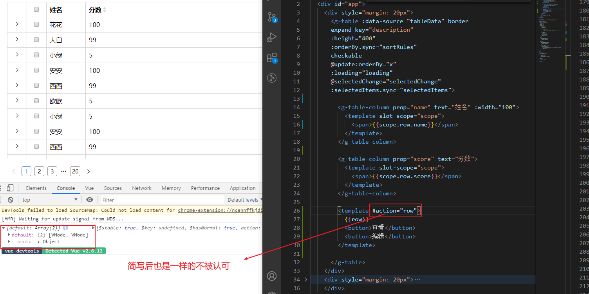

虽然不知道为什么加上slot-scope使用作用域插槽后，slots就变得六亲不认，但是这个属性我们可以在这里灵活运用，我们可以通过，`this.$slot`拿到非`action`插槽内容，该内容即通过 `table-column` 组件中转的插槽内容，因为`table-column`本身是不会有slot-scope的，所以会被slots统计到。

#### 4. 通过$slots组装columns
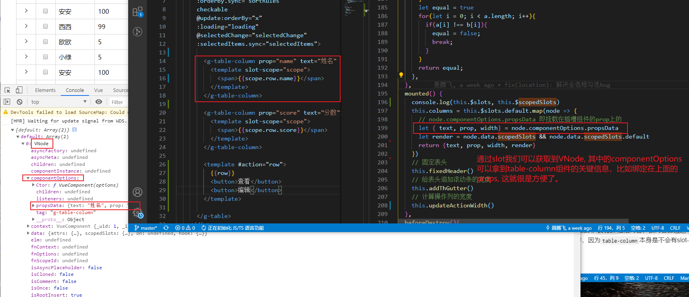
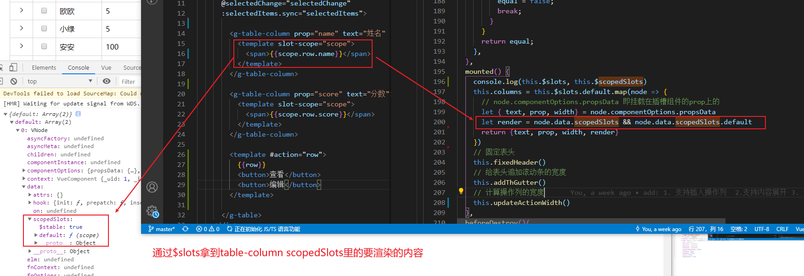

##### 如何将该render函数渲染？
因为要渲染的内容是在 table-column里的，属于子组件的插槽内容，如何渲染到父组件上？ 这里有个hack的方式：
使用`VNodes`组件：
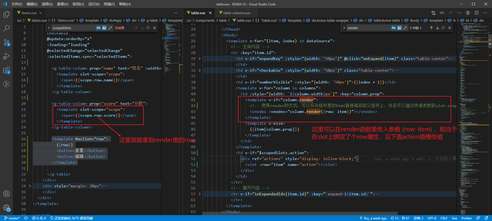

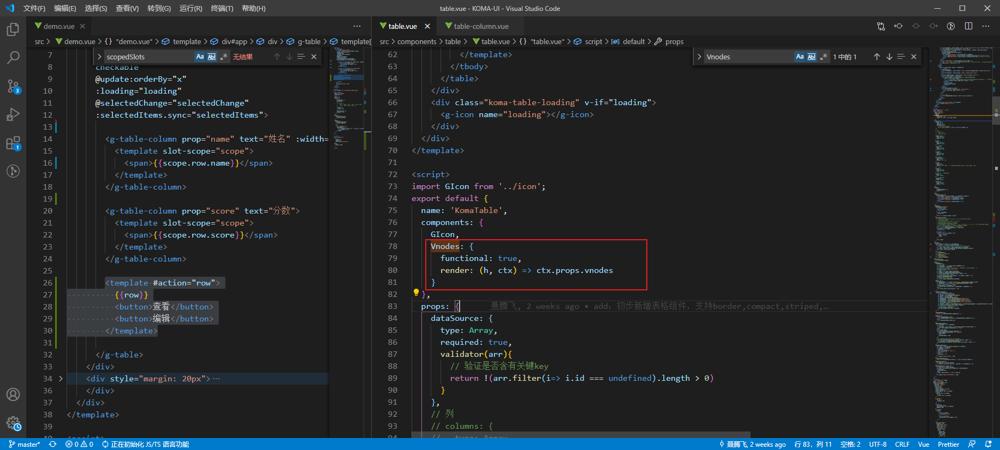

完成上面的一步，我们就能渲染表格的自定义内容了。
