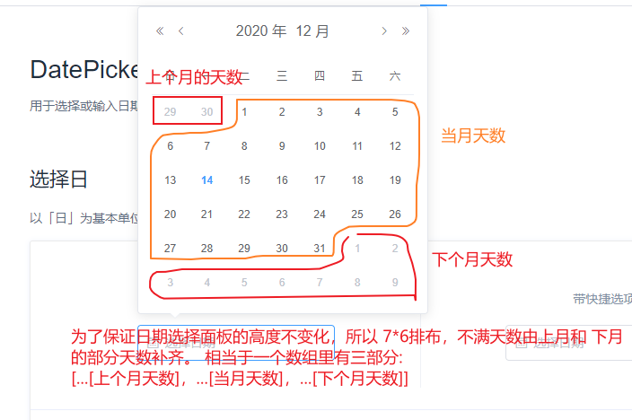
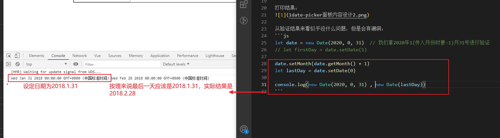
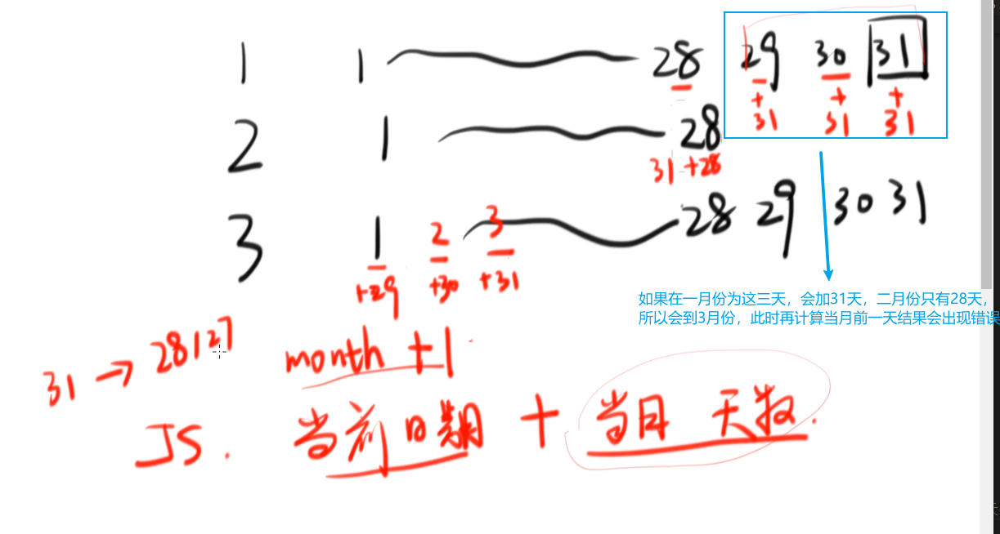
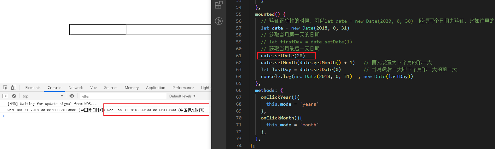
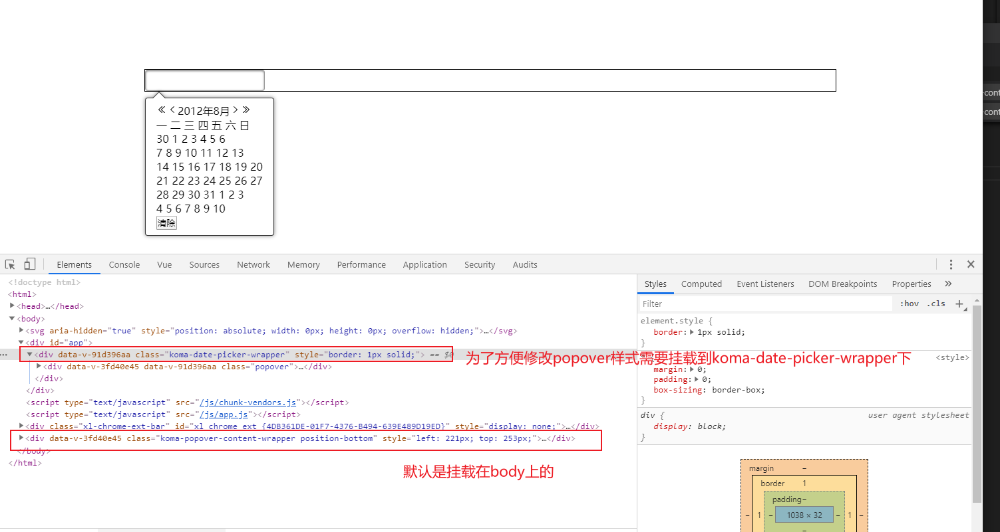
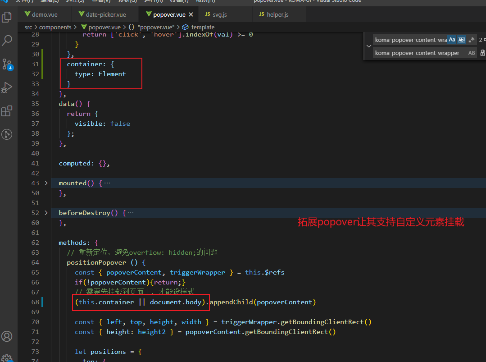
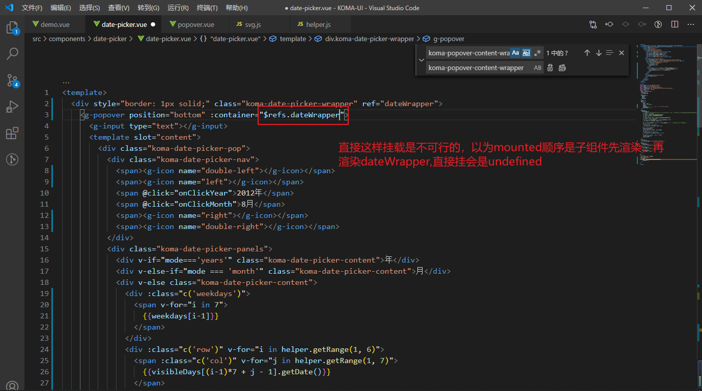
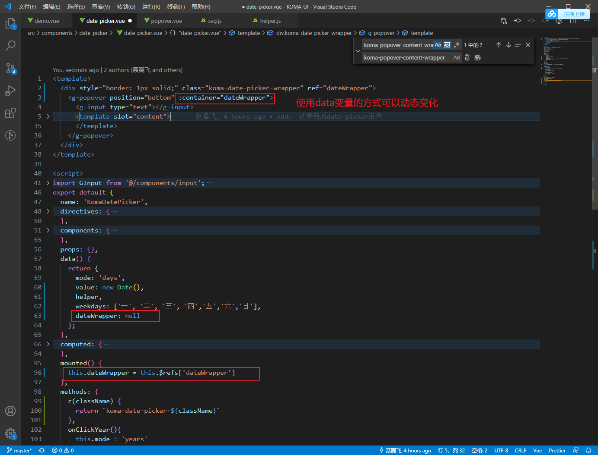
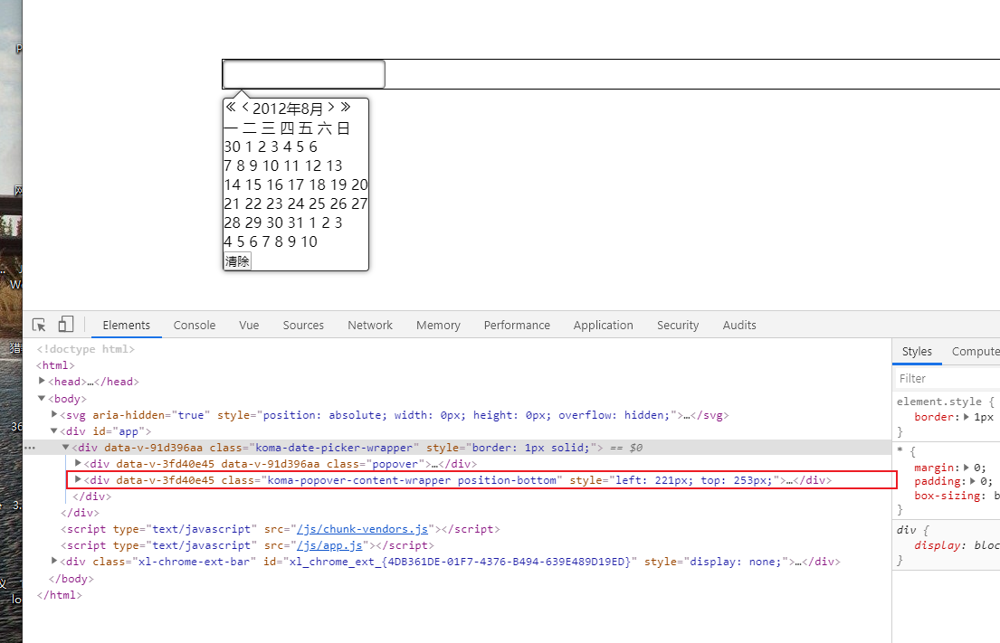
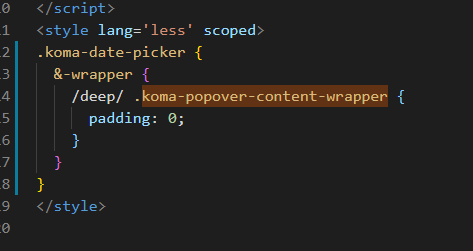

# date-picker组件


### 1.如何获取到当月的第一天和最后一天？
在设计日期面板时：


如何拿到当月的第一天和最后一天？

- 方法一：
```js
let date = new Date()  // 获取到当前时间
let firstDay = date.setDate(1)  // 设置成当月的1号，即当月第一天

// 获取当月最后一天思路是先获取到下个月第一天，然后往回拨一天
date.setMonth(date.getMonth() + 1) // 将日期设置后成下个月第一天
let lastDay = date.setDate(0)   // setDate指定0时，日期会被设置成上个月最后一天

console.log(new Date(), new Date(firstDay), new Date(lastDay))
```

打印结果：


从验证结果来看似乎没什么问题，但是会有漏洞：
```js
let date = new Date(2020, 0, 31)  // 我们拿2020年1(传入月份时要-1)月31号进行验证
// let firstDay = date.setDate(1)

date.setMonth(date.getMonth() + 1)
let lastDay = date.setDate(0)

console.log(new Date(2020, 0, 31) , new Date(lastDay))
```
打印结果：


为什么会出现这样的结果？
```js
// 问题出在这句上，当前月份加一，它会加上当月的天数，如上面会加31天
date.setMonth(date.getMonth() + 1) 
```


如何避免这样的错误？
将将当月的天数加一个月前，将天数回拨到28号，就不会在次月溢出。


- 方法二：
```js
let year = date.getFullYear()
let month = date.getMonth()
let firstDay = new Date(year, month, 1)
let lastDay = new Date(year, month + 1, 0)
```

### 2. 为了方便修改popover的样式， 将popover定位挂载到 


#### ① 拓展popover组件支持元素挂载 


#### ② date-picker上添加挂载元素



挂载成功。


跨组件修改popover样式：
