# date-picker组件


### 1.如何获取到当月的第一天和最后一天？
在设计日期面板时：


如何拿到当月的第一天和最后一天？

创建日期常用方法：
```js
new Date()    // 没有参数， Tue Dec 15 2020 09:29:46 GMT+0800 (中国标准时间)
new Date(1607998084742)    // Unix时间戳，表示自1970年1月1日00:00:00 UTC（the Unix epoch）以来的毫秒数，忽略了闰秒。
new Date('1995-12-17T03:24:00')  // 时间戳字符串
new Date(2020, 11, 1) // 年月日
```
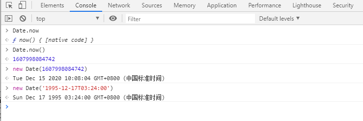

获取日期常用方法：
```js 
let date = new Date()  // 获取当前时间 Tue Dec 15 2020 09:29:46 GMT+0800 (中国标准时间)
let year = date.getFullYear()  // 获取年
let month = date.getMonth()  // 获取月，返回0-11, 0代表1月
let day = date.getDate()    // 获取日 返回 1-31
let week = date.getDay()    // 获取周 返回 0-6 , 0代表周日
let seconds = date.getTime()  // 获取毫秒数，表示自1970年1月1日00:00:00 UTC（the Unix epoch）以来的毫秒数，
```
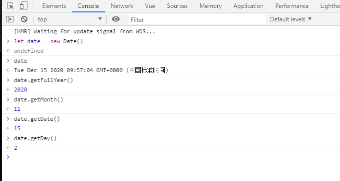

设置日期常用方法：
```js
let date = new Date() 
// 设置月份，介于0-11之间的整数
date.setMonth(1)    // 返回值是基于 1.1.1970  00:00:00 UTC 开始计算的毫秒数

// 设置年份
date.setFullYear(2018) // 返回值是基于 1.1.1970 00:00:00 UTC 开始计算的毫秒数

// 设置日
date.setDate(24)
```
月：
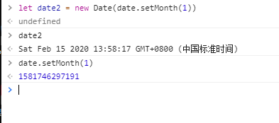
年：
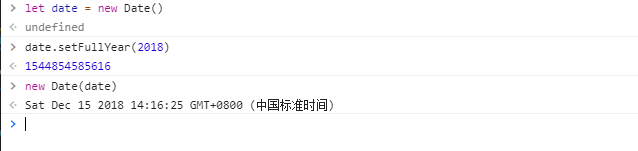
日：
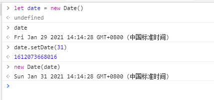

#### 获取当月第一天和最后一天：
- 方法一：
```js
let date = new Date()  // 获取到当前时间
let firstDay = date.setDate(1)  // 设置成当月的1号，即当月第一天

// 获取当月最后一天思路是先获取到下个月第一天，然后往回拨一天
date.setMonth(date.getMonth() + 1) // 将日期设置后成下个月第一天
let lastDay = date.setDate(0)   // setDate指定0时，日期会被设置成上个月最后一天

console.log(new Date(), new Date(firstDay), new Date(lastDay))
```

打印结果：
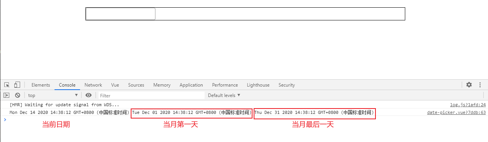

从验证结果来看似乎没什么问题，但是会有漏洞：
```js
let date = new Date(2020, 0, 31)  // 我们拿2020年1(传入月份时要-1)月31号进行验证
// let firstDay = date.setDate(1)

date.setMonth(date.getMonth() + 1)
let lastDay = date.setDate(0)

console.log(new Date(2020, 0, 31) , new Date(lastDay))
```
打印结果：
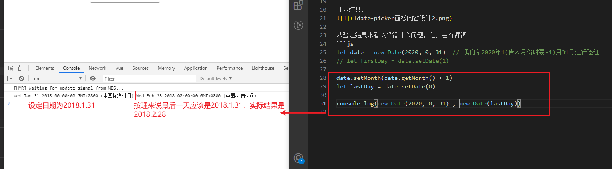

为什么会出现这样的结果？
```js
// 问题出在这句上，当前月份加一，它会加上当月的天数，如上面会加31天
date.setMonth(date.getMonth() + 1) 
```
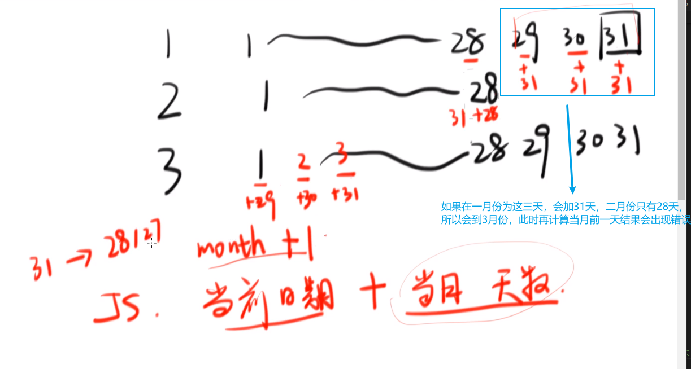

如何避免这样的错误？
将将当月的天数加一个月前，将天数回拨到28号，就不会在次月溢出。
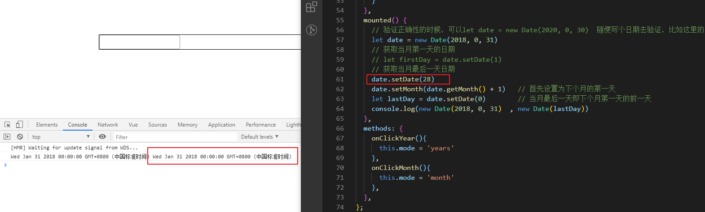

- 方法二：
```js
let year = date.getFullYear()
let month = date.getMonth()
let firstDay = new Date(year, month, 1)
let lastDay = new Date(year, month + 1, 0)
```

### 2. 为了方便修改popover的样式， 将popover定位挂载到 
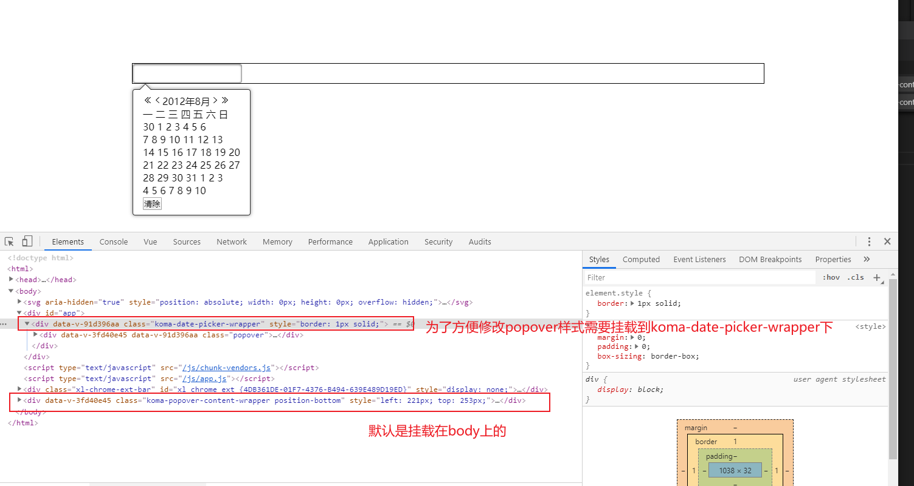

#### ① 拓展popover组件支持元素挂载 
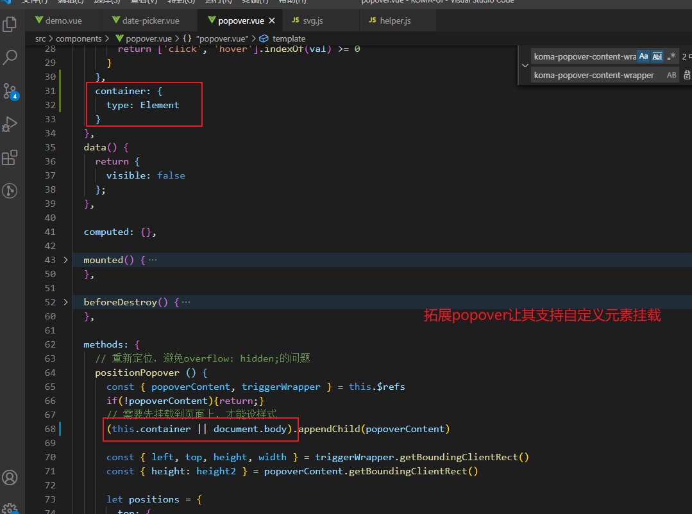

#### ② date-picker上添加挂载元素
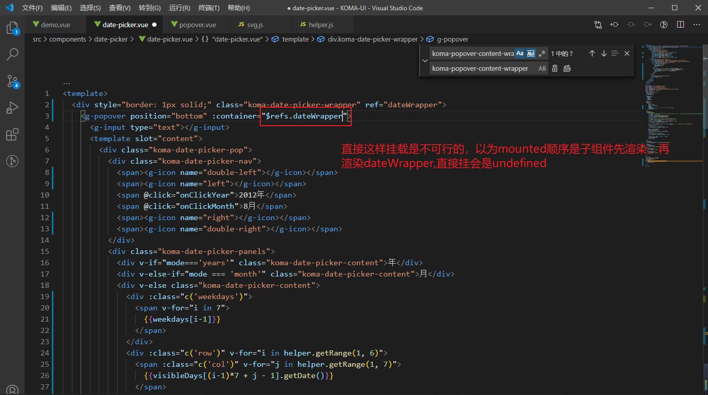
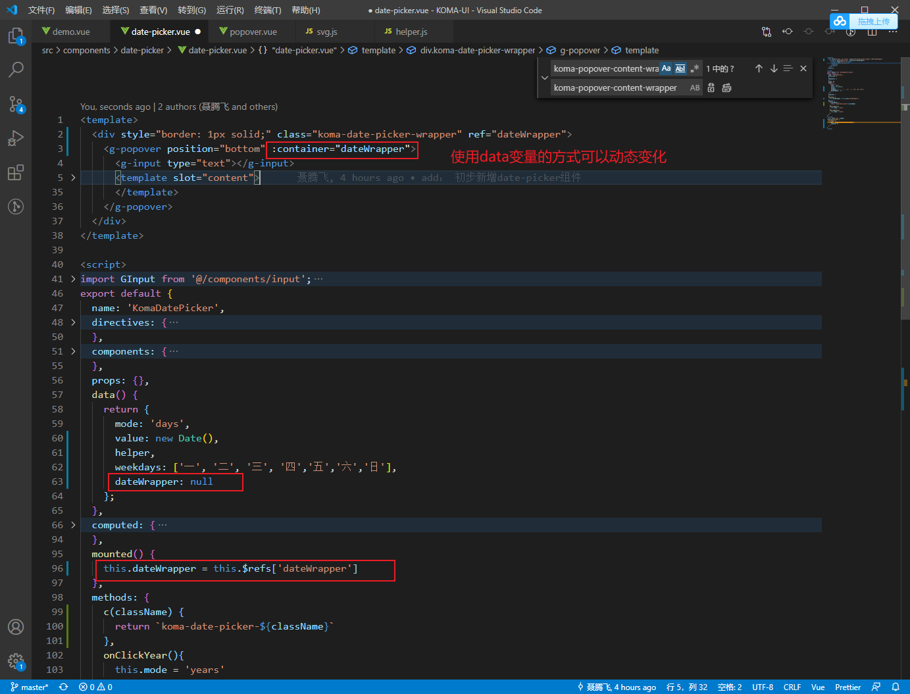

挂载成功。
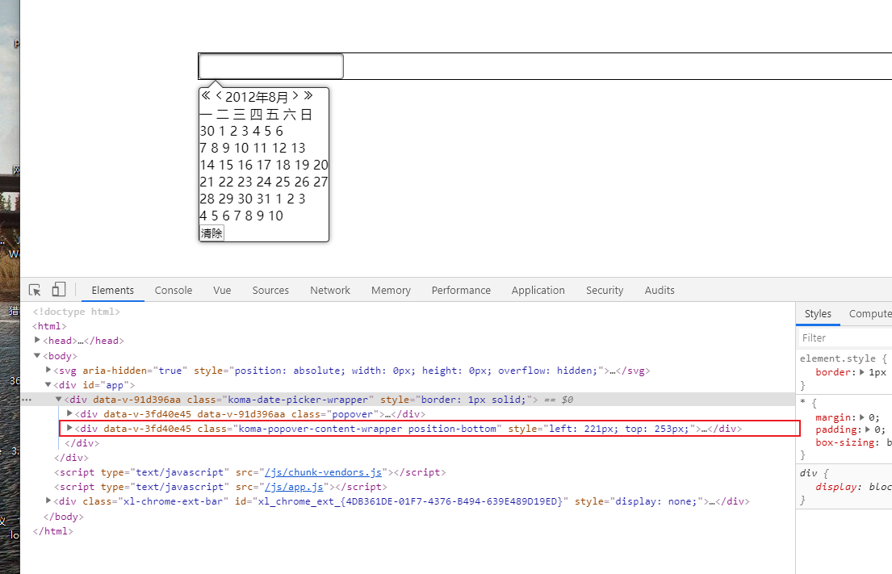

跨组件修改popover样式：
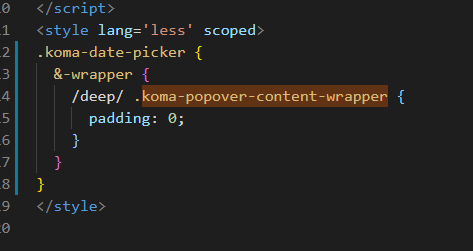

#### ③ 取消点选事件
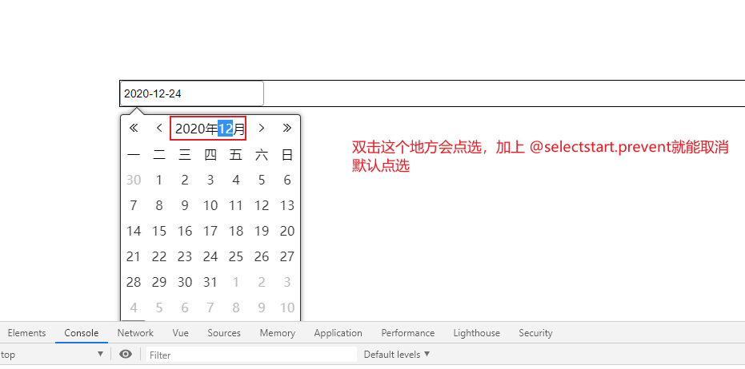
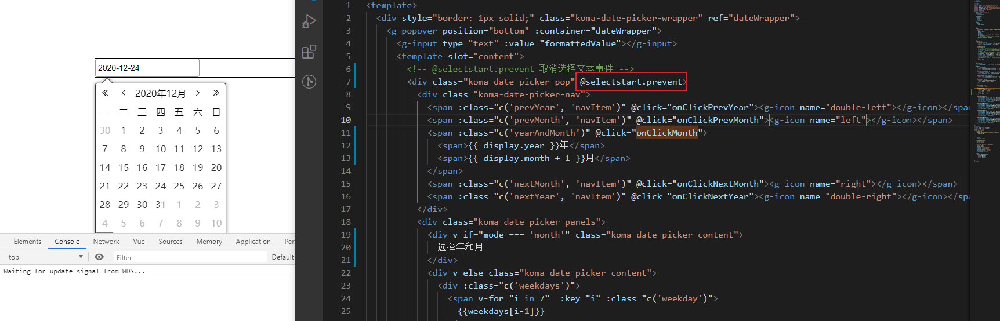