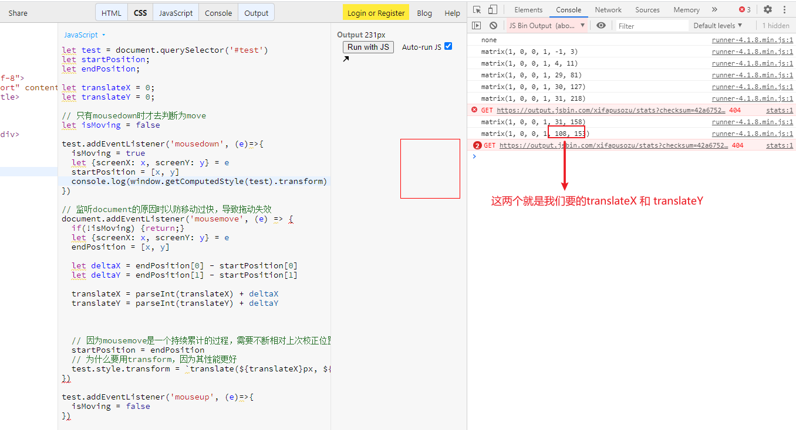

### 简单拖曳实现两种方式


### 方法一：
使用trag api:
https://developer.mozilla.org/zh-CN/docs/Web/API/HTML_Drag_and_Drop_API


[简单的drag示例](https://jsbin.com/coqiwotaru/1/edit?html,js,output)

```html
<div id="app">
  <div id="test" draggable="true"></div>
</div>
```
```js
let test = document.querySelector('#test')
let startPosition;
let endPosition;

test.addEventListener('dragstart', (e)=>{
  let {screenX: x, screenY: y} = e
  startPosition = [x, y]
})

test.addEventListener('dragend', (e)=>{
  let {screenX: x, screenY: y} = e
  endPosition = [x, y]
  let deltaX = endPosition[0] - startPosition[0]
  let deltaY = endPosition[1] - startPosition[1]
  // 注意通过style.left获取到的是内联样式，所以初始为空，parseInt会出现NaN
  // test.style.left = parseInt(test.style.left) + deltaX + 'px'
  // test.style.top = parseInt(test.style.top) + deltaY + 'px'

  // 使用getComputedStyle，不管内联还是非内联样式都能拿到
  let {left, top} = window.getComputedStyle(test)
  test.style.left = parseInt(left) + deltaX + 'px'
  test.style.top = parseInt(top) + deltaY + 'px'
})
```

#### 移动过程中隐藏原来的
```js
test.addEventListener('dragstart', (e)=>{
  let {screenX: x, screenY: y} = e
  startPosition = [x, y]
  // 不加延时会有问题
  setTimeout(()=>{
    test.style.visibility = 'hidden'
  })
})

test.addEventListener('dragend', (e)=>{
  let {screenX: x, screenY: y} = e
  endPosition = [x, y]
  let deltaX = endPosition[0] - startPosition[0]
  let deltaY = endPosition[1] - startPosition[1]
  // 注意通过style.left获取到的是内联样式，所以初始为空，parseInt会出现NaN
  // test.style.left = parseInt(test.style.left) + deltaX + 'px'
  // test.style.top = parseInt(test.style.top) + deltaY + 'px'

  // 使用getComputedStyle，不管内联还是非内联样式都能拿到
  let {left, top} = window.getComputedStyle(test)
  test.style.left = parseInt(left) + deltaX + 'px'
  test.style.top = parseInt(top) + deltaY + 'px'
  test.style.visibility = 'visible'
})
```


### 方法二：
使用mouseenter事件：
https://jsbin.com/huhexapegu/1/edit?html,js,output

#### ① 使用定位的方式

实现思路： 每次mousedown的时候获取到自身的top和left值和初始位置（startPosition），移动过程中通过获取移动的位置（endPosition）获取到位移差，让初始的top和left加上位移差即可。
```
每次鼠标按下获取初始top和left + 移动过程中位置的偏移量 = 新的top + left
```
```js
let test = document.querySelector('#test')
let startPosition;
let endPosition;
let top;
let left;

// 只有mousedown时才去判断为move
let isMoving = false

test.addEventListener('mousedown', (e)=>{
  isMoving = true
  let {screenX: x, screenY: y} = e
  startPosition = [x, y]
  
  // 和drag不同，move时去获取left top时并不是初始的位置，所以要在这里获取
  // drag时，本身的位置left top是不会变化的
  top = window.getComputedStyle(test).top
  left = window.getComputedStyle(test).left
})
// 监听document的原因时以防移动过快，导致拖动失效
document.addEventListener('mousemove', (e) => {
  if(!isMoving) {return;}
  console.log(1)
  let {screenX: x, screenY: y} = e
  endPosition = [x, y]
  let deltaX = endPosition[0] - startPosition[0]
  let deltaY = endPosition[1] - startPosition[1]
  
  test.style.left = parseInt(left) + deltaX + 'px'
  test.style.top = parseInt(top) + deltaY + 'px'
})

test.addEventListener('mouseup', (e)=>{
  isMoving = false
  let {screenX: x, screenY: y} = e
})
```


#### ② 使用transform定位，性能更好
https://jsbin.com/xifapusozu/1/edit?html,js,output

实现思路：大致和上面的一样，但是有个问题获取初始transform时，得到的并不是我们想要的x和y，而是下面这种Matrix矩阵：

获取translateX,translateY很蛋疼。所以我们也无法通过
```
每次鼠标按下获取transform初始值(这步卡死) + 移动过程中的偏移量 = 最终translate
```

我们需要两个变量手动去记录translateX和translateY，每次按下前默认为0。
这两个值很好记录，即：
```js
translateX += 偏移量deltaX    // 每次偏移加上上次的translateX
translateY += 偏移量deltaY
```
**需要注意的是delta值的计算：因为移动后即产生了translate的值，这是个累加的过程，所以每次移动后都要将 `startPosition = endPosition`算出移动过程中的delta，给translate池做加减。**

```js
let test = document.querySelector('#test')
let startPosition;
let endPosition;
let translateX = 0;
let translateY = 0;
let isMoving = false

test.addEventListener('mousedown', (e)=>{
  isMoving = true
  let {screenX: x, screenY: y} = e
  startPosition = [x, y]
})

// 监听document的原因时以防移动过快，导致拖动失效
document.addEventListener('mousemove', (e) => {
  if(!isMoving) {return;}
  let {screenX: x, screenY: y} = e
  endPosition = [x, y]
  let deltaX = endPosition[0] - startPosition[0]
  let deltaY = endPosition[1] - startPosition[1]
  translateX = parseInt(translateX) + deltaX
  translateY = parseInt(translateY) + deltaY
  // 这句非常关键  
  // 因为mousemove过程中，translate会保留上次的值，所以基于这个值去做累加就好
  startPosition = endPosition
  // 为什么要用transform，因为其性能更好
  test.style.transform = `translate(${translateX}px, ${translateY}px)`
})

test.addEventListener('mouseup', (e)=>{
  isMoving = false
})
```

> 1. 注意移动过快的话会丢失目标。
解决办法： mousemove时改为监听document
> 2. 使用 transform时候，移动过程中需要每次讲startPosition重置，因为transform是个累计的过程，需要不断相对上次校正位置。

