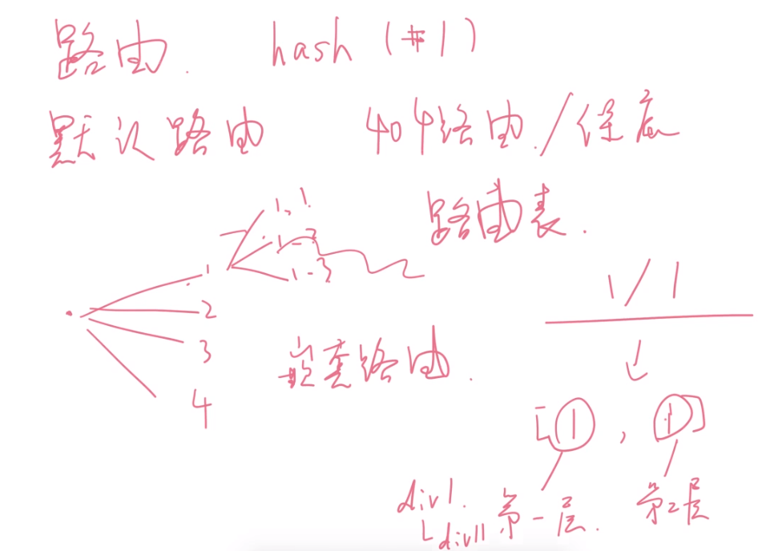

# 前端路由实现思路

### 1. 路由是什么？
通过互联的网络把信息从原地址传输到目的地址的活动。

广泛上来说路由就是分发请求，将访问的请求分发到抖音、腾讯、qq等


### 2. 前端路由是什么？
url里输入不同的地址，会指向不同的页面。
> 路由模式有： hash，history，memory

同域名下，hash不同就去展示不同的div。

简单的hash路由跳转：
```js
<a href="#1"></a>
<a href="#2"></a>
<a href="#3"></a>
<a href="#4"></a>

<div id="app"></div>

<div id="div1" style="display: none;"></div>
<div id="div2" style="display: none;"></div>
<div id="div3" style="display: none;"></div>
<div id="div4" style="display: none;"></div>
<div id="div404" style="display: none;"></div>

// js
function route() {
  let number = window.location.hash.substr(1)
  let app = document.querySelector('#app')

  number = number || 1;
  // 获取页面
  let div = document.querySelector(`#div${number}`)
  if(!div){
    div = document.querySelector(`#div${404}`)
  }
  div.style.display = 'block';
  // 展示页面
  if(app.children.length > 0) {
    app.children[0].style.display = 'none';
    document.body.appendChild(app.children[0])
  }
}
// 监听页面hash变化
window.addEventListener('hashchange', ()=>{
  route()
})
```


### 3. 路由表
上面的route函数里，固定获取了 `#div${number} ` 这么做肯定扩展性很不好，因此衍生出路由表。
```js
const div1 = document.createElement('div')
div1.innerHtml = '1'
const routeTable = {
  '1': div1
}

function route() {
  let number = window.location.hash.substr(1)
  let app = document.querySelector('#app')

  number = number || 1;
  // 获取页面
  let div = routeTable[number]
  if(!div){
    div = document.querySelector(`#div${404}`)
  }
  div.style.display = 'block';
  // 展示页面
  if(app.children.length > 0) {
    app.children[0].style.display = 'none';
    document.body.appendChild(app.children[0])
  }
}
```

### 4. 嵌套路由
路由下面还有子路由


### 5.hash，history，memory模式

路由模式有： hash，history，memory

模式|优点|缺点|
--|--|--|--|
hash|任和情况都能作为前端路由，路由信息存储在url里|seo不友好,服务器收不到请求，会自动过滤掉 #后面的内容，比如 baidu.com/#111 => baidu.com/
history|后端将所有前端路由都渲染同一页面，路由信息存储在url里|不支持IE8
memory|将路由信息存放到localStorage里等，适合非浏览器|单机路由

hash模式的实现，是基于 `history.pushState` API来完成 URL 跳转而无须重新加载页面。

hash举例：
https://codesandbox.io/s/oqjvqm6w05

获取路由参数：
> `hash模式: windown.location.hash.substr(1)`  // 获取#后面的内容
> `history模式: windown.location.pathName`     // 获取域名/后面的内容

### 6. vue-router
```html
<div id="app">
  <!-- 使用 router-link 组件来导航 -->
  <router-link to="/1"></router-link>
  <router-link to="/2"></router-link>

  <!-- 路由匹配到的组件将渲染在这里 -->
  <router-view></router-view>
</div>
```

```js
// 1. 定义 (路由) 组件。
// 可以从其他文件 import 进来
const Foo = { template: '<div>foo</div>' }
const Bar = { template: '<div>bar</div>' }

// 2. 创建路由表
const routes = [
  { path: '/foo', component: Foo },
  { path: '/bar', component: Bar }
]

// 3. 创建 router 实例，然后传 `routes` 配置
const router = new VueRouter({
  routes // (缩写) 相当于 routes: routes
})

// 4. 创建和挂载根实例
const app = new Vue({
  router
}).$moute('#app')
```