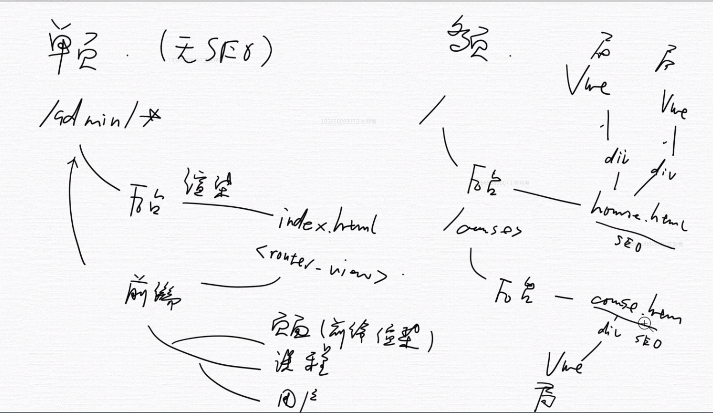
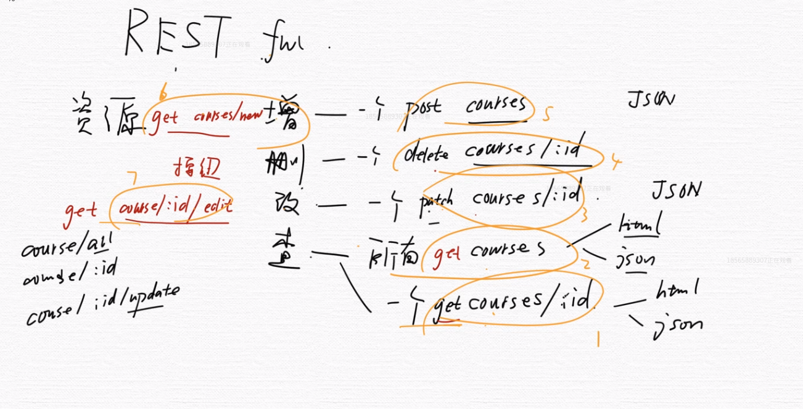
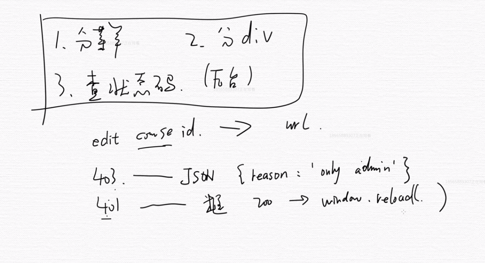
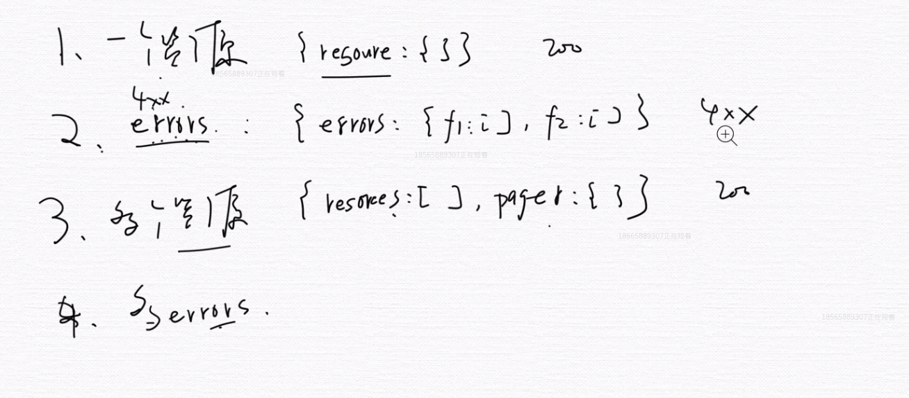

### 1. 单页 vs 多页

单页SPA:
无SEO， 对谷歌百度的爬虫不是很友好
可以做后台管理系统等。

多页MPA：
有SEO，将关键内容展示给SEO。

### 2. RESTful API
RESTful 是目前最流行的 API 设计规范，用于 Web 数据接口的设计。

### 3. 前端权限设计
可以考虑分用户组的方式，给用户组分配权限。然后前台去获取这个用的相关权限。

### 4. JSON设计
前后端数据传递JSON设计。
要知道前后的是交互是http协议，只能字符串传输数据。
