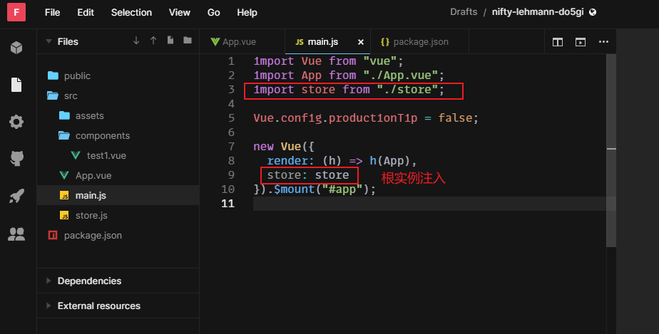
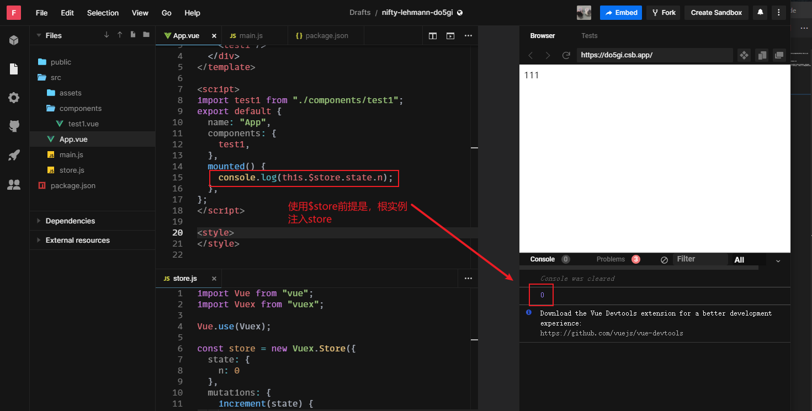
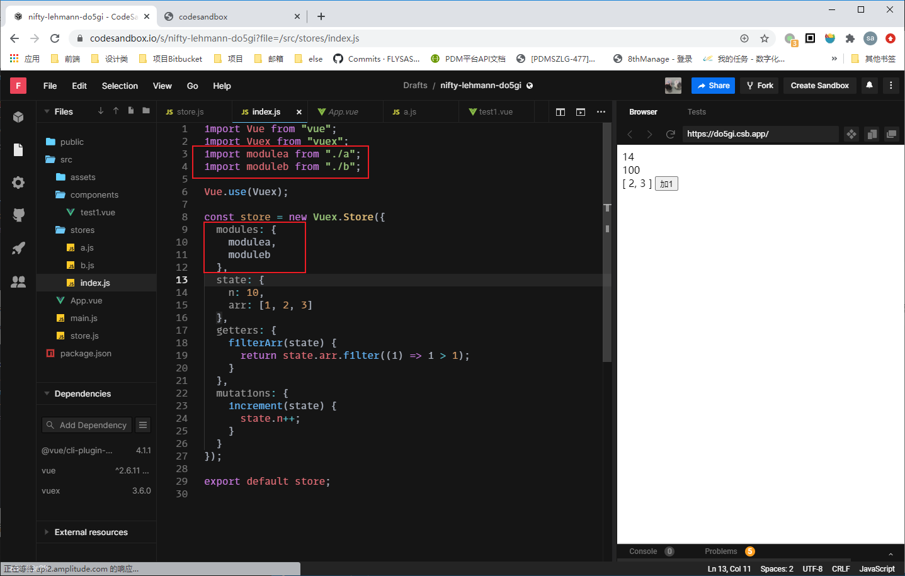
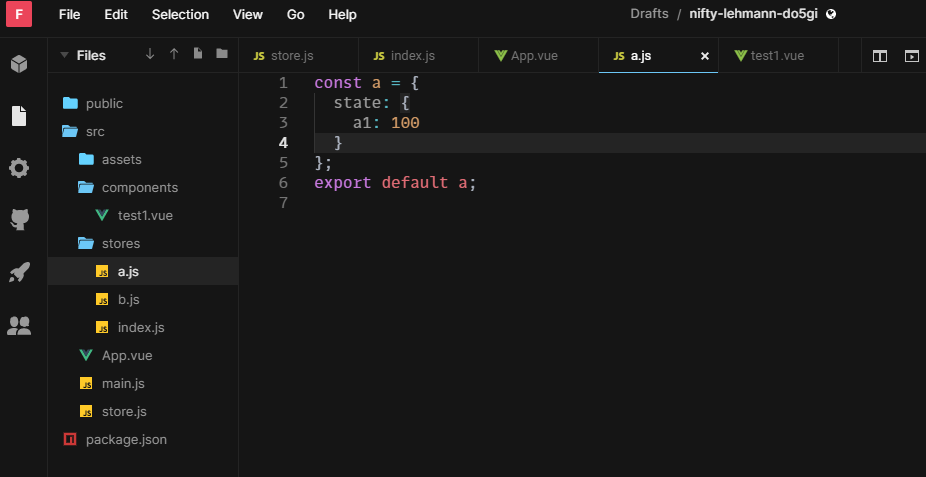
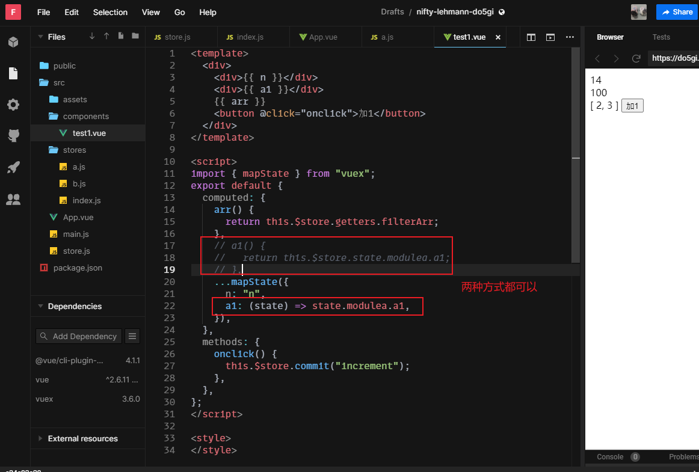

# 状态管理

### 1. 状态
分为UI状态（不需要存入MYSQL 数据库）和用户状态（需要存入MYSQL 数据库）。

### 2. 管理
状态（数据变量）管理和事件管理。

### 3. Vuex是什么？
应用核心是 store (仓库)。
Vuex 是一个专为 Vue.js 应用程序开发的状态管理模式。

> Vuex和单纯的全局对象主要区别有两点：
> 1. Vuex的状态存储是响应式的。store中的状态变化，那么相应的组件也会更新。
> 2.  不能直接改变store中的状态，改变store中的状态唯一途径是显式地提交（commit）mutation。

- #### 安装及使用
```
npm install vuex --save
```

```js
// 创建一个store.js
import Vue from "vue";
import Vuex from "vuex";
Vue.use(Vuex);
const store = new Vuex.Store({
  // 状态对象
  state: {
    n: 0
  },
  // 改变上面的 state 的commit方法
  mutations: {
    increment(state) {
      state.n++;
    }
  }
});
export default store;
```
```js
// main.js引入store
import Vue from "vue";
import App from "./App.vue";
import store from "./store";

Vue.config.productionTip = false;

new Vue({
  render: (h) => h(App),
  store: store
}).$mount("#app");
```

为了在 Vue 组件中访问 this.$store property，你需要为 Vue 实例提供创建好的 store。Vuex 提供了一个从根组件向所有子组件，以 store 选项的方式“注入”该 store 的机制：



### 4. 核心概念

- ### state
  #### ① 定义state
  **状态对象**，可以理解为数据源。状态对象必须是纯粹 (plain) 的。
  ```js
  // 定义数据源
  const store = new Vue Store({
    state: {
      n: 0,
    }
  })
  ```
  
  #### ② 获取state的方法：
  - 1.使用 `$store.state`
  因为 state 的存储是响应式的，从store实例中读取状态最简单的方法是在计算属性中返回这个状态：
  ```js
  // 创建一个test.vue组件
  const test = {
    template: '<div>{{n}}</div>',
    computed: {
      n() {
        return this.$store.state.n  // 使用计算属性就能触发更新相关联的 DOM
      }
    }
  }
  ```
  - 2.使用辅助函数 `mapState`
  `mapState` 的好处提取于，需要获取多个状态的时候，重复声明计算属性显得非常冗余，此时我们借助 `mapState` 辅助函数帮我们生成计算属性。
  ```js
  import { mapState } from 'vuex';
  export default {
    //...
    computed: mapState({
        // 箭头函数可使代码更简练
      count: state => state.count,

      // 传字符串参数 'count' 等同于 `state => state.count`
      countAlias: 'count',

      // 为了能够使用 `this` 获取局部状态，必须使用常规函数
      countPlusLocalState (state) {
        return state.count + this.localCount
      }
    })

    // 当映射的计算属性的名称与 state 的子节点名称相同时，我们也可以给 mapState 传一个字符串数组。
    computed: mapState(['count'])


    // 为了不影响组件内部的计算属性，可以这样
    computed: {
      computedName(val){
        return 'name'
      },
      ...mapState({
        //...
      })
    }
  }
  ```
---
- ### getters
  getter可以理解为store的计算属性， 对state进行一些过滤处理的操作。

  ```js
  const store = new Vuex.Store({
    state: {
      todos: [
        { id: 1, text: '...', done: true },
        { id: 2, text: '...', done: false }
      ]
    },
    getters: {
      // getter接收state作为第一个参数
      doneTodos: state => {
        return state.todos.filter(todo => todo.done)
      }
    }
  })
  ```

  - #### 组件内部调用getter的方法：
    - 使用 `$store.getters`
      ```js
      // 创建一个test.vue组件
      const test = {
        template: '<div>{{doneTodos}}</div>',
        computed: {
          doneTodos() {
            return this.$store.getters.doneTodos  // 使用计算属性就能触发更新相关联的 DOM
          }
        }
      }
      ```
    - 使用 `mapGetters` 辅助函数
    ```js
    import { mapGetters } from 'vuex'
    export default {
      computed: {
        // ...
        ...mapGetters({
          'doneTodos'
        })
      }
    }
    ```

- ### mutations
  更改 store 中的状态的唯一方法是提交 mutation。
  ```js
  const store = new Vuex.Store({
    state: {
      count: 1
    },
    mutations: {
      // 接收state作为第一个参数
      increment(state) {
        // 变更状态
        state.count++
      }
    }
  })
  ```

  - #### 组件内部提交 mutation 的方法：
    - 1： 使用 $store.commit `mutation`
      ```js
      const store = new Vuex.Store({
        state: {
          count: 1
        },
        mutations: {
          increment (state) {
            // 变更状态
            state.count++
          },
          // 额外的参数
          incrementN (state) {
            state.count += n
          }
        }
      })
      ```
      ```js
      // 组件内部
      this.$store.commit('increment')
      // 提交额外的参数
      this.$store.commit('increment', 10)
      ```

    - 2. 使用 mapMutations 辅助函数
    ```js
    import { mapMutations } from 'vuex'
    export default {
      // ...
      methods: {
        ...mapMutations([
          'increment', // 将 `this.increment()` 映射为 `this.$store.commit('increment')`

          // `mapMutations` 也支持载荷：
          'incrementBy' // 将 `this.incrementBy(amount)` 映射为 `this.$store.commit('incrementBy', amount)`
        ]),

        ...mapMutations({
          add: 'increment' // 将 `this.add()` 映射为 `this.$store.commit('increment')`
        })
      }
    }
    ```

    > 需要注意的是，Mutation 必须是同步函数，mutations是不支持异步函数的，因为不方便devTool的追踪。
---
- ### actions
  Action 类似于 mutation，不同在于：

  - Action 提交的是 mutation，而不是直接变更状态。
  - Action 可以包含任意异步操作。

  ```js
  const store = new Vuex.Store({
    state: {
      count: 0
    },
    mutations: {
      increment(state) {
        state.count++
      }
    },
    actions: {
      increment (context) {
        context.commit('increment')
      }
      // 简化
      increment ({commit}) {
        commit('increment')
      }
    }
  })
  ```
  Action 函数接受一个与 **store 实例具有相同方法和属性的 context 对象**，因此你可以调用 context.commit 提交一个 mutation，或者通过 context.state 和 context.getters 来获取 state 和 getters

  - #### 组件内部分发 Action 的方法：
    - 1： 使用 `$store.dispatch` 方法触发
      ```js
      const store = new Vuex.Store({
        state: {
          count: 1
        },
        mutations: {
          increment (state) {
            state.count++
          },
        },
        actions: {
          increment ({commit}) {
            commit('increment')
          }
        }
      })
      ```
      ```js
      // 组件内部
      this.$store.dispatch('increment')
      // 提交额外的参数
      this.$store.dispatch('increment', 10)
      ```

      看起来多此一举，为什么不直接commit mutation 还得中转一次？还记得 mutation 必须同步执行这个限制么？Action 就不受约束！我们可以在 action 内部执行异步操作：
      ```js
      actions: {
        actionA ({ commit }) {
          return new Promise((resolve, reject) => {
            setTimeout(() => {
              commit('someMutation')
              resolve()
            }, 1000)
          })
        },
        actionB ({ dispatch, commit }) {
          return dispatch('actionA').then(() => {
            commit('someOtherMutation')
          })
        }
      }
      ```


    - 2. 使用 mapActions 辅助函数
    ```js
    import { mapActions } from 'vuex'
    export default {
      // ...
      methods: {
        ...mapActions([
          'increment', // 将 `this.increment()` 映射为 `this.$store.commit('increment')`

          // `mapActions` 也支持载荷：
          'incrementBy' // 将 `this.incrementBy(amount)` 映射为 `this.$store.commit('incrementBy', amount)`
        ]),

        ...mapActions({
          add: 'increment' // 将 `this.add()` 映射为 `this.$store.commit('increment')`
        })
      }
    }
    ```
---
- ### modules
由于使用单一状态树，应用的所有状态会集中到一个比较大的对象。当应用变得非常复杂时，store 对象就有可能变得相当臃肿。

为了解决以上问题，Vuex 允许我们将 store 分割成模块（module）。每个模块拥有自己的 state、mutation、action、getter、甚至是嵌套子模块——从上至下进行同样方式的分割：

```js
const moduleA = {
  state: () => ({ ... }),
  mutations: { ... },
  actions: { ... },
  getters: { ... }
}

const moduleB = {
  state: () => ({ ... }),
  mutations: { ... },
  actions: { ... }
}

const store = new Vuex.Store({
  modules: {
    a: moduleA,
    b: moduleB
  }
})

store.state.a // -> moduleA 的状态
store.state.b // -> moduleB 的状态
```

#### 模块内的局部状态
对于模块内部的 mutation 和 getter，接收的第一个参数是模块的局部状态对象。


[示例:](https://codesandbox.io/s/nifty-lehmann-do5gi?file=/src/stores/a.js)
模块化的应用：





---
总结：
```js
- state: 
// 状态
this.$store.state.xxx
// 辅助函数
import { mapState } from 'vuex';
computed: mapState(['xxx'])

- getters:
// store的计算属性
this.$store.getters.xxx
// 辅助函数
import { mapGetters } from 'vuex';
computed: mapGetters(['xxx'])

- mutations:
// 提交 mutation， 不支持异步，默认只有一个state参数
this.$store.commit('xxx')
// 辅助函数
import { mapMutations } from 'vuex';
methods: {
  ...mapMutations
}

- actions:
// 分发 mutation，支持异步，默认有 {state, commit, dispatch} 等参数
this.$store.dispatch('xxx')
// 辅助函数
import { mapActions } from 'vuex';
methods: {
  ...mapActions
}

// store.js
actionB ({ dispatch, commit }) {
  return dispatch('actionA').then(() => {
    commit('someOtherMutation')
  })
}


- modules:
// 模块化
```


