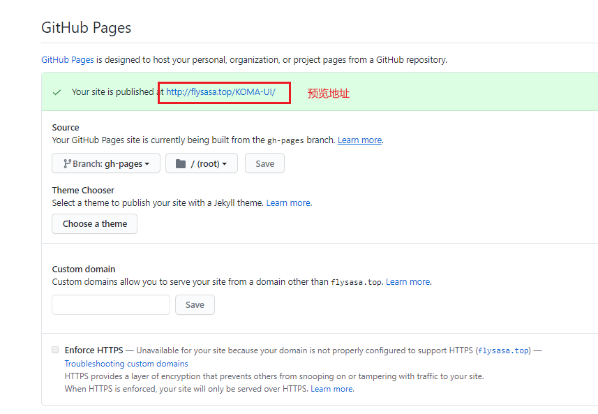
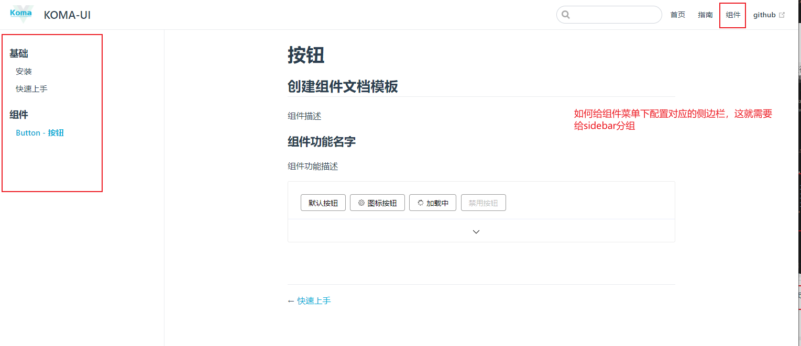

# vuepress主题搭建

参考：
[vuepress官方文档](https://vuepress.vuejs.org)
[vuepress使用教程](https://juejin.cn/post/6844903842375532558)

[代码高亮插件](https://highlightjs.org/)
[代码折叠功能](https://blog.csdn.net/weixin_39844549/article/details/110477043)


这篇文章记录了我搭建vuepress的整个过程，方便以后记录查询。

## 1.搭建类：
搭建教程即安装到部署的整个流程。

### 1. 安装
```js
npm i vuepress -D   // 安装vuepress包

// 在package.json中添加指令
"scripts": {
  // 本地开发
  "docs:dev": "vuepress dev docs",
  // 打包上线
  "docs:build": "vuepress build docs"
}

// 编译
npm run docs:dev

```
启动成功后会 `VuePress` 会在 http://localhost:8080 (opens new window)启动一个热重载的开发服务器。

### 2. 打包部署
#### ① 打包
```js
// 打包
npm run docs:build
```
**在markdown中 demo组件不包裹`ClientOnly`会报错**

#### ② 部署
#### 1. 首先在 `config.js` 中加入base
base是githubpage的仓库名


#### 2. 项目根目录下创建 `deploy.sh` 文件
记得改掉仓库地址


#### 3. 执行`deploy.sh`发布
- 第一种 命令行直接 `./deploy.sh`


- 第二种 添加脚本
`"d": "bash deploy.sh"`


打包文档后，部署使用 `npm run d` 或者 `./deploy.sh`

#### 4. 预览成功




---

## 2.vuepress使用类
下面的是我使用vuepress的心得。
### 1. 目录结构
```
|-- docs // 特定的目录
    |-- README.md // 首页
    |-- .vuepress // 特定的目录
        |-- config.js // 特定的配置文件
```


### 2. 主题色修改
在目录 `/docs/.vuepress/styles`  下新增 `palette.styl` 文件，内容如下：
```
$accentColor = #00abd5 //要修改的主题颜色
```

### 3. 首页的配置：

在首页的YAML格式配置中，我们填写了一些配置，下面我们将详细描述每一个配置的具体含义
- home:true：标记此页面是否为首页
- lang:zh-CN：表示本页面的语言为zh-CN(简体中文)
- heroText: 首页的标题内容
- heroImage: 首页的标题图片，其中全路径为docs/.vuepress/public/logo.jpg，默认去public目录下找静态资源
- actionText: 首页跳转按钮的内容
- actionLink: 首页跳转按钮挑战的路径，其中全路径为docs/interview/readme.md，默认readme命名的文件可以省略不写链接的后面内容，省略后的链接如上
- features: 表明首页的特征，固定的格式为title + details，以三栏流式布局的方式展示
- footer: 为底部内容，与普通的网页一样，我们可以在footer里面写版权信息


到这里可能会产生疑问，为什么 /home.png 就能读取到图片，这个图片应该放在哪里呢？
在vuepress的官方文档中有详细说明，https://vuepress.vuejs.org/zh/guide/assets.html#%E5%85%AC%E5%85%B1%E6%96%87%E4%BB%B6


### 4. 导航栏的配置：
> 配置导航栏需要在.vuepress/config.js文件中进行配置


### 5. 侧边栏的配置：
> 侧边栏分组即意味着把链接进行分组，每一个链接对应一个页面。

侧边栏分组可以如下进行配置，其中collapsable属性设置为false，意味着展开这个分组，属性设置为true，意味着折叠这个分组。



---
## 3. 插件类
### - 代码折叠功能
vuepress没有提供代码折叠的配置，所以插入折叠组件。
#### 一. 编写代码折叠mixin.js
① 在`/docs/.vuepress`下创建`mixin.js`文件，编写代码折叠逻辑。


```js
// mixin.js
export default {
  data () {
    return {
      //每一个区域的高度
      codeParent: [],
      codeHeightArr: [],
      //每个区域的显示状态
      isShow: [],
    }
  },
  methods: {
    //根据子元素的高度 设置代码区域父元素的高度
    showCode (index) {
      this.$set(this.isShow, index, !this.isShow[index])
      this.$nextTick(() => {
        if (this.isShow[index] === true) {
          this.codeParent[index].style.height = +this.codeHeightArr[index] + 25 + 'px'
        } else {
          this.codeParent[index].style.height = 0
        }
      })
    },
    //得到所有代码区域的高度
    getCodesHeight () {
      const arr = document.getElementsByClassName('code-content-height')
      this.codeParent = document.getElementsByClassName('code-content')
      const arrLength = arr.length
      for (let i = 0; i < arrLength; i++) {
        this.codeHeightArr.push(arr[i].getBoundingClientRect().height)
        this.isShow.push(false)
      }
    },
  },
  mounted () {
    //异步获取当前组件内部 code区域的高度 以便于给点击的时候使用
    this.$nextTick(() => {
      this.getCodesHeight()
    })
  },
}
```

② 同目录下创建enhanceApp.js这里引入折叠代码的相关css应用于全局。 

`enhanceApp.js` 用于全局去引入附加的 Vue 插件、注册全局组件，或者增加额外的路由钩子等。


https://vuepress.vuejs.org/zh/theme/writing-a-theme.html


```js
import './public/index.less'
export default ({
  Vue, // VuePress 正在使用的 Vue 构造函数
  // options, // 附加到根实例的一些选项
  // router, // 当前应用的路由实例
  // siteData // 站点元数据
}) => {
// ...做一些其他的应用级别的优化
}
```

③ /doc/.vuepress/public创建index.less
```less
.theme-container.sidebar-open .sidebar {
  box-shadow: 0 0 10px rgba(0, 0, 0, 0.2);
  border: 0;
}
.sidebar, .navbar {
  z-index: 10000;
}
 
.component-wrapper {
  border: 1px solid #ebebeb;
  border-radius: 3px;
  transition: .2s;
 
  .component-wrapper-demo {
    padding: 24px 24px 15px 24px;
  }
 
  h4 {
    margin: 55px 0 20px;
  }
 
  &:hover {
    .lock-code .lock-code-word {
      font-size: 14px;
      transform: translateX(-40px);
      opacity: 1;
    }
 
    .lock-code .icon-down {
      transform: translateX(-40px);
    }
 
    box-shadow: 0 0 8px 0 rgba(232, 237, 250, .6), 0 2px 4px 0 rgba(232, 237, 250, .5);
  }
 
  .code-content {
    background-color: #fafafa;
    border-top: 1px solid #eaeefb;
    overflow: hidden;
    transition: height .2s;
 
    .code-content-height {
      .code-user-desc {
        background: #ffffff;
        margin: 10px 10px 0 10px;
        padding: 5px 10px;
        font-size: 14px;
        line-height: 26px;
        border: 1px solid #ebebeb;
        border-radius: 3px;
      }
 
      > pre {
        background: none;
 
        > code {
          color: #3182bd;
        }
      }
    }
  }
 
  .lock-code {
    border-top: 1px solid #eaeefb;
    height: 44px;
    box-sizing: border-box;
    background-color: #fff;
    border-bottom-left-radius: 4px;
    border-bottom-right-radius: 4px;
    text-align: center;
    margin-top: -1px;
    color: #d3dce6;
    cursor: pointer;
    position: relative;
    line-height: 44px;
    color: #d3dce6;

    > svg {
      vertical-align: middle;
    }
 
    &:hover {
      background-color: #f9fafc;
 
      .lock-code-word {
        color: #409eff;
      }
 
      .icon-down {
        fill: #409eff;
      }
    }
 
    .icon-down {
      transform: translateX(0px);
      transition: all .1s;
    }
 
    text-align: center;
 
    .lock-code-word {
      font-size: 0px;
      margin-left: 15px;
      display: inline-block;
      transition: all .1s;
      opacity: 0;
    }
  }
}
 
::-webkit-scrollbar {
  width: 8px;
  background-color: #f5f5f5;
}
 
::-webkit-scrollbar-thumb {
  border-radius: 6px;
  background-color: #ccc;
}
 
::-webkit-scrollbar-track {
  border-radius: 6px;
  background-color: #f5f5f5;
}
```

④ 封装代码折叠组件。

```vue
// demos-component
<template>
  <div class="demo">
    <h2>{{ title }}</h2>
    <p>组件描述</p>
    <h3>组件功能名字</h3>
    <p>组件功能描述</p>
    <div class="component-wrapper">
      <div class="component-wrapper-demo">
        <slot name="code"></slot>
      </div>
      <div class="code-content" style="height: 0;" v-highlight>
        <div class="code-content-height">
          <div class="code-user-desc">
            组件描述说明
          </div>
          <pre><code class="vue">{{ computedCodeStr }}</code></pre>
        </div>
      </div>
      <div class="lock-code" @click="showCode(0)" ref="xxx">
        <k-icon class="icon-down" :name="isShow[0] === false ? 'down' : 'up'"></k-icon>
        <span class="lock-code-word">{{isShow[0] === false ? '显示代码' : '隐藏代码'}}</span>
      </div>
    </div>
  </div>
</template>

<script>
import mixin from '../mixin';
import KIcon from '../../../src/components/icon';
export default {
  name: 'demosComponent',
  mixins: [mixin],
  components: {
    KIcon
  },
  props: {
    // 大标题
    title: {
      type: String,
      default: '创建组件文档模板'
    },
    // 代码块
    codeStr: {
      type: String,
      default: ''
    }
  },
  computed: {
    computedCodeStr() {
      return this.codeStr.replace(/\t+|  +/g, '').trim()
    },
  },

}
</script>
```

⑤ 使用封装的折叠代码组件


## - 代码高亮插件引入
在组件中插入代码想使得代码语法高亮可以用 `highlight.js` 插件

① 安装
`npm i highlight.js -D`

② 全局引入
enhanceApp.js中 引入highlight插件,这里使用与atom-one-light主题
```js
import './public/index.less'
// 代码高亮文件引入
import Vue from 'vue'
import hljs from 'highlight.js'
//样式文件,这里我选的是atom-one-light样式，文件里面还有其他样式可供选择
import 'highlight.js/styles/atom-one-light.css'
Vue.directive('highlight',function (el) {
  let blocks = el.querySelectorAll('pre code');
  blocks.forEach((block)=>{
    hljs.highlightBlock(block)
  })
})
export default ({
  Vue, // VuePress 正在使用的 Vue 构造函数
  // options, // 附加到根实例的一些选项
  // router, // 当前应用的路由实例
  // siteData // 站点元数据
}) => {
// ...做一些其他的应用级别的优化
}
```

③ 使用
之后在包装代码的外层div加上v-highlight指令，并在code标签标明代码模板类型为html/javascript/css
```html
<div class="code-content" v-highlight style="height: 0;">
  <div class="code-content-height">
    <!-- <div class="code-user-desc">
      组件描述说明
    </div> -->
    <pre><code class="html">{{codeStr}}</code></pre>
  </div>
</div>
```
使用效果：


其他主题可以到highlight的官方文档中寻找

[代码高亮插件](https://highlightjs.org/)