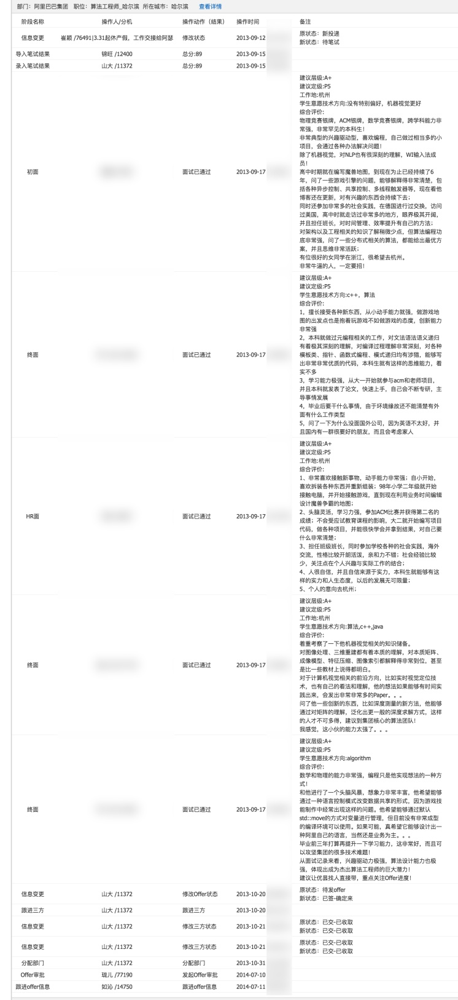

今天没有看造轮子，只是看了一些面经给自己打了打鸡血（最近加班有点多，所以学习激情不是很高）。
知道了阿里星大神，什么才是剽悍的人生

**总结：得好好一步一个脚印去学习，不要妄图一口吃成一个大胖子，心急吃不了热豆腐。**

死海效应： 最近公司牛逼的前端都离职了，留下的都是对自己技术没有多大信心的，就好像死海一样，牛逼的人都蒸发了，只剩下差一点的，只有自己更牛逼一样跳出现在的环境。

### 针对最近学习激情减弱的解决方案：

看都阿里面试官经常会提到一个关键词———自我驱动力（self-motivated）。
这篇文章详细介绍了什么是自我驱动？
[自我驱动力](https://www.zhihu.com/question/19710416)

### 1. 搞清楚为什么
### 2. 专注于宏图愿景
### 3. 保持活力 （这是我印象比较深刻的一点，因为跟自己深有同感）
当你的情绪低落时，你很难驱动你自己。

研究表明，每周外出几次进行合理时间长度的活动会减弱抑郁症状。锻炼30分钟也将有助于提高羟色胺、多巴胺、降肾上腺素水平，进而环节紧张情绪。 当我锻炼30分钟以上时（尤其是在早上），我整天都会更加放松，思路也会更清晰。 此外，如果你在锻炼中不断驱动自我、试探自己的极限，这也是非常健康的。例如，我以前从来没有跑过半马，而今年我决定挑战一下。过程很痛苦，但当我完成之后，我立刻想到：“如果我可以跑完半马，那我是不是同样有能力完成其他的事情？” 在生理上驱动自己会对你的心理以及人生中的其他部分产生同样的驱动力，例如你的事业。

### 4. 找到一个可信赖的伙伴
### 5. 有推动力的警句
### 6. 制造较小的、可达到的目标
把你的远大目标分解为小而简单的目标，你会感觉到你在征程中逐步前进，同时也会在完成掉小目标时获得成就感。进步感和成就感是一对美妙的组合。
### 7. 享受生活
如果你玩的开心，你会在工作时具有更强的驱动力。90%的人都是如此。好吧，我没有证据证明这个数据是准确的，但我十分确定大多数人都是如此。
你有没有注意到，当你在玩乐时，你会更加有魅力、更积极、更乐观？你有没有注意到如果你真的享受工作，你会更高产？你有没有注意到，如果你让工作环境变得更棒，其实你就是在激励其他团队成员？

### 8. 冥想
### 9. 进行头脑风暴，记录想到的idea
### 10. 想象未来，着手实现！

---

## 明日目标： 看完icon组件