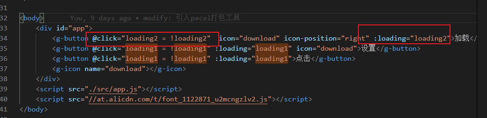
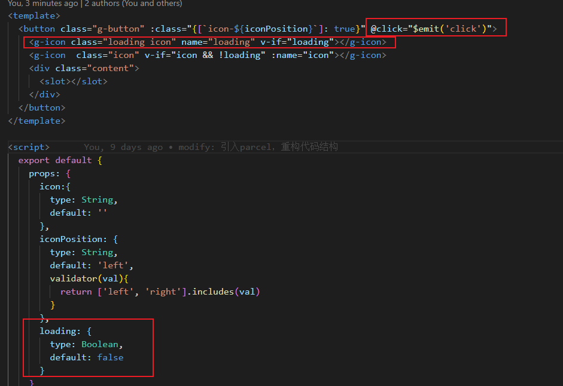
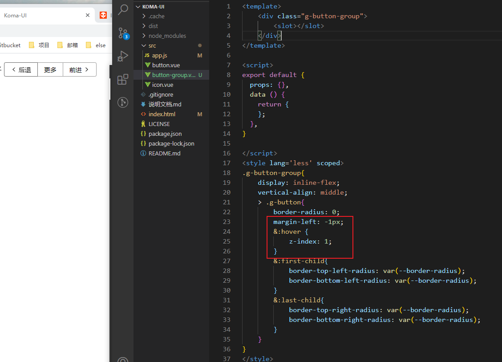
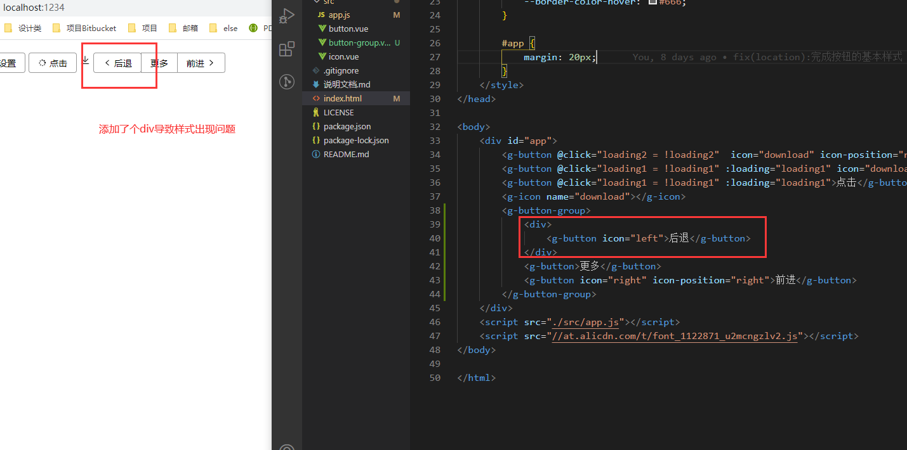

### button组件

#### 添加click loading事件

添加一个loading状态，同时监听click事件

需要注意的是在组件内部，因为vue对你建的组件不知道click在哪触发，需要手动加一个click的emit触发事件

#### 添加button-group组件
button组件要注意链接处的边框和圆角处理 学会使用hover z-index的处理

处理组件使用的极端情况:
判断插槽内容的合法性

#### 明日学习内容： 单元测试