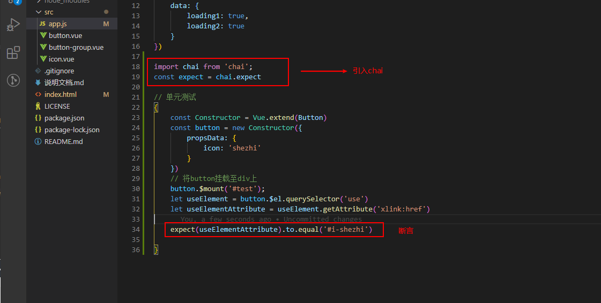
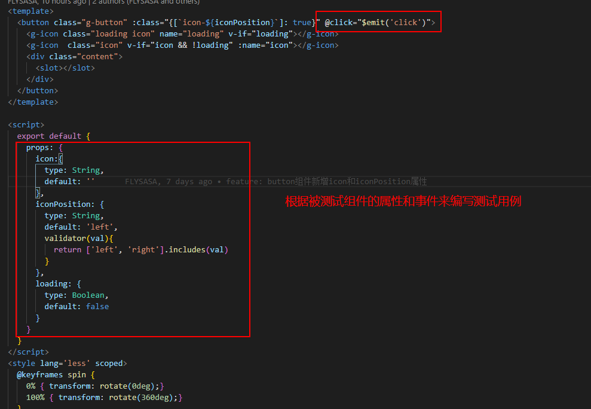
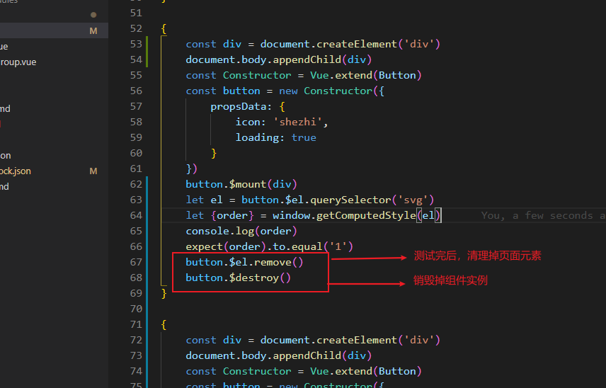
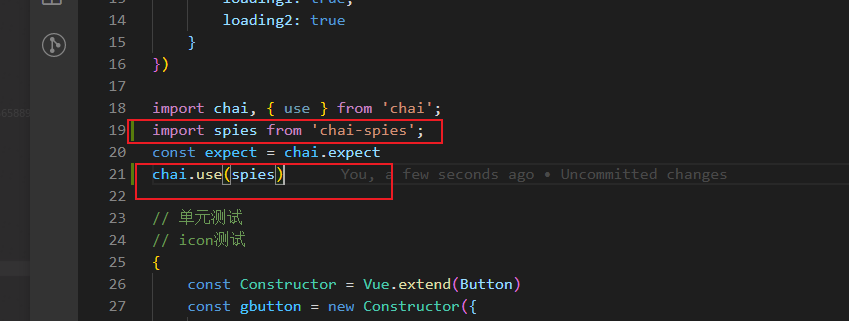
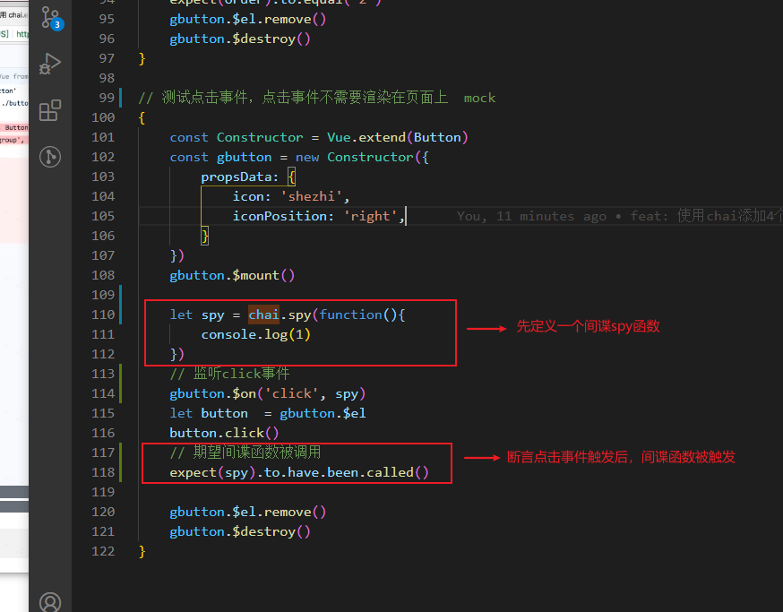

### 单元测试
>BDD: Behavior Driven Development (行为驱动开发)
>TDD：Test Driven Development (测试驱动开发)
>Assert: 断言


### 编写button测试用例
扩展button实例


引入chai


测试方向


#### 编写测试用例，验证图标 icon order为1

思路是，需要将button实例挂载到一个div上，才能有css属性order
```
const Constructor = Vue.extend(Button)
const button = new Constructor({
    propsData: {
        icon: 'shezhi',
        loading: true
    }
})

const div  = document.createElement('div')
document.body.apendChild(div)
button.$mount(div)              // 需要挂载实例到div上，不然将没有css
let svg = button.$el.querySelector('svg')
let { order } = window.getComputedStyle(svg)   // 所有css属性值都是字符串
expect(order).to.equal('1')     
```

销毁实例



#### 测试点击事件
首先安装
```
npm i -D chai-spies
```

引入


定义间谍函数，并希望被触发

