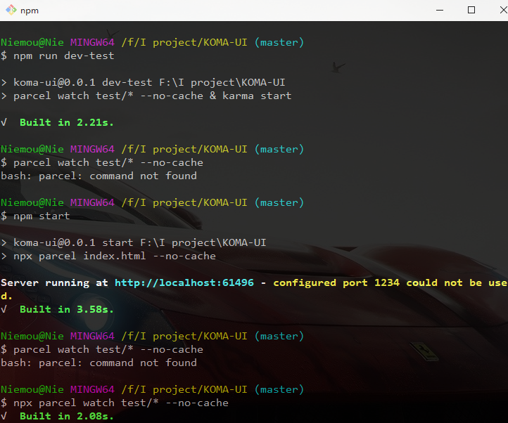
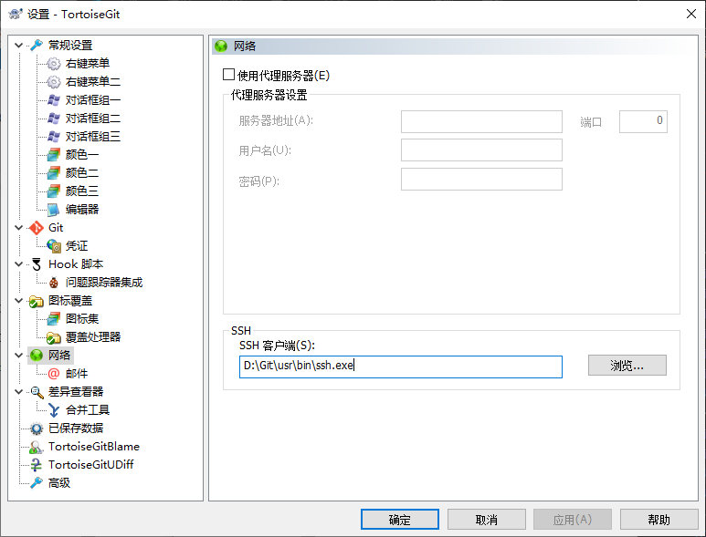

在英文路径下，重装git, 不推荐在git官网下载，会非常慢，用镜像:
[传送门](https://npm.taobao.org/mirrors/git-for-windows/)

安装时的选项可以参考下面，这样编译时会有一些图标等好玩的东西，而不是乱码。
[解决git乱码的问题](https://www.jianshu.com/p/414ccd423efc)

**注意重装后，如果使用了gitTortoise, 记得设置 网络**

