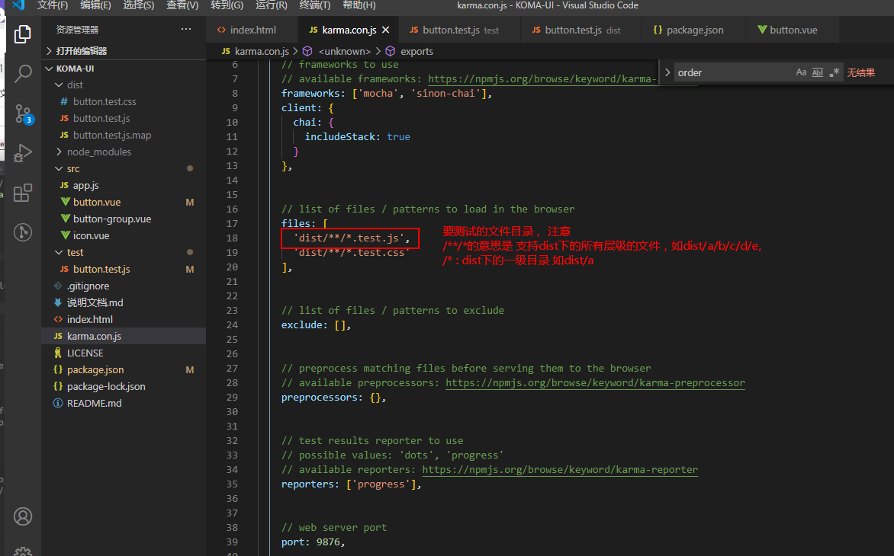
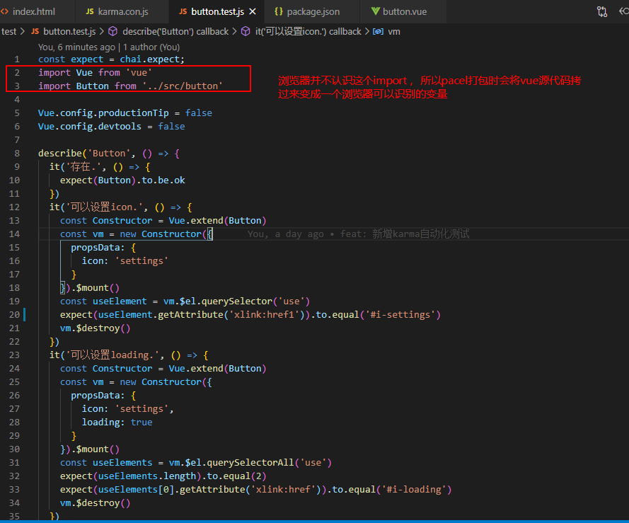

1. 安装完karma mocha 包

2. 新增karma.conf.js 配置项文件
比较重要的配置项：


3. package.json 加入执行脚本
```
"dev-test": "parcel watch test/* --no-cache & karma start",
"test": "parcel build test/* --no-cache --no-minify && karma start --single-run"
```

`pacel build test/*` 打包过程： 

pacel会 打包test下所有一级目录文件。解析文件中import语句，将其源码拷贝打包成变量。


`--no-cache --no-minify`  // 不走缓存，不压缩，不加会有问题


`karma start --single-run`  // 启动karma，只启动一次