### npm 发布包

#### 1. 上传代码到 npmjs.org

- ###### 创建 `index.js` 文件
在这个文件中将想要的导出的内容导出

package.json 入口指向导出的文件

- ###### 项目根目录下执行`npm addUser`
执行这个的时候记得不要使用淘宝源

- ###### 运行 `npm publish`

---
### 使用自己的包
别人使用我们的包的场景
- 使用 vue-cli
- 使用 webpack
- 使用 parcel

这里以`vue-cli`为例:
#### 1. 全局安装 `npm install -g @vue/cli` 
注意别安装到`npm install -g @vue/cli-service-global`这个了，会`vue create hello-world`跑不起来

#### 2. 开始按步骤构建
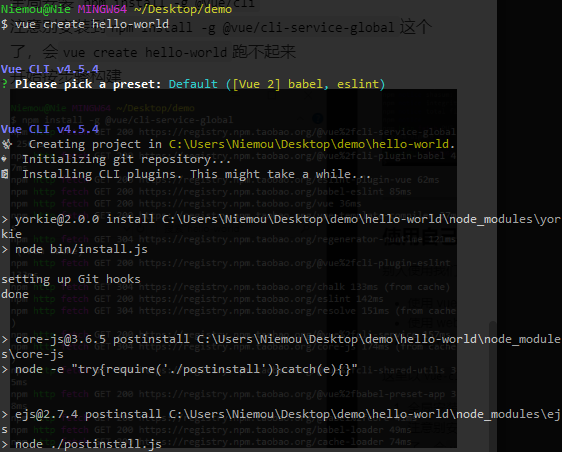
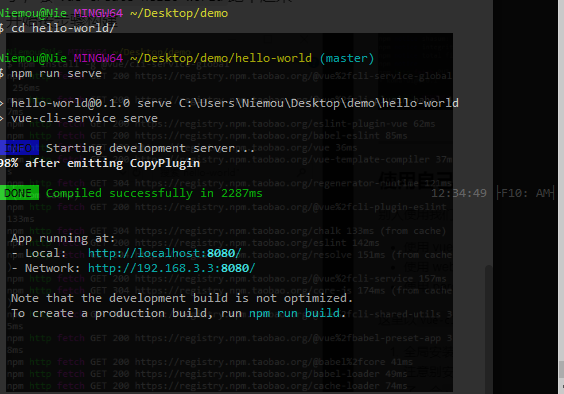

#### 3. 构建完成后，开始安装我们的包
`npm i koma-ui`

#### 4. 在项目man.js里引入 组件
会发现报错：
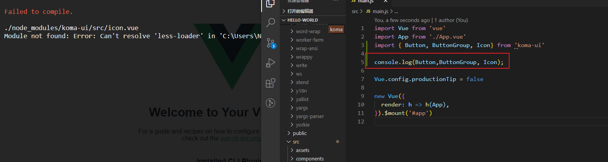

这是因为node不支持我们的包里面的import语法,然后让用户直接去使用dist里面打包后的index.js。
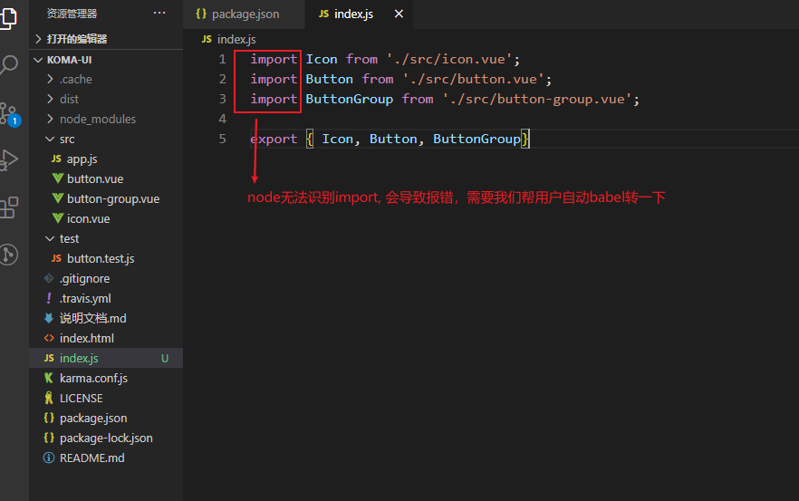

#### 如何解决import转义的这个问题？
1. **使用parcel 打包index.js，将import语法转成正常的js语法**
`npx parcel build index.js --no-cache`
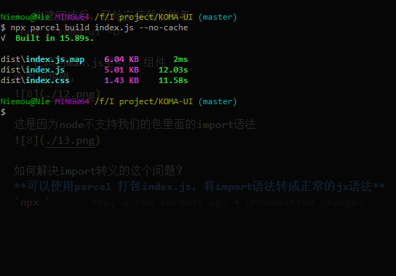
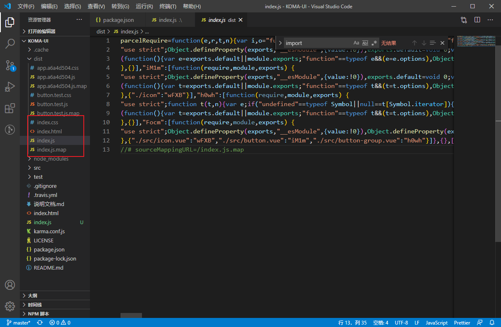

2. 修改 `package.json` 里的入口配置
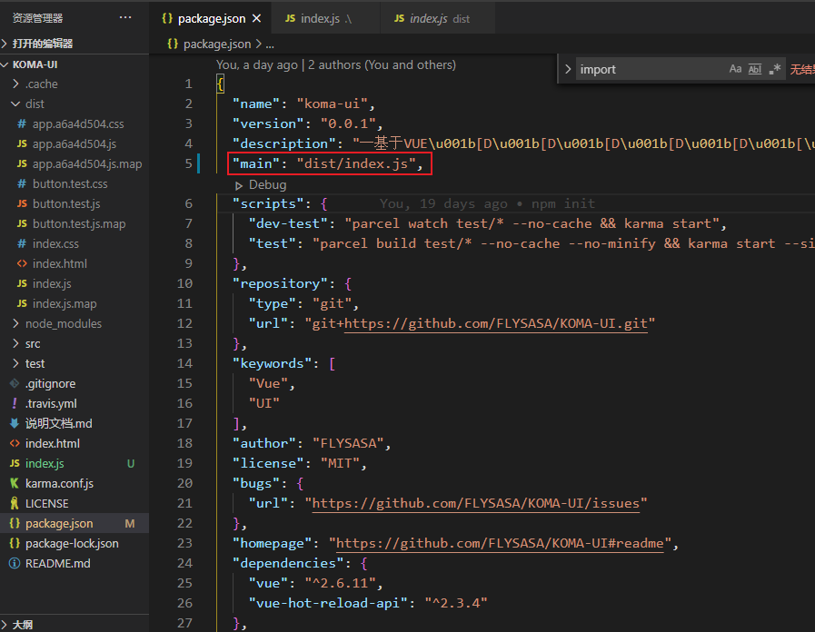

3. 修改完后需要注意的是：
**.gitignore 文件中是把dist文件忽略掉了， npm发布包时如果没有.npmignore文件的话是默认使用.gitignore的配置**
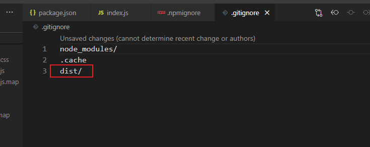

所以我们需要重新新建一个`.npmignore`文件，排除掉dist文件:
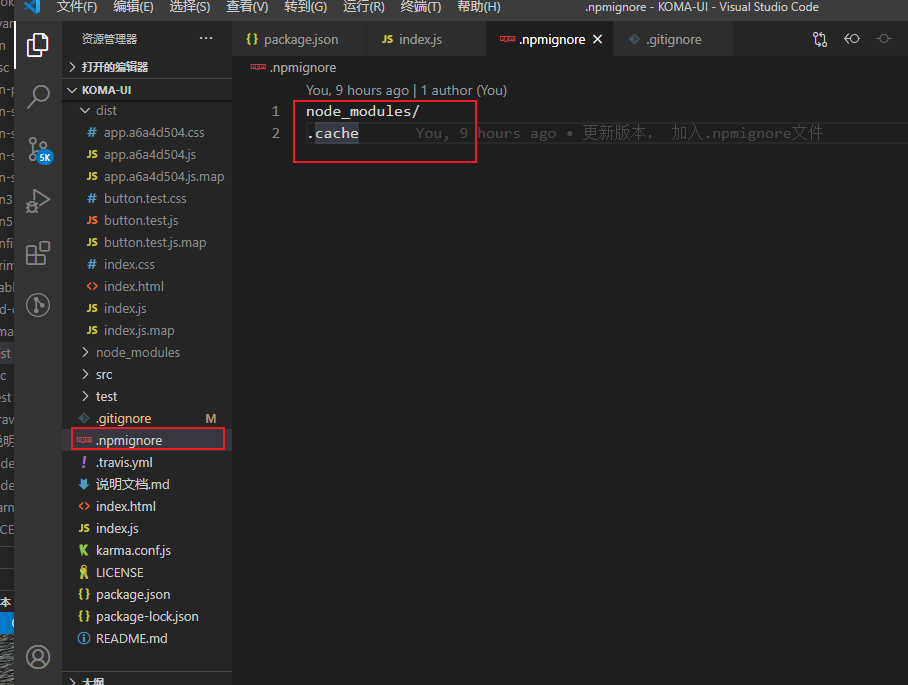
这样用户就能正常引入到dist下的index.js文件。
**yarn不会有这个问题**

4. 重新发布
`npm publish`

直接提交会报版本迭代的问题
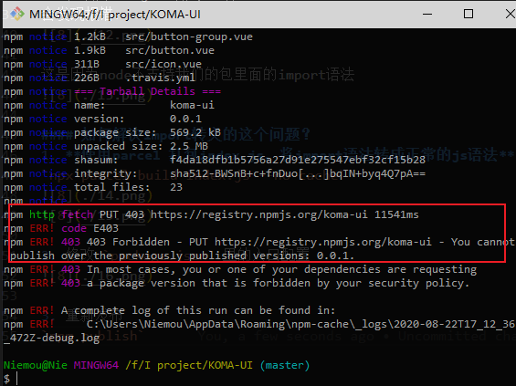

更新版本号：
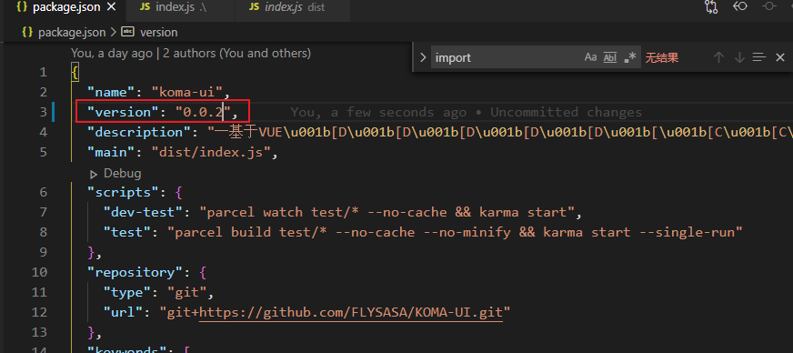

再次发布：
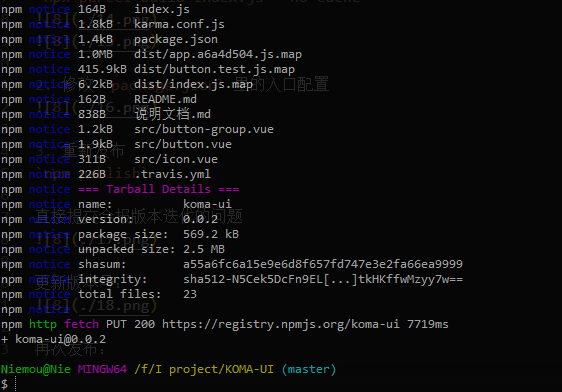

5. 测试
正常打印出引入的实例
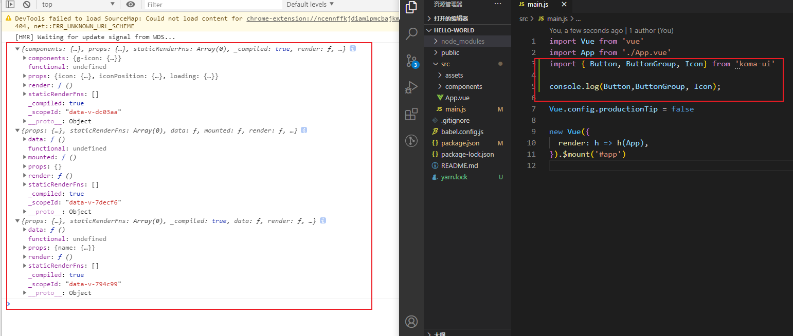

#### 5. 使用者更新发布的包
`npm i koma-ui`
或者
`yarn add koma-ui`

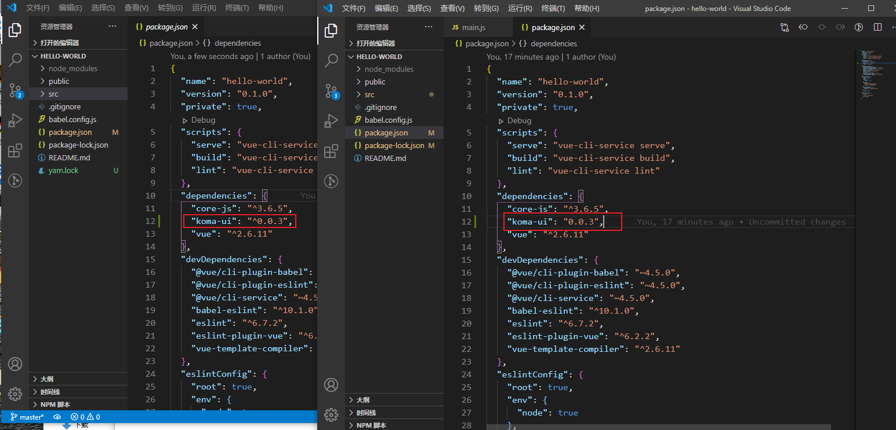

注意这里有点不一样，安装的包： npm是一个固定版本`0.0.3`，而yarn 向上兼容`^0.0.3`，这就意味着如果后续需要使用新版本的话，npm需要加上`^`。

使用：
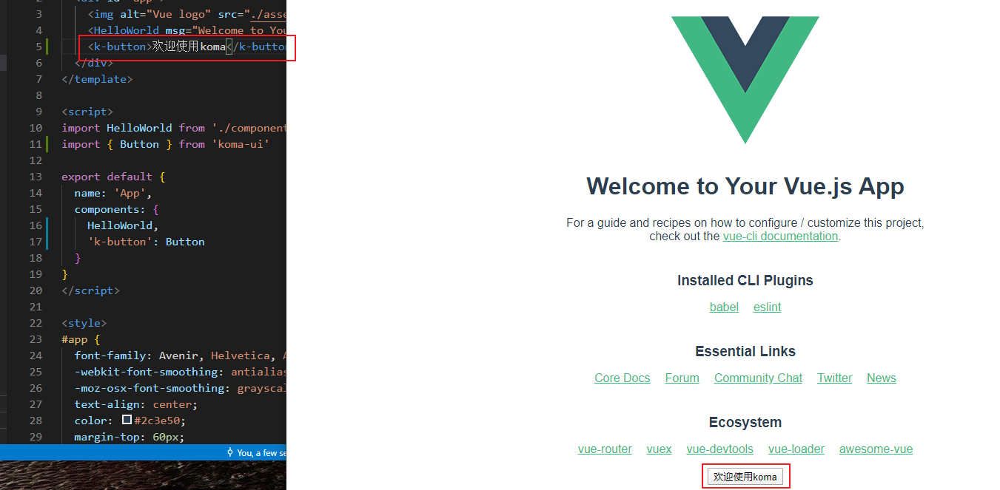

仔细看发现样式没有引入进来：
手动引入样式后发现没有border, 这是因为之前我们在root里定义了一些基本css变量

再把样式拿过来：
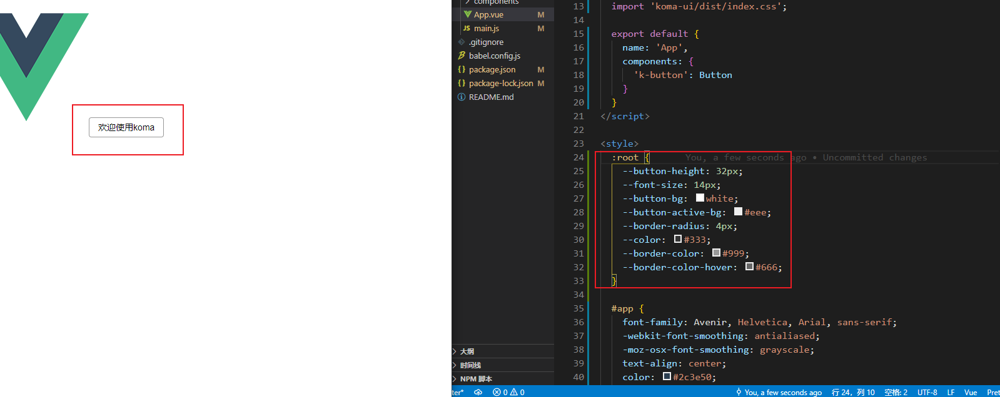

引入成功~~~~~~

---
> 总结：在使用npm发包的时候，要站在用户的角度去使用包。具体发包步骤：
> 1. 记得在项目里定义`index.js` 输出自己的组件，但是node是无法解析import的，所以需要我们使用parcel将其打包，然后指向`dist/index.js`,然后在package.json里的main指向这个路径。
> 2. `npm adduser`
> 3. `npm publish`

> 使用包的步骤:
> 1. 使用npm的时候 记得向上兼容版本， `^0.0.3`
> 2. 引入组件的root样式