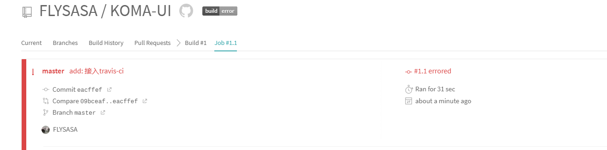
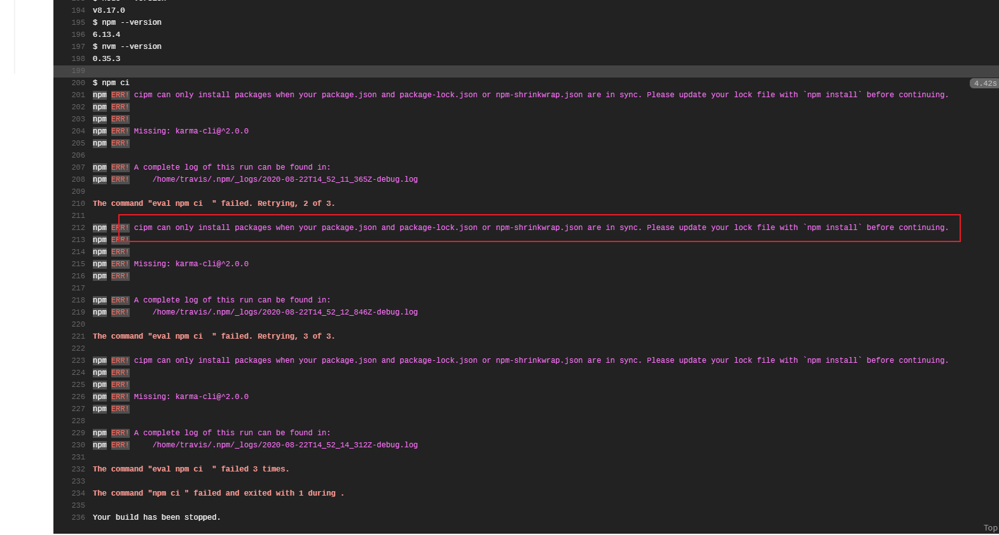
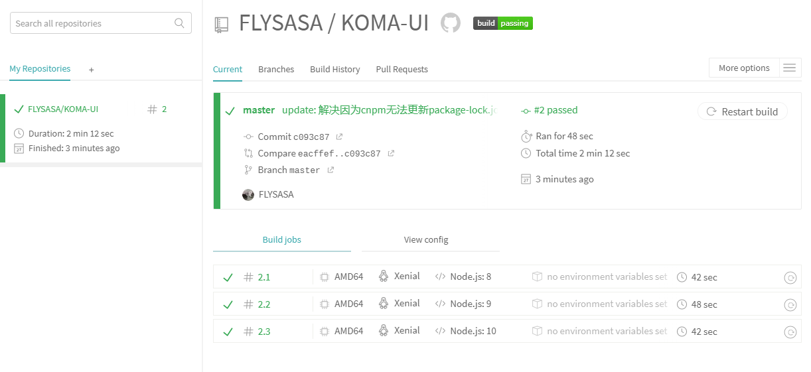

### travis ci 持续集成

步骤：
#### 1. 新建 .travis.yml 文件
```
language: node_js
node_js:
  - "8"
  - "9"
  - "10"
addons:
chrome: stable
sudo: required
before_script:
  - "sudo chown root /opt/google/chrome/chrome-sandbox"
  - "sudo chmod 4755 /opt/google/chrome/chrome-sandbox"
```

#### 2. travis-ci 找到该项目


每推送一次代码都会自动构建

开始首次构建，发现有提示错误信息



**错误原因是因为之前为了快速装包使用了cnpm, 所以导致package-lock.json无法更新，所以无法通过不同版本的node验证**

重新使用`npm i`装包：
校验成功



关于持续集成：
