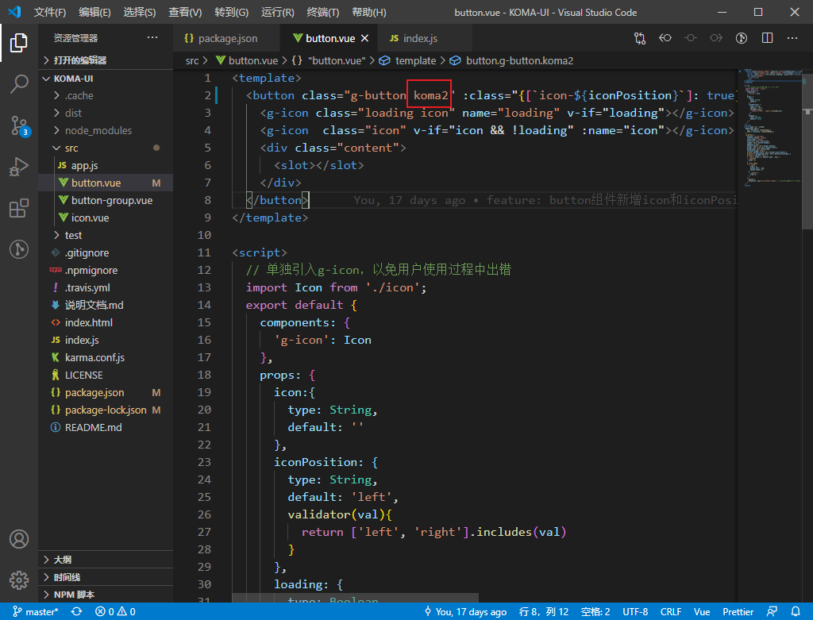
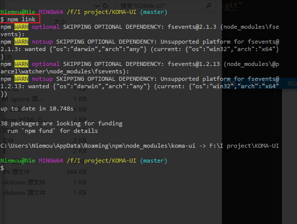
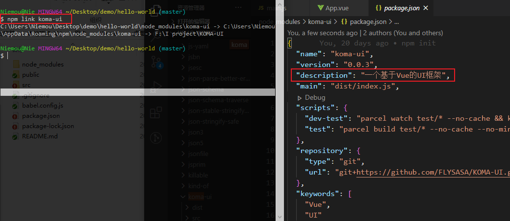
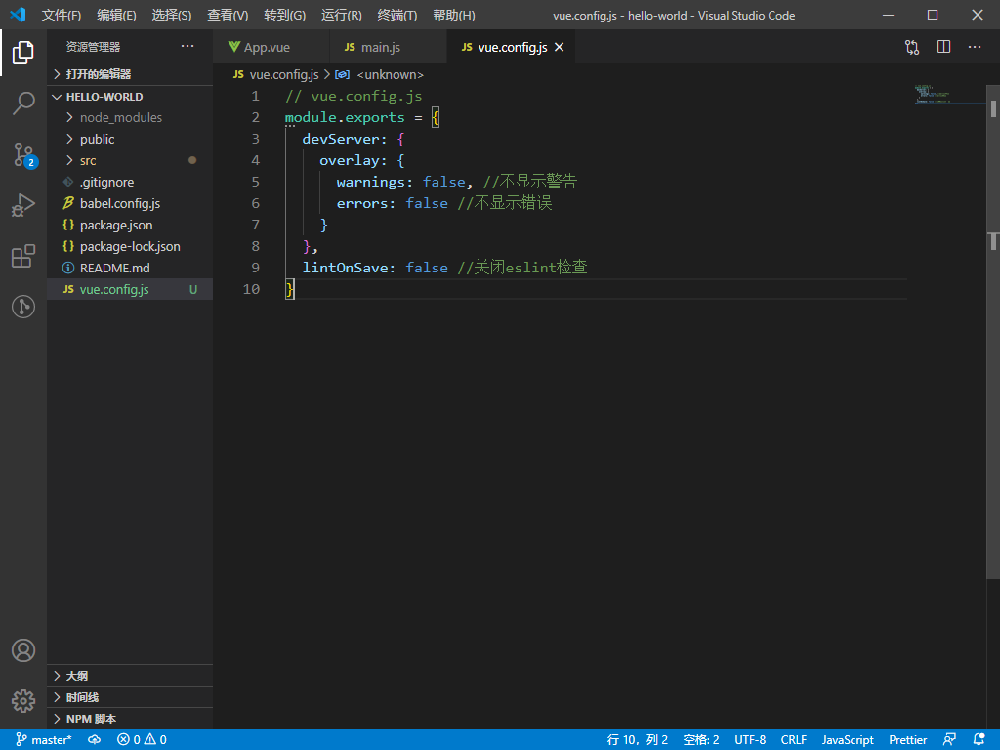
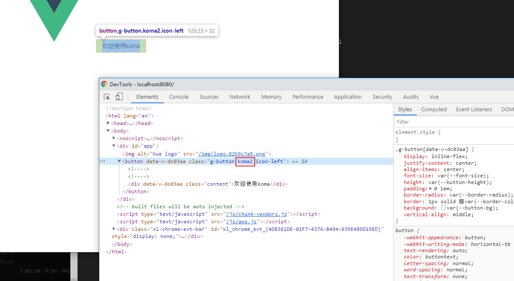
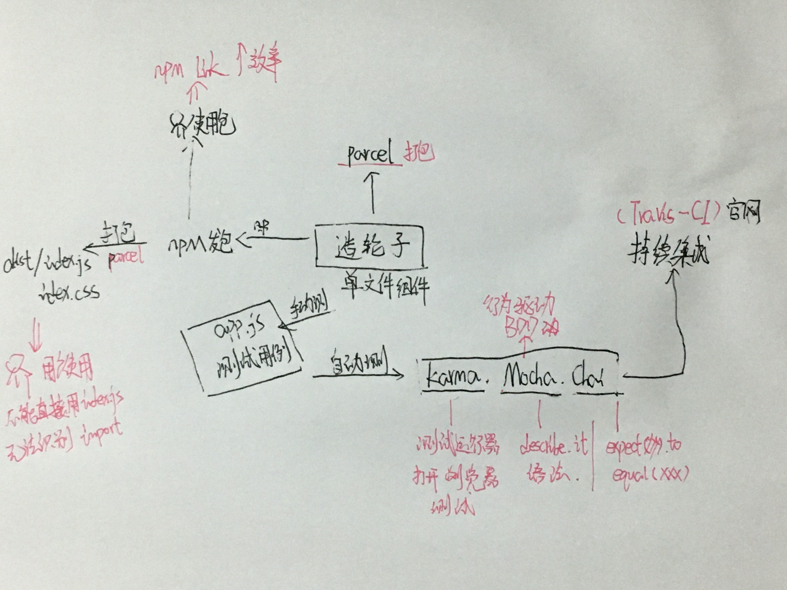

解决问题的关键是**加快解决问题的效率**。

### 如何加快造轮子的效率？

举例： 
1. 这里修改了下class：

2. build一下
`npx parcel build index.js --no-cache`

3. 使用`npm link`
这个作用主要是映射当前项目出去

4. 本机用户使用
`npm link koma-ui`

**注意这里引入的时候会报 eslint 错误，需要新建一个vue.config.js关掉eslint**

这里就能每在那边build一下都能实时响应：

总结： 

