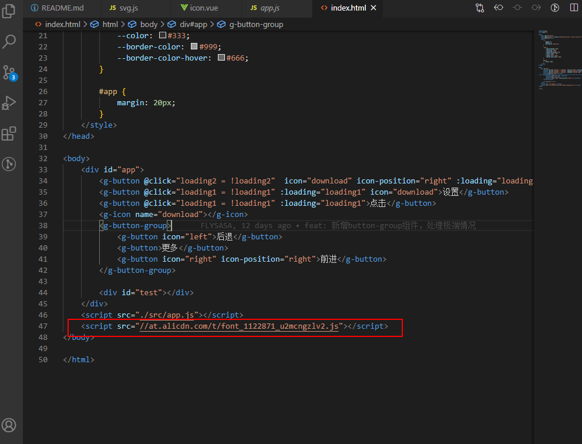
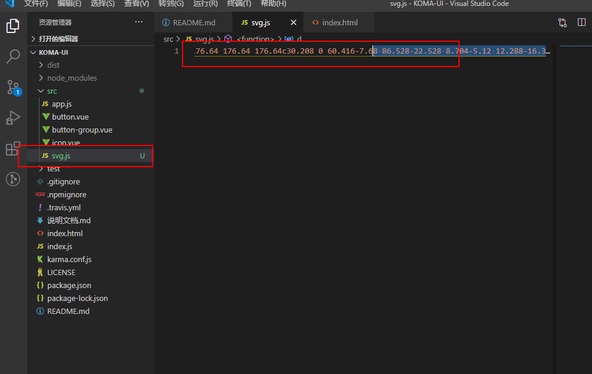
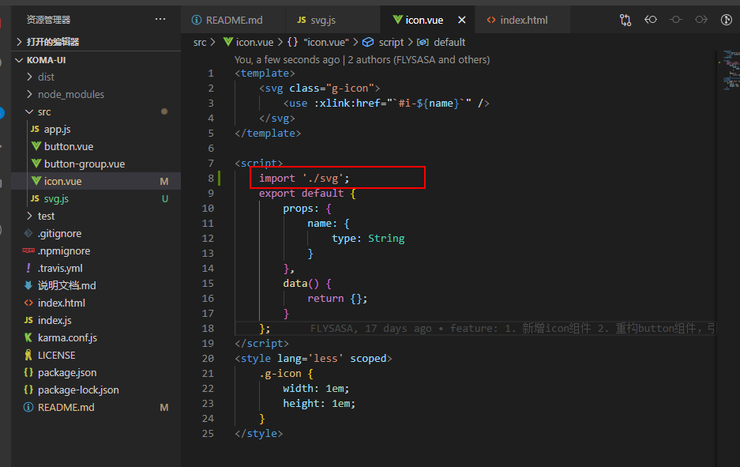

# 书写README.md

## 1. 引入 travis-ci badge
[badge引入链接]('https://docs.travis-ci.com/user/status-images/')

## 2. 书写介绍和使用说明等

## 3. 改为本地引入 svg symbols
- 新增`svg.js`
    将svg链接里的源码粘贴过来
    
    
- 引入 `svg.js`
    

- 每更新一次icon都要 重新 更新svg.js