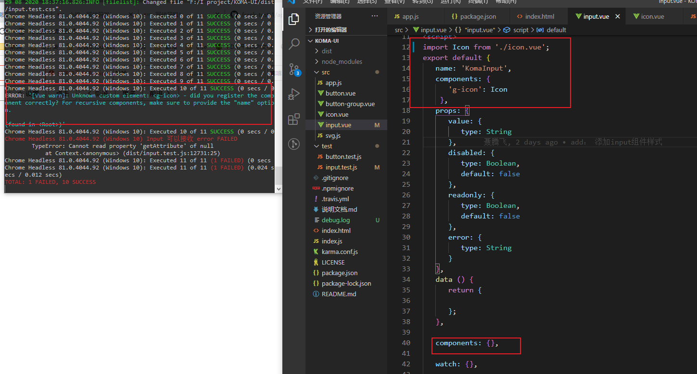

# 编写input组件的测试用例

1. 奇怪的bug
明明引入了 `g-icon` 但是测试用例一直报下面这个错误，而无法通过测试。

提示没有注册`g-icon`组件， 找了好久的bug，终于发现在input组件里，我使用了 **自定义的 vue模板**时候，在下面还有一个`components`, 所以在这个组件上面引入后，下面又给我重置掉了，所以很悲催的一直提示组件未注册，以后一定要仔细啊~~