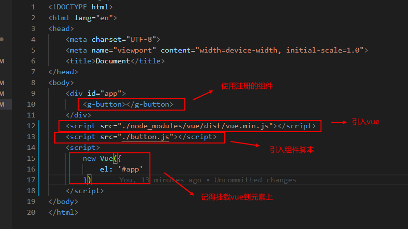
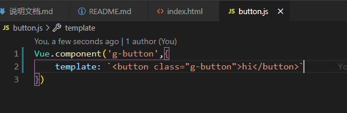
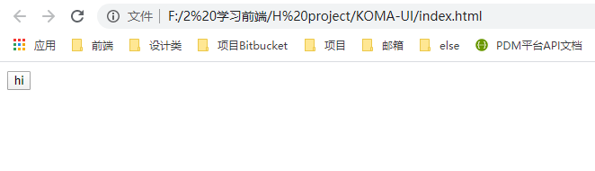
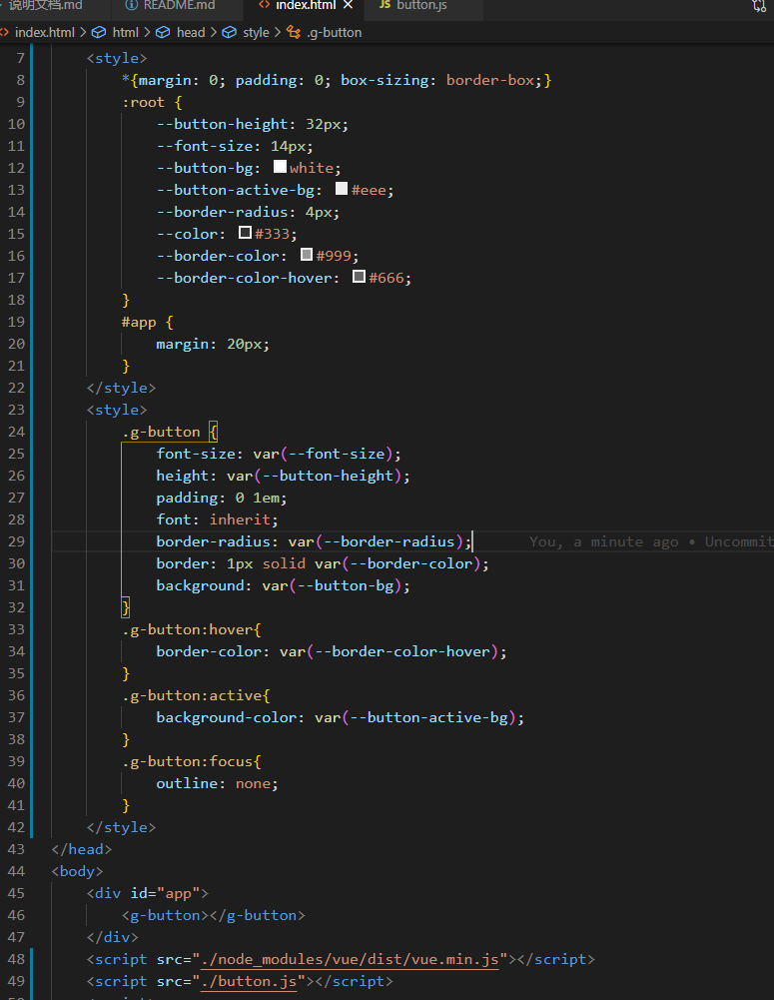
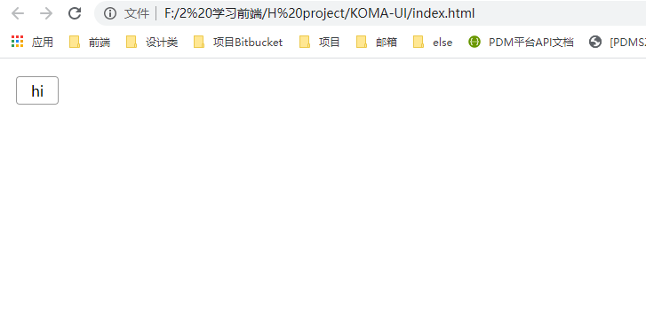
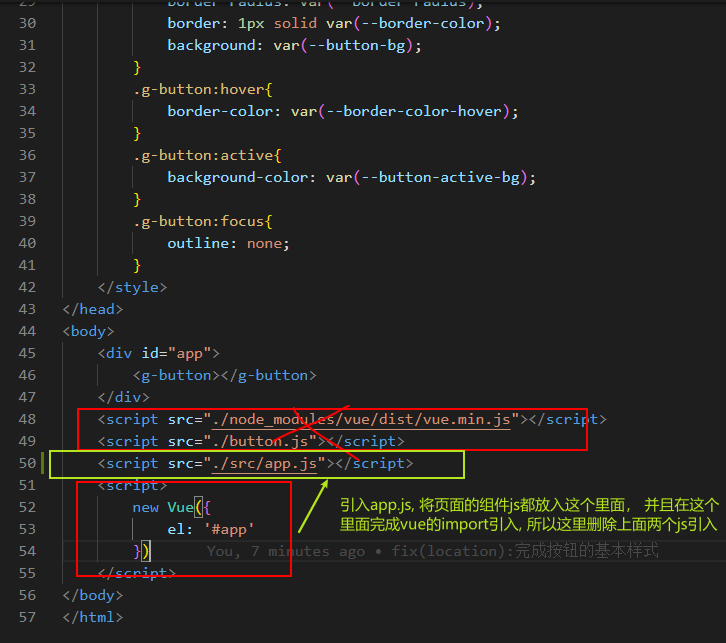
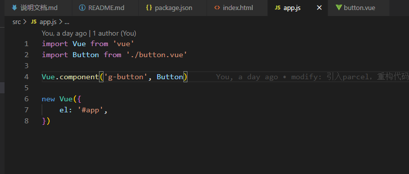
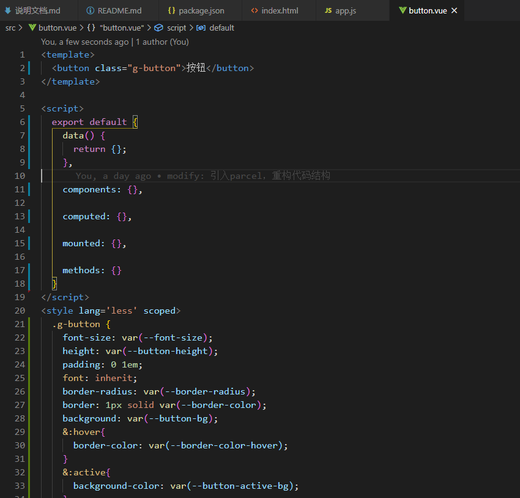
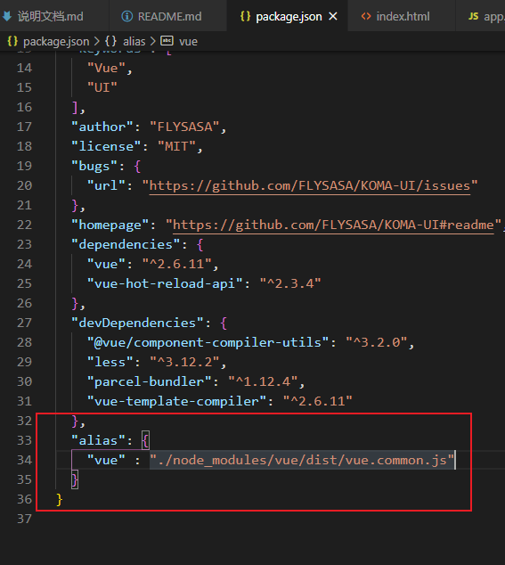
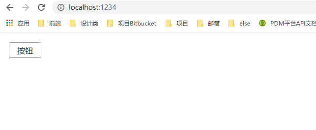

#### 学习使用vue的几种方法：
```
前提首先安装vue,  文件目录下 npm i vue
```
### 1. 首先不使用打包工具直接引入：
- 新建`index.html`


- 注册组件 `button.js`


- 页面效果：


我们可以在组件全局插入css变量，方便后期管理：
```
<style>
    :root {
        --button-height: 32px;
        --font-size: 14px;
    }
</style>
<style>
    .g-button {
        font-size: var(--font-size)
    }
</style>
```




### 2. 使用构建工具使用vue
vue的独特之处在于可以使用vue单文件的形式去写组件，这需要**构建工具**，这里引入parcel

安装之前记得设置npm 为淘宝源，不然会很慢
```
npm config set registry https://registry.npm.taobao.org
npm i -D parcel-bundler  // 面向开发者加入 -D, 面向客户不用加
```

重构代码：


app.js


button.vue


---
运行parcel
```
./node_modules/.bin/parcel  index.html
```
以上指令有可能首次会失败， 提示runtime-only
在package.json里添加, 使用完整版


添加完后, 不走缓存，运行成功
```
./node_modules/.bin/parcel  index.html --no-cache
或者
npx parcel index.html --no-cache // --no-cache不走缓存
```



---
小工具
```
npm i -g git-open

// 使用
git open   // 快速打开github 对应页面
```

