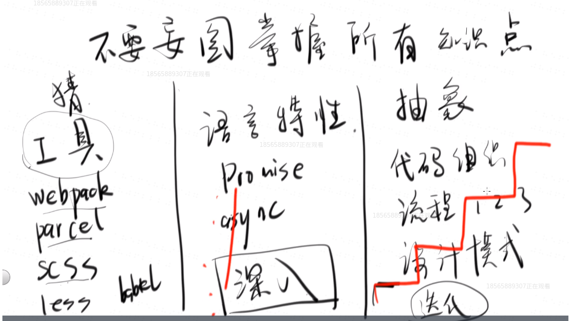
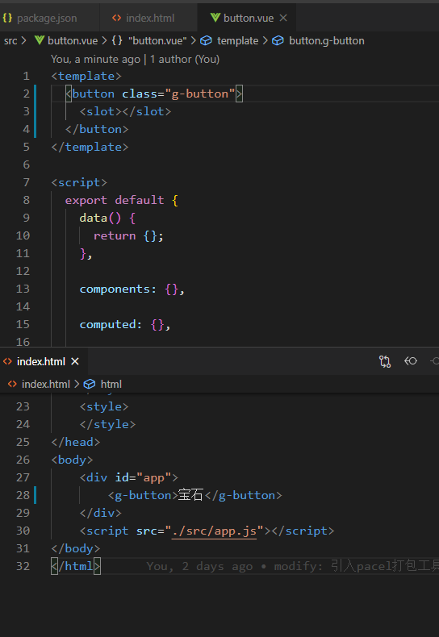
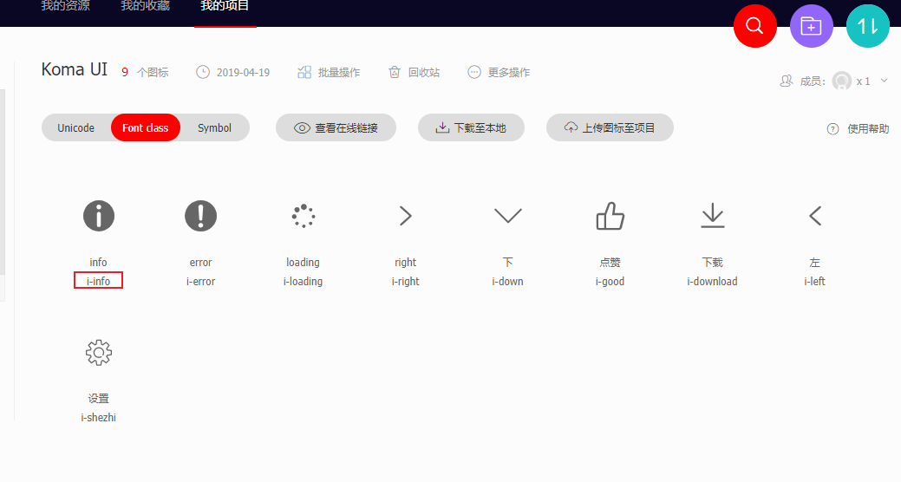
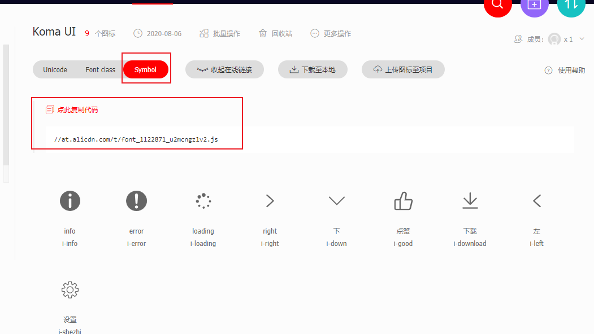
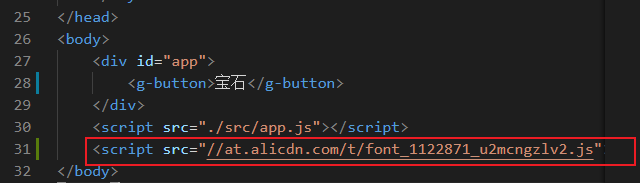
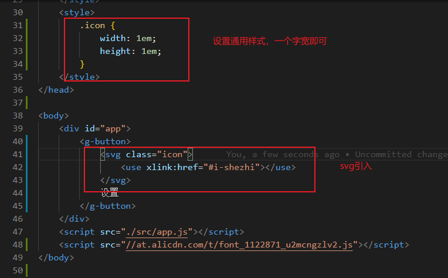
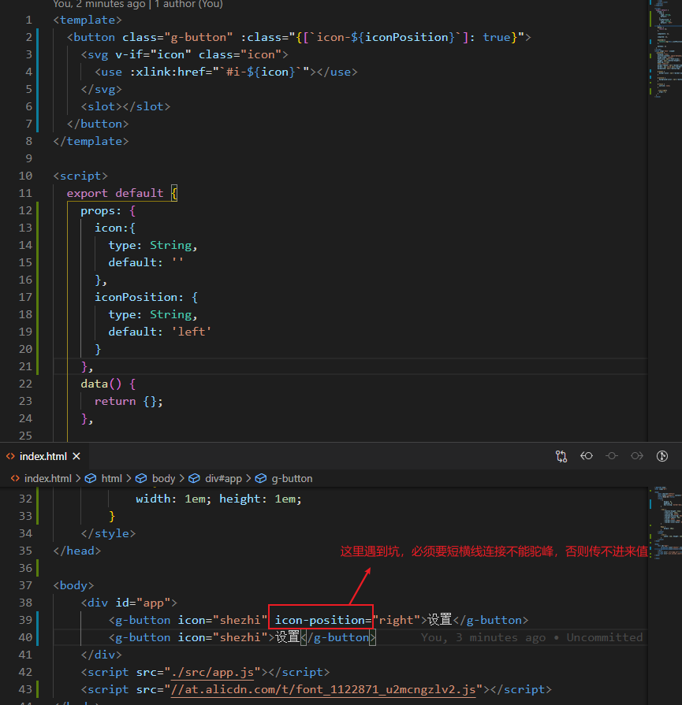
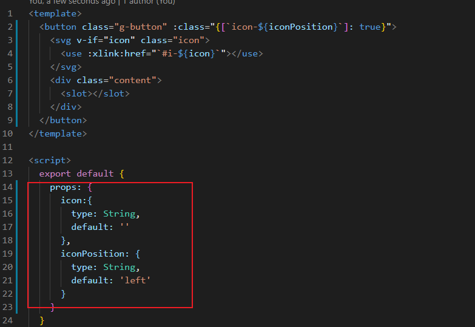
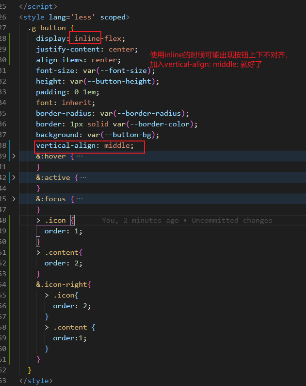

###前端学习方法
工具类更新很快，大致了解一下就可以
语言特性类需要深入了解
抽象代码组织能力要加强

### button组件
知识点：
#### 1. slot插槽
可以理解为一个武器（组件）的插槽，宝石（使用者要传入的文本等）镶嵌到插槽的位置

#### 2. 添加icon
图标网站： [iconfont]('https://www.iconfont.cn/')
1. 新建项目，设置好fontClass前缀：

2. 生成在线代码，Symbol引入，复制生成的代码

3. script引入

引入成功

4. 具体使用方法

5. 添加属性icon 和 iconPosition

css样式：

