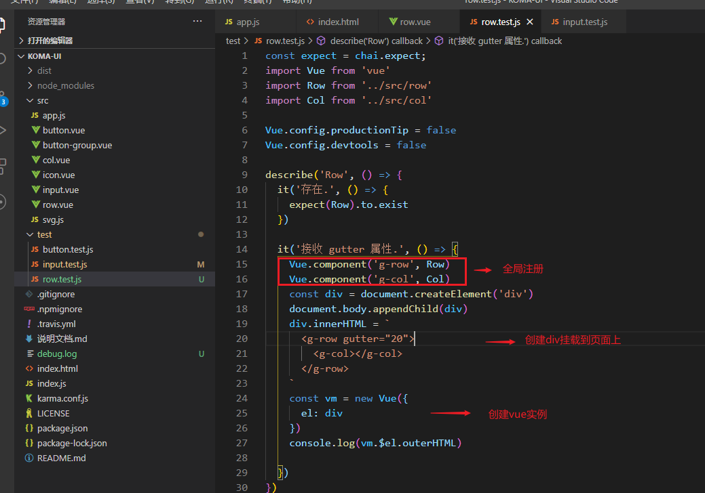
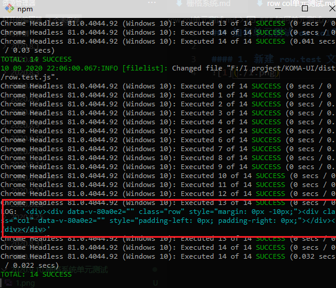
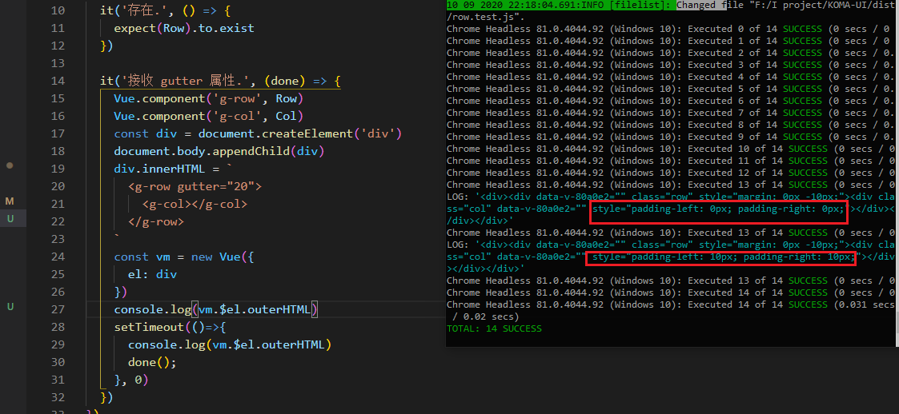

### 如何单元测试row col？

#### 1. 新建 row.test 文件


打印出来：


打印出来，会发现col 的padding不对，按理来说应该是gutter的一半，这确实0。

延时打印一下：


**会发现第二次打印结果是正确的，这里还加了一个done, 测试框架异步测试要加入done.**


### 扩展：为什么第一次打印没有padding?
```
// vue渲染过程
const div = document.createElement('div')  
const child = document.createElement('child') // created 这两步是同步的
div.appendChild(child)    // mounted 这一步是异步的
document.body.apendChild(div)   // mounted 这一步是异步的       
console.log(div.outerHTML)  // 这个是同步的会在异步之前执行
```


### 测试用例常用语法：
```
// 如果需要测试css属性，需要将其挂载到div上
const div = document.createElement('div')
document.body.appendChild(div)
const Constructor = Vue.extend(col)
const vm = new Constructor({
  propsData: {
    span: 1
  }
}).$mount(div)
const el = vm.$el
expect(el.classList.contains('col-1')).to.be.true
```