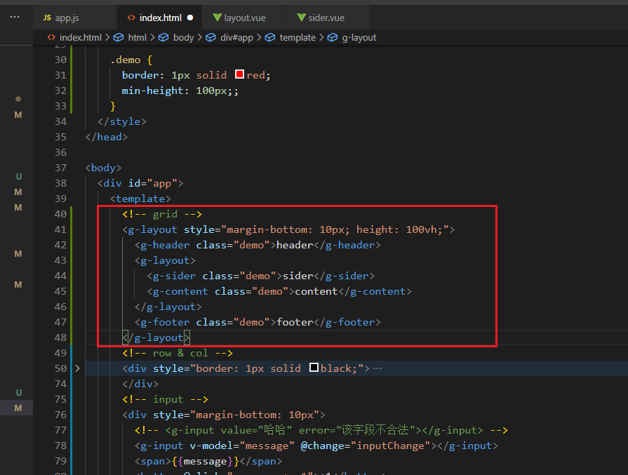
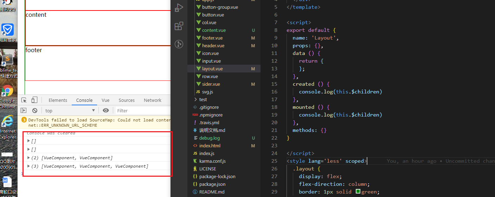
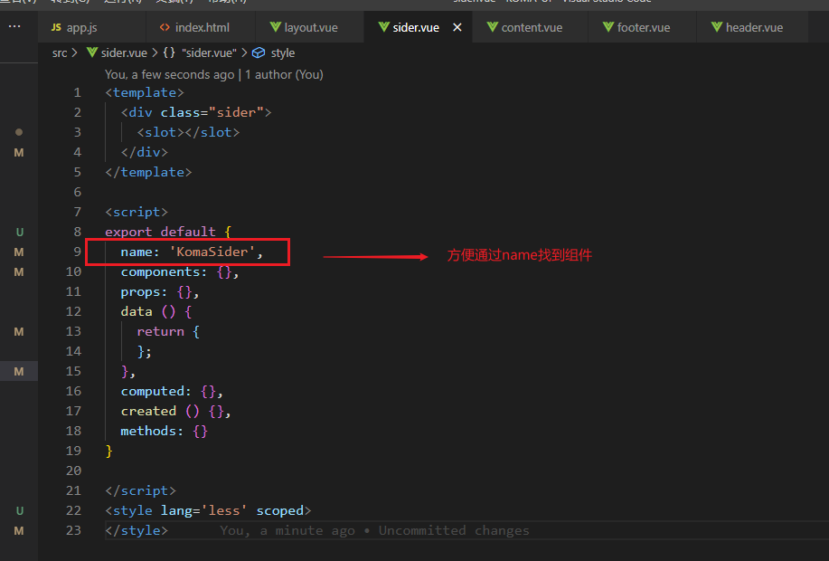
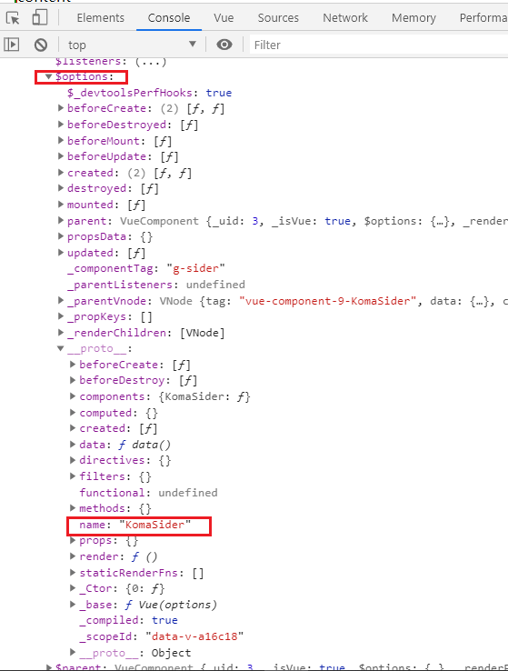
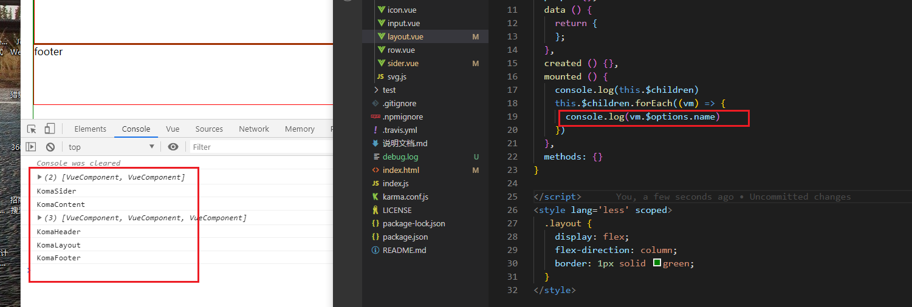
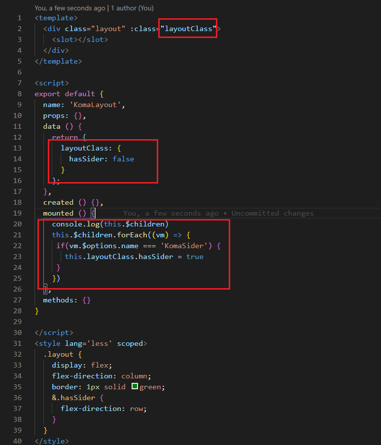
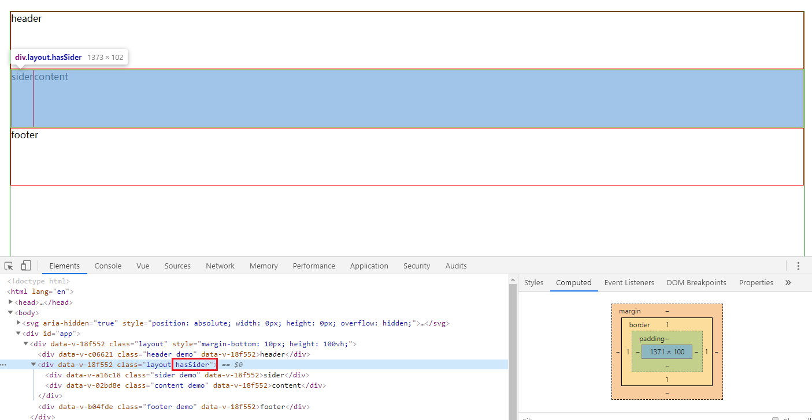

### grid组件

使用：
一般在layout组件下都是 `flex-direction: column;`布局，只有layout组件下有`sider`时才会`flex-direction: row;`布局

#### 如何判断layout下是否有sider组件？
在父组件layout created时候，子组件是还没有创建的，所以我们需要在mounted时，完成此判断。

##### 1. 给组件命名

打印出来：

##### 2. 根据name给组件加上class

