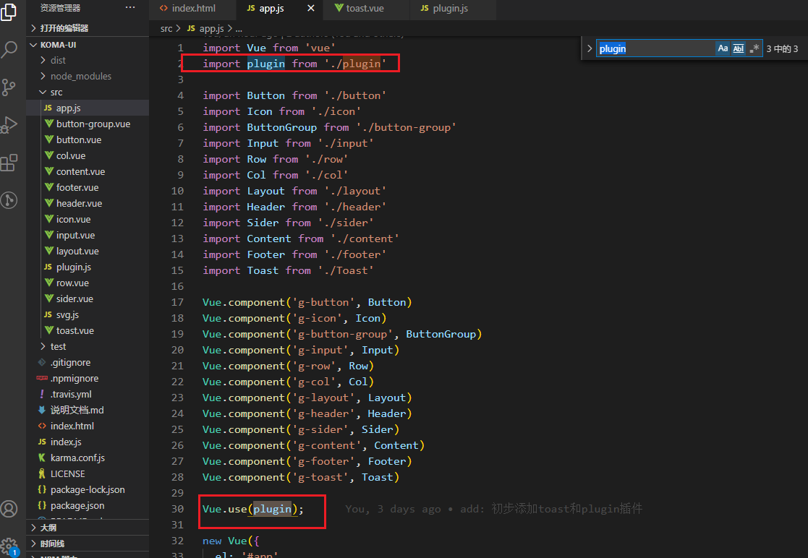

# Toast组件

### 1. Vue 插件的应用
设想toast使用方式， 一般会全局调用如： `this.$toast('知道了')`， 这就需要在Vue上全局绑定一个toast实例，但是直接在 `Vue.prototype.$toast`上绑定该实例是非常不好的方法，因为你无法知道用户引入 Vue 的方式。
比如： `import Vue2 from 'Vue'` 所以此时引入就是失效的。

这里引申出Vue插件的使用方式：
[插件的作用就是为vue添加全局功能](https://cn.vuejs.org/v2/guide/plugins.html)


### 2. 引入一个插件
1. 新建一个plugin.js 然后在里面 export default 导出 一个install对象


2. 使用插件
引入之后，使用 `Vue.use(plugin)`, 用户使用会自己绑定Vue, 避免了上面的问题



### 3. 新建toast组件
在插件中定义组件和写测试用例很像， `Vue.extend(toast)`扩展一个组件实例出来，然后传入属性，最后要将`toast.$el` mount到body中。


注意这个地方的使用： 
如何将用户传入的 message 绑定给 slot ?

```
toast.$slot.default = message
```


### 4. 如何手动加入某个元素mount后的样式
在画白线的时候，遇到一个问题，因为toast的多行文本关系，所以不能定死toast的高度，所以只能设置一个 `min-height`，这时候里面的line就无法通过 height: 100%的方式获取到高度，渲染到页面上height会一直为 0。


**这里解决办法是使用js的方式手动给line加上高度：**
1. 如何获取到父元素的最终高度？
绑定一个ref，然后通过 `getBoundingClientRect()` 方法获取实际高度
```
let height = this.$refs['toast'].getBoundingClientRect().height

// 注意 this.$refs['toast'].style.height 只能获取到内联样式
```

2. 给line加上父元素的最终高度
```
// 这里实际上加上了个内联样式，注意要带上单位
this.$refs['line'].style.height = `${height}px`
```
3. 为什么要加个 `$nextTick` ?

由于异步原因，直接获取`this.$refs['toast'].getBoundingClientRect()`的高度是0。

**凡是页面上明明有高度，但是打印出来高度为0的基本上都是异步原因。**


### 5. 如何彻底销毁一个实例元素？
```
this.$el.remove();
this.$destroy();
```

### 6. 如何避免同时出现多个toast？
