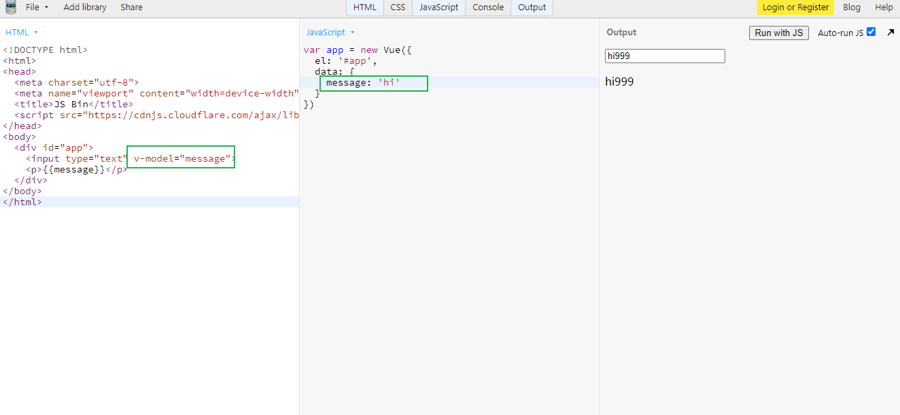
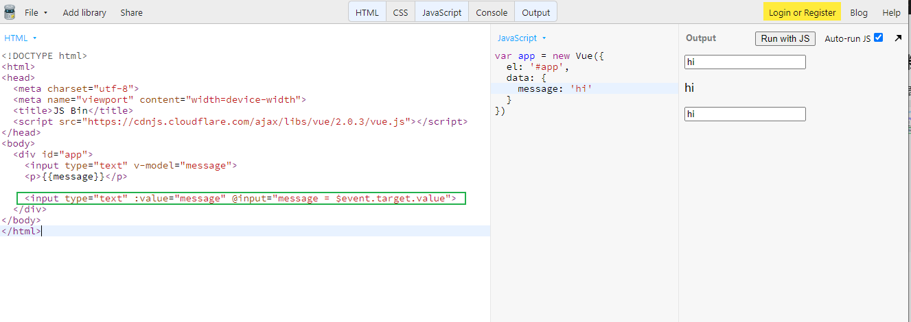
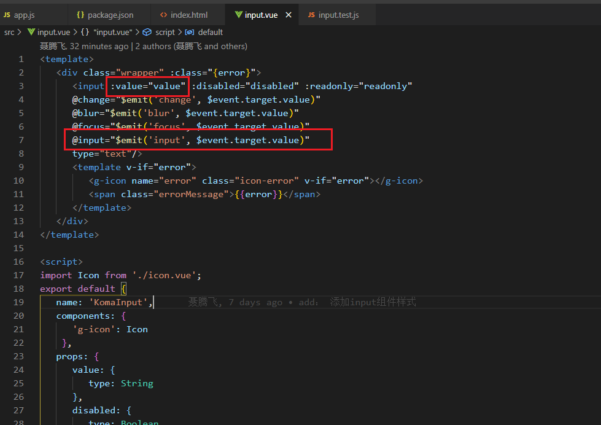
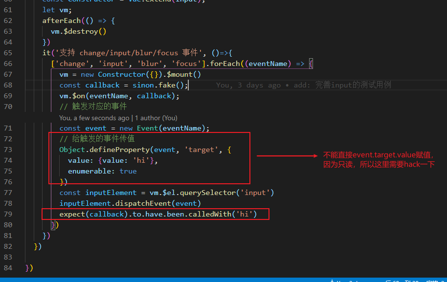

### v-model 的语法糖

vue的双向绑定，其实是语法糖：


相当于:



v-model其实相当于：  
```
:value="value"
@input="value=$event.target.value"
```

所以组件要支持v-model，需要注意支持这两点：
> 
1. :value="value"  绑定value

2. 监听 input 事件



### 完善input组件的测试用例
