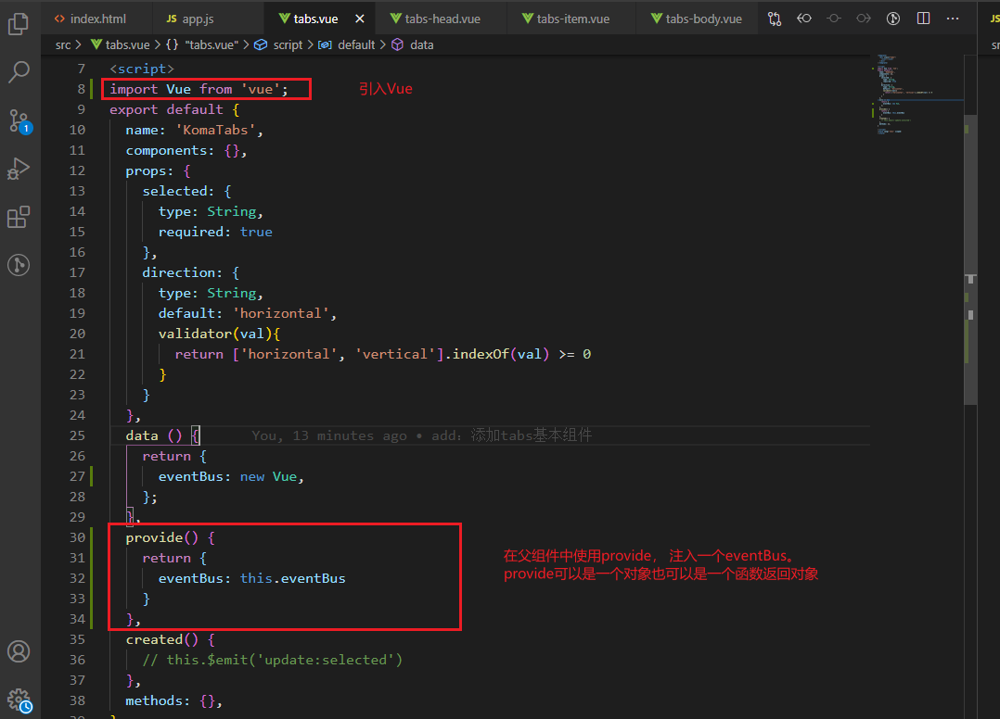

### 1. 使用设计


### 2. .sync 使用


我们可能对一个prop双向绑定，即父组件传值给子组件，子组件再更新这个值给父组件，但是vue是不支持双向绑定的。

**需要在子组件中以 `update:selected` 的模式触发事件来更新值。 语法糖的需要使用`update:xxx(prop名字)`才生效**

```
// 子组件
this.$emit('update:selected', newtab)  // 注意这里的update:tab 不要使用 驼峰命名，因为绑定在html上的是无法识别大小写的，会统一转成小写

// 父组件
:selected="selectedTab"
@update:tab = "selectedTab = $event"

// Vue官方提供了一个语法糖，使用 `.sync` 即可达到上面的效果
// 父组件
:selected.sync="selectedTab"
```


### 3.tabs的依赖注入和eventBus
tabs使用场景是，点击一个item会通知其他组件自身状态的更新，这就需要事件发布和事件订阅了。


> 一个合格的`eventBus`，应该具备发布一个事件（类似 `$emit('xxx',val)`），以及监听一个事件（类似 `$on('xxx', function)`）的功能，我们可以使用 `new Vue`。




### 4. 通过注入的eventBus来发布和订阅事件


### 5. 在flex中如何让设置单独靠左
在slot上加class是无效的


给个 `margin-left: auto;` 即可