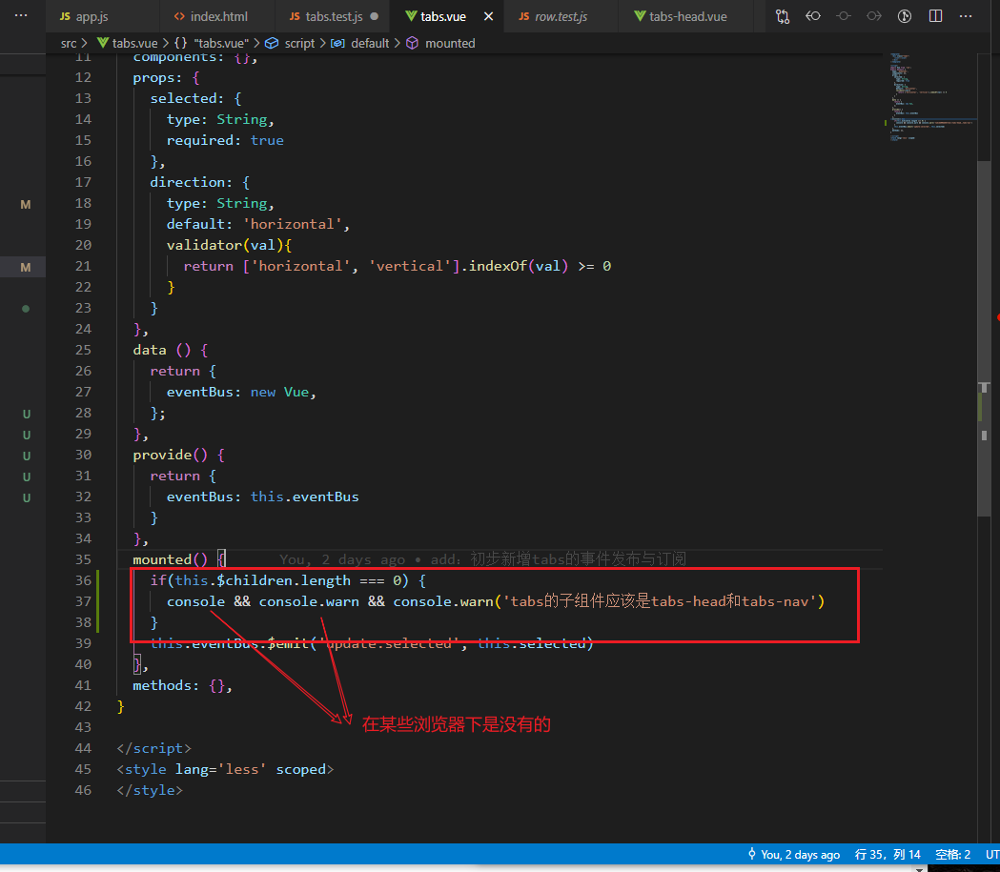
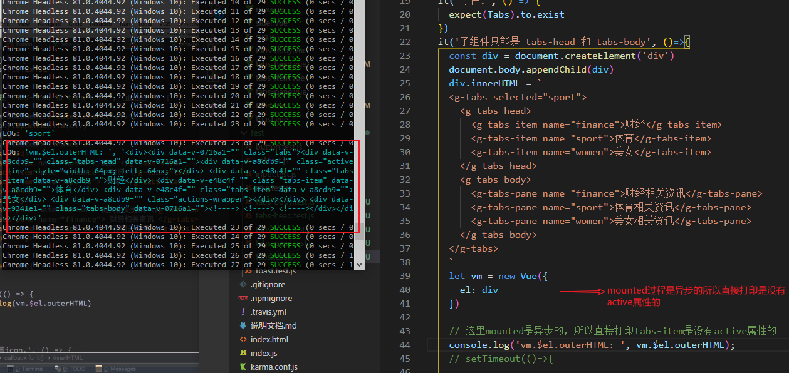
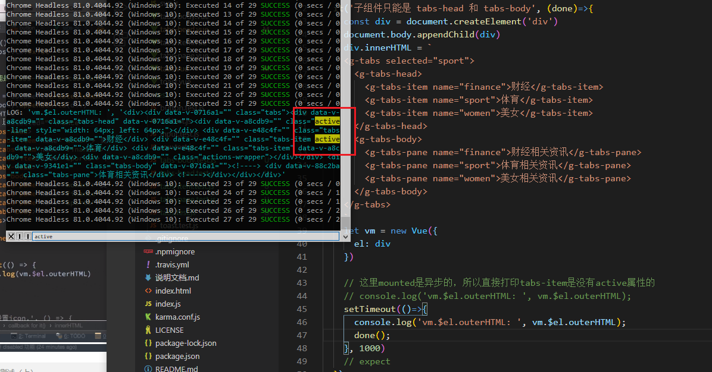
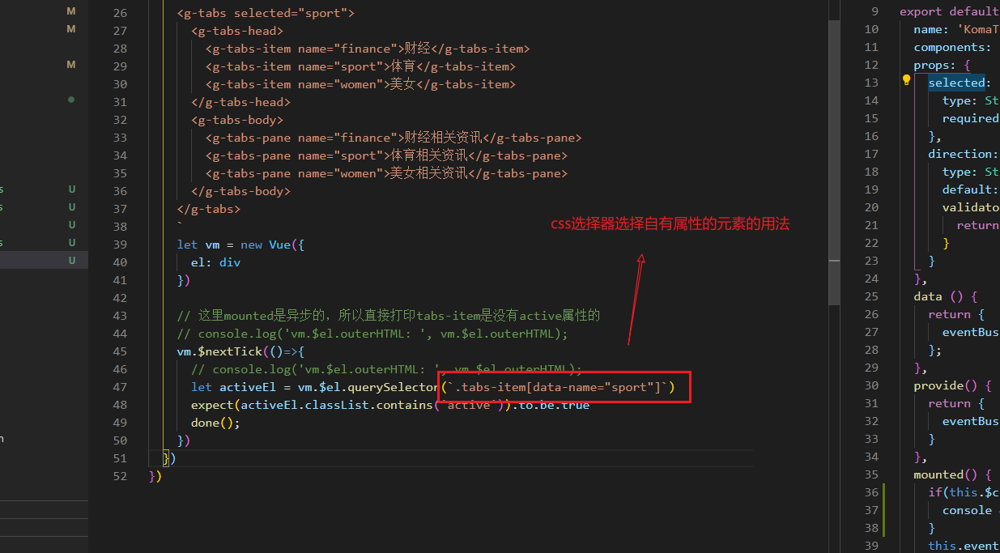

### tabs组件的测试用例

#### 1. 测试tabs子组件只能是 tabs-head 和 tabs-body

在使用组件时：
```
<g-tabs>
  <div>hi<div>
<g-tabs>  
```

在`g-tab`组件中, `this.$children`是空数组。以此我们可以添加判断提示：


### 2. 测试selected属性
selected属性测试子组件 `tabs-item` 有`active` class即可。


直接打印html会发现并没有 active，是因为mounted是异步过程，所以我们需要延时打印。






