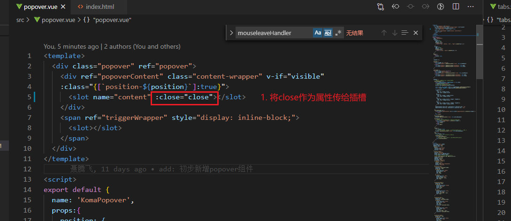

# popover组件

## 1. 实现简单版popover

实现popover组件的时候，要实现一个小功能：


```js
// 初步实现
<div class="popover" @click="click">
  <div class="content-wrapper"  v-if="visible">
    <slot name="content"></slot>
  </div>
  <slot></slot>
</div>

// 第一次尝试失败
// 效果： 点击按钮无反应，不会弹出popover
// 失败原因： 因为事件监听没有延迟，点击后加上监听器，事件继续冒泡到document，监听的事件立刻被触发
click(){
  this.visible = !this.visible
  if(this.visible){
    // 监听documnent
    document.addEventListener('click', ()=>{
      this.visible = false
    })
  }
},

// 第二次尝试失败
// 效果： 点击按钮首次会出现popover，再点击外面会关掉，但是再次点按钮击无反应
// 失败原因： 事件持续监听，每点击一次增加一个监听器，第二次点击按钮会触发监听器false掉
click(){
  this.visible = !this.visible
  if(this.visible){
    // 延时监听document, 这样因为异步延迟，首次会出现popover
    setTimeout(()=>{
      document.addEventListener('click', ()=>{
        this.visible = false
      })
    })
  }
},

// 第三次尝试失败
// 效果： 点击按钮首次会出现popover，再点击外面会关掉，但是再次点按钮击无反应
// 失败原因： 因为errorHandler bind.(this) 后会变成一个新的函数， 所以清除errorHandler时，不是同一个函数
click(){
  this.visible = !this.visible
  if(this.visible){
    // 延时监听document, 这样因为异步延迟，首次会出现popover
    setTimeout(()=>{
      document.addEventListener('click', function errorHandler(){
        this.visible = false
        document.removeEventListener('click', errorHandler)
      }.bind(this))                         // 这里记得要绑定this, 不然this.visible里的this会指向document
    })
  }
},

// 第四次尝试成功
click(){
  this.visible = !this.visible
  if(this.visible){
    // 延时监听document, 这样因为异步延迟，首次会出现popover
    setTimeout(()=>{
      let errorHandler = ()=>{
        this.visible = false
        document.removeEventListener('click', errorHandler)
      }
      document.addEventListener('click', errorHandler)  // 将函数抽离成一个变量, 这样能保证是同一个监听函数
    })
  }
},
```

## 2. 实现点击popover时不关闭


### 简单版的弊端:

#### 1.样式问题
当给父容器加一个div并设置 `overflow: hidden;`时，popover会被遮挡。


#### 2.打断了用户的事件链

这里点击button无法正常打印，因为事件冒泡被阻止


## 3. 重构popover

**核心思路：不能再将content放置在popover下，而是将其直接挂载到body下，避免overflow: hidden；的影响**

初步实现：
```
// html: 
<template>
  <div class="popover" @click.stop="click">
    <div ref="content" class="content-wrapper" v-show="visible">
      <slot name="content"></slot>
    </div>
    <span ref="triggerWrapper">
      <slot></slot>
    </span>
  </div>
</template>

// css
<style lang='less' scoped>
  .popover {
    display: inline-block;
    vertical-align: top;
    position: relative;
  }
  .content-wrapper {
    position: absolute;
    border: 1px solid green;
    box-shadow: 0 0 3px rgba(0,0,0,0.5);
    transform: translateY(-100%)
  }
</style>
```
// js


存在样式bug


最终解决方案：


样式问题：


解决小三角没有阴影的问题：
记得还要加上background

`但是这个filter: drop-shadow()兼容性可能有问题：`


## 4. 让popover支持position
html:


css:


js: 


位置left时，纵向居中对齐


## 5. 让popover支持click和hover触发
**记得在destroyed时手动删掉监听器**


## 6. 通过插槽触发子组件的close方法




